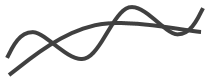
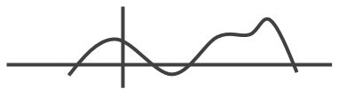
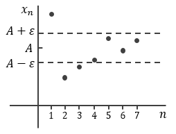
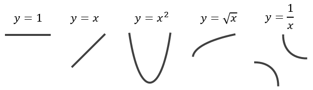
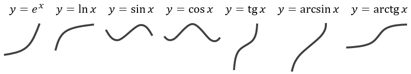
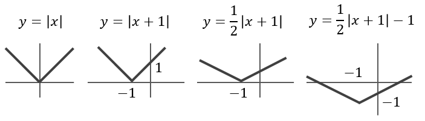
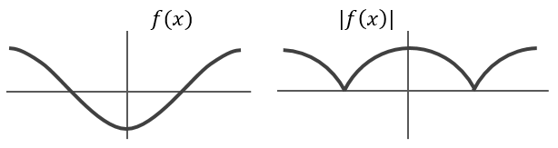
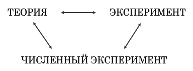
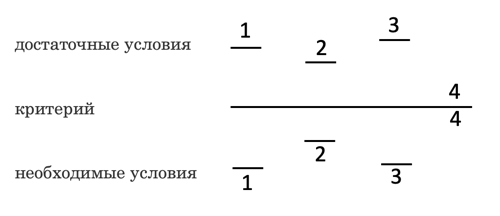
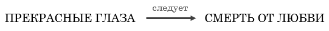

# Предисловие

Слово «инженер» произошло от латинского *ingenium*, что означает «способность», «изобретательность». Профессия инженера зародилась в глубокой древности. Первые люди на земле были и первыми инженерами — сама жизнь требовала от них изобретательности. Скажем, охота первобытных людей на мамонта — это каскад сложнейших инженерных задач. Их надо было продумать, подготовить, умело реализовать, неся бремя ответственности, — ведь за малейшие ошибки приходилось платить жизнью и не только своей, но, возможно, и племени.

За многие тысячелетия профессия инженера сильно изменилась — непрерывно сужается специализация, инженерная работа все теснее сближается с научной, но суть профессии остается незыблемой. Во все годы инженер функционирует по схеме: анализ ситуации — принятие решения — исполнение — бремя ответственности.

Да, природа не храм, а мастерская, и человек в ней работник. Человек, окончивший втуз, — инженер и научный работник. А что характерно для современной научно-инженерной работы? Прежде всего узкая направленность, требующая длительной специальной подготовки в конкретной области. Требуется, конечно, и фундаментальная общая подготовка. Она нужна не только для дальнейшей специализации, но и для взаимопонимания с коллегами смежных (а иногда весьма далеких) отраслей. Ведь многое рождается на стыке различных направлений, вовсе не обязательно близких — все чаще и неизбежней возникают альянсы естественно-гуманитарные. Другой чертой, характерной для современного исследования, является колоссальная трудоемкость — практически
все задачи решаются коллективами, причем огромная нагрузка ложится на каждого исполнителя.

Почти аксиома: выпускник втуза должен обладать общими и специальными знаниями, уметь работать с научной литературой и, чуть ли не главное, быть физически и психологически готовым к
любому объему работы.

Чем же может быть полезна математика при подготовке будущего инженера и научного работника, каково ее назначение?

**Сервильное** — обслужить соседние дисциплины (физику, химию, механику), дать им формализованный язык для описания различных процессов и явлений.

**Тренировочное** — специалист должен тренировать свои мозги, как спортсмен — мышцы. Математика, пожалуй, идеальное средство для мозгового тренинга (разумеется, далеко не единственное — при желании можно с той же целью заняться и чем-нибудь другим, например, философией, контрапунктом, шахматами).

**Историческое** — передать нынешнему поколению опыт предыдущих (а если удастся, то и «опыт» последующих), иллюстрирующий и подтверждающий эффективность использования математики в решении различных конкретных задач любого масштаба — от глобальных до самых прозаических.

**Этическое** — математику (как и литературу, и искусство) можно использовать для решения многих жизненно важных вопросов, связанных с самоанализом, анализом и рационализацией своей жизни и отношения к ней, культурой труда, культурой мышления, поведением, взаимоотношением с обществом и осознанием своего места в нем и т. д. Развитое этическое начало у специалиста — не роскошь, а необходимость. Вот, например, четыре из 15 требований, предъявляемых академиком А. Ф. Иоффе к физику-экспериментатору: честность, отсутствие должного самолюбия, самокритичность, скромность.

**Эстетическое** — развить ассоциативное мышление, чтобы изучаемые вопросы, теоремы, методы не только знать и понимать, но и глубоко чувствовать, ощущая их красоту и эффективность, величие и универсальность, границы применимости и связь с другим сторонами человеческого познания: музыкой, языком, философией, физикой, литературой... Еще одно из упомянутых требований А. Ф. Иоффе — знать  художественную литературу, интересоваться искусством, любить и понимать музыку.

При идеальном преподавании математики, по-видимому, все указанные назначения могут быть выполнены. Правда, в этом обычно нет необходимости, ведь от учеников требуется совсем немного: прорешать все примеры, заучить все формулы (да и все ли?)...

Жаль. Математика — эта многовековая битва идей, умов, характеров, личностей, грандиозная по масштабу и драматической напряженности, не менее захватывающая и впечатляющая, чем любое спортивное или театральное зрелище — превращается в скучную прозаическую инструкцию.

На правах бывшего инженера и научного работника и нынешнего преподавателя математики во втузе мне хочется поговорить об инженерной математике. Правда, инженер — понятие расплывчатое, его функции и обязанности постоянно меняются — это может быть и конструктор, и экономист, и управленец, и экспериментатор, и программист, к тому же нынешний инженер часто вынужден быть «един во многих лицах». Мне наиболее близок инженер-вычислитель, программист, интерпретатор — обработчик эксперимента, однако надеюсь, что в той или иной степени нижесказанное будет полезно инженеру вообще.

# Глава 1. С ЧЕГО НАЧИНАЕТСЯ ИНЖЕНЕР

Много лет преподавая математику во втузе, привык сталкиваться с некоторыми характерными заблуждениями в психологии учеников: школьников, абитуриентов, студентов. Порой кажется, что преподаватели и ученики говорят на разных языках.

Первые встречи — в июле, августе, когда начинаются приемно-вузовские страдания. Из года в год одни и те же вопросы: зачем эта нервотрепка? ведь только что сдавали экзамены в школе? есть ли вообще какая-нибудь польза от экзаменов? Я в своей жизни сдал экзаменов свыше сотни, и бесполезных среди них что-то не помню. Наоборот, всем хорошим во мне обязан экзаменам. Что еще так организует и мобилизует? Разумеется, это не единственный допинг в обучении, но уж очень мощный. Жаль нынешних школьников — им почти не приходится сдавать экзаменов, а те, что приходится, боюсь, не доставляют им радости.

Моя аксиома: сдав экзамен, я должен узнать что-то новое о сданном предмете и о себе самом, полезное на будущее; стало быть, каждый сданный экзамен — это шаг вперед в моем развитии. А насчет двойных экзаменов в течение одного лета... Увы, сдавать надо не два одинаковых экзамена, а два разных (принципиально разных!) по одной программе. Школьный экзамен — удел каждого и одинаков для всех, приемный во втуз — лишь того, кто решил стать инженером. Школьный экзамен устремлен в прошлое — это отчет о проделанной работе. На приемном — экзаменатор думает о будущем: сможет ли абитуриент стать полноценным студентом, «потянет» ли?

Часто школьники (еще чаще родители) тревожатся, что им дали мало знаний. Меня это тоже беспокоит, но отнюдь не в первую очередь. Через несколько лет сегодняшний абитуриент должен стать инженером. Знания — услада школьника. Потребности инженера гораздо шире, так как кроме званий ему нужны навыки, понимание, рефлексы, интуиция, умение анализировать ситуацию, принимать решения. Одно знание в ряде случаев мало чего стоит. Тысячи болельщиков не хуже самых лучших футболистов «знают», как надо забивать голы. Среди сотен пришедших на концерт иные не хуже пианиста «знают», как играть сонату Бетховена. Знание правил шахматной игры приобретается за 15 минут, умение играть на уровне мастера — за 15 лет.

Образно выражаясь знания — это деньги. А богатство — не только количество денег, но прежде всего умение их зарабатывать и тратить.

Мы часто говорим: «знание — сила», не замечая, что этот тезис, бесспорно прогрессивный во времена Бэкона, уже явно устарел, его нужно как-то дополнить, скажем, «знание — сила, знание без понимания — слабость» или «знание — сила, понимание — мощь». Конечно, понимание углубляется всю жизнь, и было бы странно требовать сразу то, что приходит постепенно, с годами, опытом работы. Но правильная психологическая ориентация (основа будущего понимания) должна вырабатываться как можно раньше. Вот что мне хотелось бы видеть в «багаже» старшеклассника, а тем более абитуриента и студента, независимо от объема знаний.

**1. Грамотность.** Проверяя записи на приемном экзамене и исправляя грамматические ошибки, всегда сталкиваюсь с бесcтыдным недоумением — что тут такого, я торопился, какая разница и т. п. (словом, перечитайте некоторые диалоги Дон Кихота с Санчо Пансой). Поверьте, я стараюсь не придираться к стилистическим ошибкам, пока они не превращаются в математические. Да мне-то, собственно, и не нужно, чтобы студент **знал** русский язык, нужно, чтобы его знание обслуживало все, чем он занимается: математику, физику, политэкономию... (точно так же, как и моим коллегам не нужно, чтобы он **знал** математику — нужно, чтобы его знание **обслуживало** физику, механику...). Кстати, самые трудные (страшные!) вопросы для абитуриентов — языкового характера. Скажем, можно ли в предложении переставить, выкинуть или добавить те или иные слова, изменится ли смысл утверждения, если одни слова заменить другими и т. д. Подобные вопросы хорошо бы хоть правильно понять, где уж там правильно на них ответить — заботы мольеровского мещанина во дворянстве, как лучше сказать маркизе о ее прекрасных глазах и своей любви, им неведомы.

Трудно удержаться, чтобы не процитировать воспоминания академика А. Н. Крылова о том, как принимали экзамены в одной французской школе в конце позапрошлого века: «Характерна также оценка письменных работ по математике: она производится, во-первых, преподавателем французского языка, который обращает внимание на правильность языка и орфографии, и, во-вторых, преподавателем специалистом, который уже оценивает работу по существу». Это разумный подход. Ведь что ожидает школьника, студента в будущем? Придется делать доклады, писать отчеты, статьи...

**2. Аккуратность.** С первых дней обучения вынужден твердить: все, что вы пишете, кто-то будет читать — значит, неряшливое, небрежное, неопрятное для окружающих изложение результатов проделанной работы делает ее бессмысленной, никому не нужной; исполнителю может быть трудно, это никого не интересует и к делу не относится, но потребителю должно быть легко, так что думайте о нем, а не о себе. Иногда приходится слышать о работнике комплимент — аккуратный инженер. В таких случаях мне всегда стыдно за свою профессию. Мы ведь не говорим; смелый летчик-испытатель или трудолюбивая балерина. Да это было бы просто смешно — трусливых летчиков и ленивых балерин не бывает. А неаккуратных инженеров — увы...

**3. Отношение к результату, контроль.** Для школьника этой проблемы не существует, рядом с ним учитель. Для инженера: контроль — важнейший этап в решении задачи (азбучная истина — как ни трудно получить результат, иногда еще труднее его осознать и разумно им распорядиться). А начинать приходится с... аккуратности, чистописания. Все записи должны иметь систему, понятную хотя бы их автору; эта система должна быть организована так, чтобы трудно было ошибиться и легко себя проверять (а не наоборот). Стремлюсь привить вкус к контролю результатов, превратить его в органическую **потребность**, такую же естественную, как забота женщины о том, красиво ли она выглядит, или забота повара, вкусен ли сваренный им обед. По-моему, стыдно, вычислив с помощью интеграла площадь и получив отрицательный результат, нести его преподавателю — а ведь несут. 

Многие школьники и даже студенты наивно думают, что в своей работе они будут ежеминутно дифференцировать, интегрировать... Смею заверить, что гораздо чаще придется складывать А и В и вычитать С.

Разница в другом. Школьник получает результат — и все, а инженер и получает результат, и **отвечает** за него. В отличие от школьника, машины, попугая, инженер, прежде чем выдать информацию, думает, взвешивает, анализирует, сопоставляет, сомневается, мучается, страдает, радуется, снова думает, пытается проконтролировать себя прямо и косвенно... Одно из моих педагогических «чудачеств» — при решении задач категорически запрещаю ученикам смотреть в ответ, кстати, и после решения — тоже. Причин несколько, Во-первых, совпадение полученного результата с ответом ни о чем не говорит. Это отнюдь не критерий истинности решения. К тому же бывают и опечатки. Во-вторых, и самое главное, жизнь не задачник и выдвигает задачи без ответов, и надо готовиться именно к такой ситуации.

Получив результат, нужно устроить себе проверку — сначала чисто техническую (повторный проход по всем выкладкам), затем смысловую: забыв обо всех промежуточных мучениях и преобразованиях, с результатом в руках окунуться в условие задачи. Для контроля надо использовать любые, даже самые грубые и косвенные возможности: размерность, симметрию, предельные случаи и частные варианты, теоремы об оценке, результаты ранее решенных задач (особенно из элементарной математики), наконец, здравый смысл.

**4. Ощущение частного и общего, умение получить информацию из соотношения.** Часто слышны стоны по поводу обилия и громоздкости формул, трудности их запоминания. Мне кажется, специально запоминать любые формулы не нужно, в чем-то даже вредно. Они должны запоминаться сами, надо только создать для этого подходящие условия. Вынужден признать — часть вины здесь наша, взрослых. Промышленность могла бы помочь нашим школьникам и студентам, ведь различные формулы можно печатать на обложках тетрадей, книг, блокнотов, на обоях, клеенках, сумках, полиэтиленовых пакетах, календарях, кофточках, рубашках, в коридорах, в магазинах, в транспорте, словом, всюду, где только можно. (Кстати, Софья Ковалевская выучила производные именно с помощью обоев.)

Но бывают и лишние, по крайней мере необязательные формулы. Например, формула для решения квадратного уравнения. Досадно видеть, как, забыв ее, учащиеся напрягают память и мучаются по 10-15 минут. хотя достаточно помнить лишь очень простую идею ее вывода — выделение полного квадрата, и результат получится в минуту. Такие же ненужные раздумья-воспоминания вызывает почти любая громоздкая формула, особенно в тригонометрии — вроде и помнится, но что-то сомнительно, коэффициент 2 или 1/2, знак плюс или минус и т. п. Но ведь формула-то должна **работать**. И нечего думать и вспоминать — возьми и подставь что-нибудь конкретное в эту формулу, посмотри — получается или нет, если есть ошибка — она сразу обнаружится. В математике бездельников нет — все формулы, теоремы, определения **работают**, а что не **работает** — отмирает.

Другими словами, для ученика формула — хозяйка, а для специалиста — служанка. Поясню, почему смешны раздумья, скажем, над формулой $\sin (\alpha-\beta)=$... Вот как я действую, если справочник далеко, а память не надеюсь. Синус и косинус суммы и разности выражаются через синусы и косинусы слагаемых как суммы или разности попарных произведений — такова простая мораль четырёх громоздких формул. Пишу первое, что приходит в голову, например, $\sin (\alpha-\beta)=\sin \alpha \cdot \sin \beta+\cos \alpha \cdot \cos \beta$. Но это явная чепуха, тах как при $\alpha=\beta=0$ слева нуль, а справа единица. Знак минус вместо плюса тоже не спасет, Перетасую: $\sin \alpha \cdot \cos \beta+\sin \beta \cdot \cos \alpha$. При $\alpha=\beta=0$ противоречия нет, но и гарантии в знаке плюс тоже нет $(0+0=0-0=0)$. Подставлю еще что-нибудь, скажем, $\alpha=\beta=45^{\circ}$, тогда слева нуль, а справа нет, значит, не плюс, а минус. Итак, $\sin (\alpha-\beta)=\sin \alpha \cdot \cos \beta-\sin \beta \cdot \cos \alpha$. Разумеется, эту формулу я гораздо чаще помню, чем забываю, но потому-то и помню, что не боюсь забыть — у меня всегда есть «аварийный выход».

**5. Отношение к информации.** Известно, что информация бывает полезная, бесполезная и вредная. Полезную, т. е. нужную для работы, информацию можно условно разделить на две категории: а) которую удобнее хранить в памяти; 6) которую удобнее хранить вне памяти (в тетради или справочнике). Для инженера такое разделение происходит само собой, а для учащихся это серьезная проблема (решить которую мы, преподаватели, порой даже мешаем). Пример с формулой для решения квадратного уравнения характерен — как ни полезно ее знать, еще полезнее знать, как без нее обойтись.

Формула $(a+b)^{2}=a^{2}+2 a b+b^{2}$, кстати, простая и симметричная, должна быть в памяти (хотя ее и вывести несложно, просто так удобнее), а формула $x=-p / 2 \pm \sqrt{p^{2} / 4-q}$, кстати, не слишком удобоваримая, может пребывать и вне памяти, хотя, конечно, если сама запомнится — неплохо. Отмечу еще, что полезно выработать не только знание, не только навык, но и рефлекс: при встрече с **любым** квадратным трехчленом, надо — не надо, **всегда** выделять полный квадрат, вреда от этого не будет, а польза может быть. Причина проста: выражение $y=x^{2}+x+1$ явно уступает по информативности выражению $y=(x+1 / 2)^{2}+3 / 4$. Где сразу видно, что при $x=-1 / 2: \quad y_{\min }=3 / 4$, т. е. видна вершина параболы. Весьма полезен в информативном смысле еще один рефлекс — «развал», если это возможно, на линейные скобки — сразу видны корни, т. е. точки пересечения с осью $x$: $y=x^{2}+3 x+2=(x+1)(x+2)=0$ при $x=-1$ и $x=-2$.

Еще один поучительный пример — таблица интегралов из популярного задачника для втузов. В ней 17 формул, каждая из них правильна, а таблица в целом — неправильна. Что с ней делать? Для запоминания формул слишком много — почти половину нужно выкинуть, а другую — урезать. А для справочника (даже минимального) формул в этой таблице слишком мало. Осмелюсь предложить следующую, максимально, на мой взгляд, компактную таблицу — попробуйте из нее хоть что-то выкинуть:

1. $\int x^{a} d x=\frac{x^{a+1}}{a+1} ;  \alpha \neq-1; \int \frac{d x}{x}=\ln |x|$

2. $\int e^{x} d x=e^{x}$
3. $\int \sin x d x=-\cos x ;  \int \cos x d x=\sin x$
4. $\int \frac{d x}{\cos ^{2} x}=\operatorname{tg} x ;  \int \frac{d x}{\sin ^{2} x}=-\operatorname{ctg} x$
5. $\int \frac{d x}{x^{2}+a^{2}}=\frac{1}{a} \operatorname{arctg} \frac{x}{a}$
6. $\int \frac{d x}{\sqrt{a^{2}-x^{2}}}=\arcsin \frac{x}{a}$
7. $\int \frac{d x}{\sqrt{x^{2}+A}}=\ln \left|\operatorname x+\sqrt{x^{2}+A} \right|$
8. $\int \frac{d x}{\sin x}=\ln \left|\operatorname{tg} \frac{x}{2} \right|$

Вот, собственно, и все, что нужно помнить (причем даже в этих восьми строчках первые шесть уже известны из таблицы дифференциалов, в которой они читались не слева направо, а справа налево). Остальное либо вообще не нужно, либо легко домыслить самому (скажем, наличие константы $C$ в каждой формуле или $a^{x}=e^{x \ln a}$ и т. п.).

Может, не совсем ясна ненужность формулы «высокий логарифм»? Дело в том, что во многих разделах математики (в анализе, в комплексных переменных, в операционном исчислении) постоянно приходится превращать выражения вида $\frac{1}{(x-a)(x-b)}$ в разность $\left(\frac{1}{x-a}-\frac{1}{x-b}\right) \frac{1}{a-b}$. И это надо уметь делать легко и быстро, без лишних эмоций и уж, конечно, не тревожа теорему алгебры о разложении на элементарные дроби. Стало быть, $\frac{1}{x^{2}-a^{2}}=\frac{1}{2 a}\left(\frac{1}{x-a}-\frac{1}{x+a}\right)$, и учить на память соответствующую формулу совершенно незачем.

Грубейшие психологические ошибки, подобные таблице интегралов из задачника, у нас хоть и не часто, но встречаются, причем они кочуют из одного издания в другое, и бороться с ними почти невозможно. Ничего не поделаешь — справедлива и вечно актуальна «формула» Пушкина: «Нам все еще печатный лист кажется святым. Мы всё думаем: как может быть это глупо или несправедливо? ведь это напечатано!»

Досадно, но факт: неумение сортировать информацию по степени нужности и характеру употребления приводит к глупым шпаргалкам (впрочем, умных шпаргалок в природе, наверное, и не существует; по-моему, любая шпаргалка — верный признак глупости или ученика, или преподавателя, или их обоих). Роковая психологическая загадка: школьная шпаргалкомания въедается столь сильно что отбивает разум даже у студентов. Перед зачетами и экзаменами мне часто приходится говорить: «такие-то формулы запоминать не надо, пусть первый пришедший в аудиторию напишет их на доске». Более чем в половине случаев доска оказывается чистой, но в каждой отобранной шпаргалке «ненужные» формулы на почетном месте.

В любом потоке информации крайне важно регулировать степень понимания. Учиться этому можно и на простейших бытовых примерах. В ряде ситуаций понимание нам вообще не нужно. Или желательно, но не обязательно. Например, нужно знать, как опускать талончик в метро, где ближайшая булочная, что «Новый мир» выходит ежемесячно, а «Литературная газета» по средам, уметь пользоваться лифтом и т. д. — понимать здесь практически нечего. Примеры второго типа — знание правил хорошего тона и уличного движения, основ физической культуры и рационального питания и т. п. — здесь понимание весьма полезно, но можно и без него обойтись.

**6. Умение думать.** Это выражение столь емко и многопланово, что ограничусь минимумом. Начну с того, что не у всех учащихся есть даже желание думать. Их можно понять (но не простить!): если из года в год только и делать, что заглатывать знания, которые кладут в рот, то трудно даже представить себе, что этому вот-вот придет конец — через несколько лет придется работать, и надо думать о будущем, а не о прошлом (часто приходится подшучивать - мои мозги всегда при мне, а раз уж они имеются, надо как-то ими и ворочать). Еще труднее бороться с желанием думать - когда оно неуместно. В инженерной, да и в любой другой, практике часто встречаются ситуации: а) когда думать стыдно, надо знать б) когда думать смешно, надо просто перебрать варианты (если их немного). Во всех других ситуациях думать можно и нужно, а в этих двух раздумье — признак профессиональной слабости. К сожалению, у нас слишком распространен стереотип “думать всегда хорошо» (по устойчивости и вредности он может конкурировать с выражением «знание — сила»).

Для примера попробую пофантазировать. Просыпаюсь утром и **думаю**: вставать или нет? с какой ноги? идти на работу или нет? бриться или не стоит? какой костюм надеть? брюки на ноги, пиджак на плечи или наоборот? уходя закрыть дверь или оставить открытой? свет и газ выключить или нет? улицу переходить на красный свет или зеленый? И все думать, думать ...

К этим шести пунктам можно было бы добавить еще немало — и общих, и узкоматематических. Но не в количестве дело, важно другое — все эти качества надо воспитывать в школе, в вузе — поздно. Любая психологическая перестройка идет со "скрипом». В 18-20 лет слушать речи о пользе грамотности и аккуратности или необходимости делать проверку ужасно скучно — ведь студенты все это «знают», а «знание — сила».

Но вот студент заканчивает втуз, с дипломом приходит на работу. Идут недели, месяцы, годы. Набивши голову частными производными, тройными интегралами и еще бог знает чем, бывший студент вдруг замечает, что гораздо важнее совсем другое: аккуратность, серьезность, воспитанность, культура труда, профессиональное самолюбие, умение работать в коллективе. Знания, правда, тоже нужны, но часто не те, что им давали, а главное, совсем не в том качественном аспекте. В школе, в вузе задают стандартные вопросы — требуют стандартные ответы. А на работе такого нет — профессионалы понимают друг друга с полуслова-полувзгляда. И порой возникает очень обидная ситуация — знания-то есть, но они не подкреплены сложившейся системой их приобретения, навыками, умением думать и работать.

А первый год работы всегда и так очень труден — при любом уровне знаний и качестве подготовки. Происходит неизбежная метаморфоза — ученик превращается в творческого работника. Наряду с приобретением новых (как правило, узкоспециальных) знаний вырабатывается профессиональный взгляд на всё, даже давно известное (работает классический принцип — движение вперед есть возвращение к первоосновам). Что казалось главным — становится второстепенным, и наоборот.

Поясню на примере. В школе проходят много формул (математических, физических...). Рассмотрим одну из них: $s=a t^{2} / 2$. Спросите школьника, чему равен путь, пройденный за время $t$ с ускорением $a$, он ответит этой формулой. Всё верно. Но как смотрит на ту же формулу научный работник? Полушутя-полусерьезно можно сказать, что в каждой формуле важнее всего знак равенства. Он как бы фиксирует, что те или иные величины (путь, время ускорение) меняются хотя и произвольно, но с некоторым ограничением, т. е, связаны соотношением, и самое важное даже не как они связаны ($s$ пропорционально $a$ и квадрату $t$, а коэффициент пропорциональности равен 1/2), а сам факт их взаимосвязи. В процессе обучения школьникам и студентам выдаются готовые количественные соотношения. В процессе научного познания прежде всего устанавливаются взаимосвязи величин и только после того, как качественный характер явления выяснен, наводится, так сказать, количественный глянец.

Подобную ситуацию (разное восприятие одного и того же явления профессионалом и учеником) ярко иллюстрирует эпизод из рассказа Конан Дойля «Второе пятно» — реакция Ватсона и Холмса на известие о смерти Лукаса:

​	«— Удивительное совпадение!

​	— Совпадение? Один из трех людей, которых мы считали возможными участниками этой драмы, умирает насильственной смертью в тот самый час, когда разыгрывается драма. Какое же это совпадение! Нет, нет, мой дорогой Ватсон, эти два события связаны между собой, несомненно, связаны. И наша задача — отыскать эту связь».

Таких примеров немало. Вспомните рассказ Чехова «Следователь» или пушкинскую «Капитанскую дочку» (разговор Гринева с ямщиком), или роман В. Богомолова «В августе сорок четвертого». Сравните мышление профессионалов экстракласса Полякова, Алехина, Таманцева, Егорова, стажера Блинова, учеников Лужнова, Фомченко, дилетанта Аникушина.

Мне могут заметить, что все это беллетристика. Что ж — верно. Только вряд ли стоит иронизировать — что касается характера ситуаций, то художественная литература схватывает его точнее любой другой.

Любопытно, кстати, что из всего сказанного о математике лучшее, по-моему, принадлежит поэтам. Как точно выразился Гете о значимости вычислительной математики: «Говорят, что цифры правят миром; я знаю одно — цифры доказывают, хорошо или плохо он управляется». А можно ли лучше сказать о роли математики в нашей жизни, чем сервантесовский Дон Кихот: «... необходимость в математике может возникнуть в любую минуту». А вот две гениальные обмолвки русских поэтов начала прошлого века. Одна — о вычислительной математике: «... потому что все оттенки смысла умное число передает» (Гумилев); другая — о важнейшем понятии «интеграл»: «... стальных машин, где дышит интеграл» (Блок). Не скрываю зависти — только поэтам дано так смело и образно выражаться!

Так что будущим инженерам есть чему поучиться и у поэтов. Такова жизнь — гуманитарные науки становятся все более точными, а точные — все более гуманитарными. Последнее, правда, менее заметно, но это тоже реальный факт, и с ним надо считаться. Трудно, конечно, предвидеть, каким будет инженер *XXI* века, но ясно: инженер гуманитарно слабый, с неразвитым ассоциативным мышлением — бесперспективен. И не надо думать, что все это слишком «высокие материи», посильные не для каждого ученика, а только для идеального.

А, кстати, мой идеал ученика довольно прост: энергичный, думающий и, главное, умеющий учиться у всех и у всего, что его окружает. Ведь возможности для учения бесконечны. Читаешь книгу — учись (будь то поэзия или детектив, мемуары или учебник). Смотришь футбольный матч — учись (игра героев последнего чемпионата мира крайне интересна с чисто инженерной точки зрения — интересно их мышление, искусство принятия решений, техника реализации замысла, взаимодействие с партнерами, умение работать на коллектив, сказать в нужный момент свое слово...). Слушаешь музыку — учись (часто советую ученикам слушать записи Рихтера, причем не только «для души», но и «для дела» — многое можно почерпнуть: изобретательность, абстрактность мышления, ощущение деталей и целого, способность к неформальному мышлению, умение поставить «сверхзадачу» и подчинить все ее решению, профессиональное самолюбие и честность...). Ну и так далее. И уж, конечно, слушаешь преподавателя (хорошего ли, плохого) — учись.

Гораздо труднее быть идеальным педагогом, ведь это идеальный ученик плюс бесконечно многое другое. Вот один из моих идеалов, пожалуй, несколько неожиданный — Чапаев в исполнении Бабочкина. Это мой дважды идеал: педагога и инженера. Важнейшие вопросы стратегии и тактики он способен объяснить на максимально наглядной модели «картошка», демонстрируя, выражаясь современным языком, силу и формального, и неформального мышления. Все стандартные ситуации у него глубоко продуманы и прочувствованы, выработаны алгоритмы поведения. В то же время он психологически готов и к нестандартной ситуации. Вспомним, как великолепен Чапаев-Бабочкин в эпизоде «буза в эскадроне». Узнав о случившемся, он мгновенно подавляя естественные человеческие эмоции, принимает, пожалуй, единственно верное (на первый взгляд, шальное) решение — какое блестящее сочетание ума, воли, инженерного таланта, психологической тонкости! Другой пример: находчивый ответ на вопрос о большевиках и коммунистах — отличное умение принять правильное решение в условиях недостаточной информированности.

Разумеется, талантлив не только киногерой, но и его жизненный прототип. Приведу красноречивый отрывок из автобиографии прославленного лётчика, участника спасения челюскинцев Маврикия Слепнева, начинавшего службу под руководством Василия Ивановича: «У Чапаева мне пришлось заниматься чем угодно: укреплять Гниловский хутор, строить дороги в районе Уральская, сооружать мосты, спускать на воду катера Балтийского флота, обслуживать единственный имевшийся в распоряжении чапаевских войск бронированный автомобиль. Чапаев рассуждал так: «Раз ты инженер, значит интеллигент, а раз интеллигент, то должон все знать»».

Все это мне очень импонирует. По размаху и универсальности мышления достойно эпохи Возрождения и в то же время на редкость современно. Таким мне видится инженер будущего — психологически готовым к любой неожиданной ситуации, умеющим в ней сориентироваться, принять разумное решение в условиях неопределенности, а если понадобится, сплотить коллектив и повести его за собой.

# Глава 2. ВГЛУБЬ ПРОГРАММЫ

При изучении математики принято руководствоваться программой и учебником. Разумно, но: все, что нужно, ни одна программа, ни один учебник, в принципе, отразить не могут, что-то всегда остается «за кадром» (образно говоря, программа и учебник — это ноты, но еще не музыка). Остановлюсь на нескольких вопросах, которые мне кажутся принципиально важными, узловыми.

## § 1. Определения, аксиомы, теоремы, примеры

Математику выдумывают люди, и они вправе называть что угодно как угодно — скажем, кошку кошкой, а чемодан чемоданом. Большая часть математических определений это обычные названия, порой даже без какого-либо «глубокого смысла». Как и в быту: утренний прием пищи называется завтраком, женщина со светлыми волосами — блондинкой, объявление в театре о том, что все билеты проданы — аншлагом, а футболист, стоящий в воротах — вратарем. Некоторые из этих названий можно было и не давать, обойтись баз них, но они кратки, удобны и потому — живут. Замечу, что бывают и безжизненные определения, например функцию $1 / \sin x$ некоторые называют косекансом. Кому нравится — пожалуйста, называйте, не запрещено, хотя в моем лексиконе это слово лишнее, я без него спокойно обхожусь.

Отметим, что некоторые объекты в принципе не могут иметь определения. Вот почему. Давая определение какому-нибудь объекту, нужно переходить к более общему классу объектов, а такие переходы нельзя делать без конца, рано или поздно эта процедура обрывается. Скажем, мы дали определение футбольного вратаря с помощью более общего понятия — футболист. Продолжим ряд определений дальше:

​		футболистом называется спортсмен, занимающийся футболом;
​		спортсменом - мужчина, занимающийся спортом;
​		мужчиной - человек мужского пола.

Дать определение человека уже трудно. Допустим, дали — человеком называется животное, обладающее даром речи. Но тогда, как дать определение животного?

С простыми определениями-названиями надо и поступать просто, по схеме: услышал — запомнил — употребляй. Но бывают определения, за которыми стоят важные, глубокие понятия. (Собственно, понятие стоит за любым определением, но уровень их значимости неодинаков — ясно, что понятия «вратарь» и «блондинка» не столь значительны, как «человек» или даже «женщина»). Разумеется, чисто формально это такие же определения, но часто не сразу воспринимается их глубина.

Такими, не побоюсь сказать, глубинными определениями являются определения предела, производной, интеграла. Кстати, ввести их в практику было необычайно трудно, так как придумать определение «просто так» нельзя, оно должно жить в реальных задачах, т. е. должно быть ощутимо конкретным и в то же время достаточно общим, абстрактным. Существует крылатая фраза: математика — это способ давать разным вещам одно название. Действительно, вратарь — это только вратарь, блондинка — это только блондинка, а производная? Это и тангенс угла наклона касательной, и скорость, и ускорение... А интеграл? Это площадь и объем, длина дуги и масса, статический момент и электрический заряд.

Любопытно, что наиболее общие (самые важные) определения, в отличие от теорем и формул, — безымянные. Мы говорим: теорема Пифагора, формула Виета, но — функция, вектор, предел, производная. Причина проста — серьезные понятия создаются, откристаллизовываются годами и десятилетиями, трудами и муками многих математиков, так что, образно говоря, каждое значительное определение — это памятник неизвестному математику.

Среди школьных определений одним из наиболее трудных, по-видимому, является определение предела (еще труднее, конечно, неопределимые понятия: линия, множество, точка, но они трудными не кажутся). Рискуя прослыть архаистом и консерватором, осмелюсь предложить освоение этого определения начать с того, что... вызубрить его на память. Чтобы оно всегда лежало в мозгу в состоянии «интеллектуального переваривания». Далее, как обычно, — геометрическая иллюстрация, примеры, теоремы. Конечно, такой «допотопный» подход можно рекомендовать лишь в отдельных (редких) случаях, но как исключение он вполне уместен.

Определения требуют любви[^1] и внимания[^2]. Ведь это наши слова, а не зная слов и не понимая их смысла, невозможно и разговаривать. Информация к размышлению: многие абитуриенты на просьбу экзаменатора дать определение (причем не чего-то постороннего, а именно того, о чем сами весьма бойко говорят) реагируют как автомобилисты на красный свет. Необходимо осознать, что «библия» математика должна начинаться так: вначале были слова — неопределяемые понятия и определения[^3].

Определения — это слова, а из слов складываются предложения. Математические предложения бывают двух типов. Обычно это утверждения, истинность которых доказывается или опровергается какими-нибудь логическими приемами (истинные утверждения называются теоремами). Но некоторые предложения принимаются истинными без доказательств — это так называемые аксиомы. Без них не обойтись, ведь доказывать невозможно. Ведь доказательство состоит в приведении утверждения к более простым, известным, значит, какие-то надо брать за исходные (здесь дело обстоит так же, как с определениями).

В основе каждой математической дисциплины лежит некоторая совокупность аксиом, которая служит фундаментом для построения всего остального. А закладывается этот фундамент причудливо. В обычном строительстве порядок естественный: фундамент, затем первый этаж, второй и т. д. Математическое здание строятся «беспорядочно», и фундамент закладывается не сразу, а даже когда закладывается, к его проверке и пересмотру приходится постоянно возвращаться (скажем, возраст некоторых теорем теории вероятностей насчитывает сотни лет, а создание ее аксиоматики произошло лишь в ХХ веке). Действует закон диалектики: движение вперед есть возвращение к первоосновам. В это трудно сразу поверить — ведь аксиомы кажутся такими простыми, очевидными, к тому же их так мало.

Теоремы выглядят сложнее. Займемся ими. Практически любая теорема может быть записана в стандартной логической форме: ЕСЛИ..., ТО...[^4]. После ЕСЛИ перечисляются исходные условия, после ТО — что из них следует. Теорему надо показывать, т. е, приводить к аксиомам или уже доказанным ранее теоремам, так что в конечном счёте всякая теорема сводится только к исходной совокупности аксиом.

Непременная часть доказательства любой теоремы — это, если можно так выразиться, расшифровка определений, фигурирующих в ее формулировке, некоторые доказательства вообще ничего другого и не содержат. Вот почему так важны определения, без них теорему не «сложить». Эта связь взаимна. Только разобрав несколько теорем, можно понять смысл определений. Ведь сами по себе определения мертвы (мало ли каких названий можно насочинять), они начинают жить только в теоремах и примерах; собственно ради конкретных примеров они и родились. (Можно сказать, что определение тем богаче, чем больше конкретных примеров и ситуаций оно обслуживает; определение предела, кстати, одно из самих богатых, ведь даже его частные случаи — производная и интеграл — такие «богачи».)

Возникают естественные вопросы: как работать с теоремой, как понять ее смысл, сферу действия, уметь применять? Ведь ознакомление с формулировкой и доказательством еще мало что дает. Даже самого искушенного математика одно доказательство сразу не убеждает (подобно тому, как доверие к самолету появляется отнюдь не сразу после его сборки, а лишь после работы с ним летчика-испытателя на различных режимах полета), доверие к теореме приходит только после практической проверки.

Говорят, душа математики — в примерах. Их и надо звать в помощь. Для теорем из анализа прежде всего полезно продумать геометрический смысл (если он есть). А каково назначение примеров, что нового они дают по сравнению с доказательством? С точки зрения логики — ничего. Примеры могут «подсказать» теорему, помочь ее понять, ощутить некоторые неочевидные нюансы, уточнить формулировку, но, конечно, никакое количество позитивных (подтверждающих) примеров доказательством не служит и его не заменит. Другое дело — негативные (опровергающие) примеры. Достаточно одного, чтобы теорема «рухнула» — это, кстати, лучший способ опровержения ошибочных утверждений[^5].

Ведь, если найдена ошибка в доказательстве теоремы, то это ничего не значит, теорема может быть и верной, так как может, в принципе, существовать другое, правильное доказательство, Но уж если в конкретном примере теорема не работает, то она неверна, значит, это не теорема, а ошибочное утверждение.

Помимо естественного требования правильности к теореме предъявляется еще одно, правда не столь строгое, но крайне желательное — назовем его экономичностью. Исходные данные (все, что пишется после ЕСЛИ) должны быть обязательными, рабочими, лишних быть но должно. Экономичность теоремы проверяется следующим образом. В исходных условиях сохраняются все, кроме одного, которое временно убирается, и подыскивается негативный пример, когда теорема уже перестает быть верной. Этот прием применяется поочередно к каждому из исходных условий, после чего становится ясно, что лишних среди них нет, при отсутствии хоть одного теорема «разваливается» (вспомните русскую народную сказку, как солдат варил «суп из топора»: суп получился вкусный, но ведь и без топора был бы ничуть не хуже; точно так же и в условиях теоремы «топоров» быть не должно).

Рассмотрим в качестве иллюстрации теорему Ферма: если точка $x_{0}$ является точкой экстремума функции $f(x)$ и в этой точке существует производная, то она равна нулю, т. е. $f^{\prime}\left(x_{0}\right)=0$. Геометрически теорема выглядит совершенно очевидной: в точке максимума или минимума касательная, если только она есть, конечно, горизонтальна. Примеров сколько угодно, отмечу только хрестоматийные. Любимая функция инженера и ЭВМ — многочлен (причин этой любви немало, главная — простота и удобство вычислений). Рассмотрим простейшие одночлены $x$, $x^{2}$, $x^{3}$ и почти многочлен $|x|$. Их графики выглядят так:

К позитивным примерам относятся: $y=x^{2}$ (минимум) и $y=-x^{2}$ (максимум). Исходных условий два: 1) экстремум, 2) существование производной. И оба условия нужны, оба рабочие: отбросьте первое, сохраняя второе, возьмите пример $y=x$, $y^{\prime}(0)=1 \neq 0$; отбросьте второе, сохраняя первое, возьмите пример $y=| x |$, $y^{\prime}(0)$ не существует.

Теорему Ферма обычно называют необходимым условием экстремума. Признак хорошего тона; столкнувшись с необходимым условием, посмотреть, а не является ли оно достаточным (и наоборот). В данном случае — нет, не является. Из равенства $f^{\prime}\left(x_{0}\right)=0$ не следует существование экстремума в точке $x_{0}$. Попробуй мы такую теорему сформулировать, она сразу будет опровергнута негативным примером $y=x^{3}$, $y^{\prime}=3 x^{2}$, $y^{\prime}(0)=0$ а экстремума в точке 0 нет — это видно по графику и следует из определения.

Вспомним определение: точка $x_{0}$, называются точкой минимума функции $f(x)$‚ если существует окрестность точки $x_{0}$, , в которой $f(x)>f\left(x_{0}\right)$. В нашем случае $y(0)=0$‚ а в любой окрестности точки 0 имеются и точки, где $y>0$, и точки, где $y<0$, так что требуемое неравенство $y>y(0)$ не выполняется. Аналогичные рассуждения можно привести для максимума. Так же просто и установить минимум точке нуль для функции $y=x^{3}$ — ничего, кроме определения, не нужно.

Для самостоятельной практики полезно поработать с теоремой Лагранжа (она приводится в школьном учебнике без доказательства), причем ещё лучше взять ее частный случай — теорему Ролля. Если функция $f(x)$: 1) непрерывна на отрезке [*a, b*]; 2) дифференцируема в интервале (*а, b*); 3) принимает одинаковые значения на концах отрезка, т. е $f(a)=f(b)$, то существует внутри отрезка [*a, b*] хоть одна такая точка *с*, в которой $f^{\prime}(c)=0$. Сначала полезно «перевести» формулировку теоремы на геометрический язык, при этом (а может, и раньше) проявится «духовная» близость теорем Ролля и Ферма. Подобрать простейшие позитивные примеры не трудно (посмотрите наш хрестоматийный набор). Но хотелось, чтобы набор позитивных примеров был шире (в идеале универсальными), т. е. охватывал все качественно возможные ситуации, в которых теорема действует (подобно тому, как летчик стремится испытать самолет на всех возможных режимах полета). Поэтому неплохо придумать примеры, когда существует не одна точка, в которой производная равна нулю, а две, три и т. д. Сложнее придумать пример, когда таких точек бесконечно много (на конечном отрезке).

Еще один режим, который полезно ощутить практически. В простейших примерах второе условие теоремы перевыполняется, т. е. функция дифференцируема не только в интервале, но и на отрезке, чего теорема не требует. чем же объясняется такое «крохоборство»? Почему нельзя было заложить в исходные условия дифференцируемость на отрезке (тогда бы первое условие автоматически отпало, так как дифференцируемая функция обязана быть непрерывной)? Разнице вроде не такая большая, теорема, конечно, останется верной, но «платить» за получаемый результат придется чуть дороже, а это может обернуться сужением сферы ее действия. (Отметим полную аналогию теоремы с покупкой в магазине: после ЕСЛИ — сколько платим, после ТО — что приобретаем). Чтобы конкретно ощутить возможную потерю, стоит подумать и найти пример функции, дифференцируемой именно в интервале (но недифференцируемой на отрезке, стало быть, на концах отрезка — обоих или хотя бы одном).

После того, как все важное рассмотрено, можно заняться пустяками (в кавычках и без). Например, имеет ли какое-нибудь значение знак величин $f(a)$ и $f(b)$ (продумать геометрически)? Как выглядит теорема Ролля, если в качестве $f(x)$ выступает наша любимая функция — многочлен и $f(a)=f(b)=0$?

Для проверки экономичности теоремы Ролля нужно придумать три (по числу исходных условий) негативных примера:

|      I       |      II      |     III      |
| :----------: | :----------: | :----------: |
| 1) отброшено | 1) сохранено | 1) сохранено |
| 2) сохранено | 2) отброшено | 2) сохранено |
| 3) сохранено | 3) сохранено | 3) отброшено |

Наконец, пример-шутка. Рассмотрим функцию

$y=\left\{\begin{array}{ll}\sin 1 / x & \text { при } x\neq0 \\ 0 & \text { при } x=0\end{array}\right.$ на отрезке [−1, 1].

Очевидно, **ни одно** из трех условий теоремы Ролля не выполнено, а производная $y^{\prime}$ обращается в нуль бесчисленное количество раз (попробуйте нарисовать график функции). Не смущает ли вас подобная ситуация? Продумайте ее.

О конструктивности. Математика, как и любая наука, прямо или косвенно служит практике. Поэтому по отношению ко всем определениям и теоремам рано или поздно всегда встает стандартный «потребительский» вопрос — конструктивны ли они, т. е. можно ли с их помощью найти, вычислить интересующие нас величины? Разумеется, для теоретика все способы определения, а также формулировки или доказательства теоремы равноправны, но для практика этот фактор (конструктивность) — важнейший. Грубо говоря, конструктивность — хорошо, неконструктивность — плохо. Скажем, определение средней линии треугольника является конструктивным, формулировка теоремы Пифагора (как и любой другой, содержащей «на выходе» формулу) — конструктивна, а любое доказательство способом от противного — неконструктивно. Отметим, что наиболее общие, значительные определения (предела, производной, экстремума, интеграла) всегда неконструктивны. Слишком общи они по своей природе, чтобы содержать еще и рецепты вычисления. Поэтому практика требует дополнительных теорем, формул, тактических приемов и т. д. (хотя в отдельных редких случаях для получения результата хватает одного определения — как было показано наличие минимума функции $y=x^{2}$ в точке нуль или отсутствие экстремума в той же точке у функции $y=x^{3}$ устанавливается «голыми руками», без обычного в таких случаях привлечения необходимого и достаточного условий).

Развитие вычислительной математики существенно расширило требование конструктивности — иметь принципиальную возможность вычисления мало, нужно, чтобы эти вычисления были легко реализуемы, удобны, «дешевы» (это естественно: ведь то, что «за морем телушка — полушка[^6]», практически ничего не дает — «рубль перевоз» делает ее для нас недоступной). Грубо говоря, удобная конструктивность — хорошо, неудобная конструктивность или ее отсутствие (это уже все равно — что «за морем телушка», что ее вовсе нет) — плохо.

Любопытное замечание. Формально конструктивность и неконструктивность — свойства взаимоисключающие, «классовые враги». В действительности их отношения тоньше, диалектичней, порой загадочны. В том, что сегодня кажется бесполезным, заведомо неконструктивным, завтра может отыскаться рациональное зерно, которое, будучи разумно использованным, прорастет в нечто конструктивное. Поучительный пример — определения производной и определенного интеграла: неконструктивные с точки зрения классической математики, они оказались небесполезными для вычислителей (хотя, казалось бы, их требования выше — зато и возможности другие).

Бывает, и наоборот — скажем, теорема Крамера с одноименными формулами для решения системы линейных алгебраических уравнений при отличном от нуля определителе, конечно, конструктивна, но при большом числе уравнений эта конструктивность становятся плохой, нереализуемой даже на самой быстрой ЭВМ, так что формулы, оставаясь верными, перестают быть рабочими, становятся практически бесполезными (показательно, что в классической математике метод решения системы не зависит от числе уравнений, а в вычислительной — это едва ли не самое важное).

Еще одна причина, по которой конструктивность может стать плохой: допустим, в формуле фигурирует производная некоторой функции; если сама функция задана аналитически, то беспокоиться не о чем, но если ее значения получаются из эксперимента, то пользоваться формулой уже опасно, ведь вполне возможно, что погрешность определения функции очень мала, а ее производной — весьма велика. Например:

 — сами функции почти не отличаются, а производные?!

Весьма красноречив и пример с минимумом функции $y=x^{2}$ — определение, вообще говоря, неконструктивное, в этом случае сработало не хуже конструктивного. Довольно любопытными нюансами отмечена и теорема Ферма. Доказательство ее (способом от противного) неконструктивно, а формулировка? Некоторый элемент конструктивности в ней явно есть — дифференцируй $f(x)$ и приравнивай $f^{\prime}(x)$ к нулю. Но конструктивность здесь все же неполная: решить уравнение — $f^{\prime}(x)=0$ тоже, в свою очередь, проблема.

## § 2. Практические советы к экзаменам

1. Определения давайте **только** со словом «называется» или с оборотами-эквивалентами «будем говорить, что», «будем называть». Слово ЕСЛИ разрешается, оборот ЕСЛИ..., ТО... запрещается[^7].
2. Теоремы формулируйте с оборотом ЕСЛИ..., ТО... (хотя некоторые теоремы — принципиально или по грамматическим мотивам — «обходятся» без него). Но: если вам вcе ясно и **без** этого оборота удобней — что ж, пусть будет так.
3. Говоря любое предложение, надо осознавать его характер. Что это: определение? аксиома? теорема? гипотеза? допущение? мечта? надежда? пожелание? бред сивой кобылы?..
4. Все определения и теоремы, которые вы знаете, должны быть подкреплены примерами — позитивными и негативными (без примеров, только умоляю — не обижайтесь — все ваши знания почти ничего не стоят). Примеры лучше брать самые простые — они и самые выразительные: только то, что нужно, ничего лишнего, отвлекающего.
5. О конструктивности временно забудьте — хоть это и чрезвычайно важно в инженерной жизни, наши экзаменационные требования до таких высоких материй еще не доросли. Пусть это будет пока так, для души.

## § 3. Устный счет

Из всех математических богатств самое важное для инженера — число («...потому что все оттенки смысла умное число передает»). Для последних 30-40 лет характерны два процесса: 1) распространение микрокалькуляторов, 2) катастрофическое ухудшение устного счета. К сожалению, из первого последовало второе. Хотя вряд ли это было обязательно. Я, например, не видел еще чудака, который, купив автомобиль, перестал ходить пешком да еще ампутировал бы себе за ненадобностью ноги. Моя психология: сколько б ни было придумано вычислительных машин я не откажусь от самой лучшей — находящейся в моей голове. Мои мозги всегда при мне, не надо даже в карман лезть, чтобы достать. Но дело не только в удобстве. Моя «машина» хоть и считает слабее, но доверия к ней больше — только с ее благословения я, инженер, беру на себя ответственность за полученный результат, а ведь это главное в инженерной работе.

У многих абитуриентов нет даже культуры записи числа. Казалось бы — задача решена, какая разница, как записан ответ? Но даже в таком простейшем деле есть своя этика, эстетика, свои правила, традиции, хотя они могут и меняться со временем. Например, в классической математике ответы $\ln 2$, $\sin (\pi / 5)$, $\sqrt{3}$ выглядят вполне прилично, а для вычислительной математики это еще не ответы. Но это к слову, на экзаменах, конечно, достаточно ответа в одной форме — классической.

Несколько характерных примеров:

1) $3 \frac{1}{2}=\frac{7}{2}$, но правая запись лучше смотрится, так как в левой не сразу ясно, что это: $3+\frac{1}{2}$ или $3 \cdot \frac{1}{2}$, а школьников неправильные дроби пугают; кстати, и в вычислительном аспекте $\frac{7}{2}$ лучше, чем $3 \frac{1}{2}$ — одна операция вместо двух;

2) $1-\sqrt{3}=-\sqrt{3}+1$, но правая запись лучше, информативней, ведь $(1-\sqrt{3})$ — отрицательное число, значит, знаку минус — почетное место;

3) $\ln 3+8=8+\ln 3$, но левая запись выглядит (для вычислителя) довольно смешно, как смешно, скажем, слышать в ответ на вопрос о количестве наличных денег: 30 копеек и 2 рубля, ведь рубли-то важнее копеек, и все говорят 2 рубля и 30 копеек. Ну и так далее.

Вообще — толковая запись ответа (даже числа, а тем более содержащего буквенные параметры) может породить дополнительные смысловые обертоны, а это уже не мелочь[^8].

Мы живем в мире чисел: целых, дробных, отрицательных, иррациональных. Они наши верные друзья и помощники. Считать приходится всем, независимо от профессии. Инженер-расчетчик должен считать достаточно свободно в пределах тысячи или, по крайней мере, нескольких сотен. Счет должен быть быстрым, безошибочным и автоматическим. И ясно почему. На основе результатов счета **принимаются решения**, важные, ответственные, как же можно ошибаться?

Научить счету студентов я уже не могу — и некогда, и поздновато, да и учиться счету надо самому, вырабатывая свой собственный почерк[^9]. Моя задача скромнее — привить хотя бы чувство стыда не умеющим считать, помочь осознать роль счета в работе. Даже с теми, кто считает, как им кажется, хорошо, происходят порой диалоги типа:

— Вычисления правильны, но два упрека — долго думаете.
— А почему же два? Где второй?
— Первый — думаете, второй — долго.

Действительно, при «выходе» на счет и при анализе результатов счета думать можно и нужно, иногда даже долго, а при самом счете — чего же думать, считать надо, и не мешкая.

Целочисленный счет — вещь простая, одно удовольствие. Но не надо бояться и чисел вида $\sqrt{3}$, $\sqrt[4]{6}$, $e^{3 / 2}$, $\pi^{2} / 2$ — грубо приближенно и они поддаются устному счету. Возьму на себя смелость заявить: самые грубые, приближенные прикидки не менее важны, чем точнейшие, филигранные расчеты, которые, бывает, в ряде ситуаций и некогда выполнять, и незачем, а прикидки нужно делать всегда.

Такова инженерная жизнь: подставил в формулу — посчитал — подумал, что получилось — оценил ситуацию, и т.д. и т.д., много-много-много раз «одно и то же».

Еще одно замечание: о самом большом «числе» $\infty$. В таблицу умножения для старшеклассников нужно добавить следующие равенства:
$
\infty+\text { const }=\infty ; \quad \frac{\text { const }}{0}=\infty ; \\
\quad \frac{\text { const }}{\infty}=0 ; \quad \text { arctg } \infty=\frac{\pi}{2}
$
(разумеется, с обоими вариантами знаков у бесконечности, константы и нуля);

$
\ln 0=-\infty ; \ln \infty=\infty ; \\
e^{\infty}=\infty ; e^{-\infty}=0
$

В заключение — несколько мыслей мудрых людей о числе.

> Не только в жизни богов и демонов раскрывается могущество числа (Пифагор)

> Будь благословенно, божественное число, создавшее богов и людей (Пифагореец)

> Высшая мудрость — это наука о числе (Платон)

> ...но тот, кто не умеет правильно считать, никогда не станет мудрым (Платон)

> ...необходимо класть в основу всего число (Платон)

> Сильно возлюбив искусство числительное, помыслил я, что без числа никакое рассуждение философское не слагается, всей мудрости матерью его почитая (А. Ширакаци, VII в.н.э.)

> Кстати сказать, счет — самый необыкновенный локомотив, какой был изобретен человеческим гением. Он не переставая бежит в течение самой долгой человеческой жизни, никогда не останавливаясь по собственному почину. (Ч. Диккенс)

> Цифры не управляют миром, но они показывают, как управляется мир (И.В. Гете)

> Я не получаю удовлетворения от формул, пока не почувствую численных значений величин (Кельвин)

> Пред волей числ мы все рабы (В. Брюсов)

> Вам поклоняюсь, вас желаю, числа!
> Свободные, бесплотные, как тени,
> Вы радугой связующей повисли
> К раздумиям с вершины вдохновенья! (В. Брюсов)

> Я всматриваюсь в вас, о числа...
> Вы позволяете понимать века. (В. Хлебников)

> Походы мрачные пехот
> Копьем убийство короля,
> Дождь звезд и синие поля
> Послушны числам, как заход.
> Года войны, ковры чуме,
> Сложил и вычел я в уме,
> И уважение к числу
> Растет, ручьи ведя к руслу. (В. Хлебников)

> Считать в уме — дело похвальное. (Т. Манн)

>  Математика имеет в конце концов как объект своего исследования, так и cредства для исследования других вопросов ЧИСЛА, и притом числа отвлеченные. (акад. А.Н. Крылов)

> Вычисление — путь к пониманию. (почти М. Цветаева)

> Каждый из нас впервые обнаруживал мощь математических рассуждений в их простейшей форме, когда знакомился с числами и их использованием. Все мы по воспоминаниям о нашем собственном детстве и из опыта воспитания наших детей представляем себе, как обычный счет из детской игры постепенно находит себе более осознанное применение в качестве мощного инструмента для упорядочения множества вещей и событий, инструмента, который выражается в правилах действий — сложения, вычитания, умножения и деления. (Н. Бор)

Эту небольшую подборку закончу словами Эренбурга о выдающемся советском военачальнике маршале Говорове: «Есть в каждом артиллеристе великолепная трезвость ума, чувство числа, страстность, проверяемая математикой».

Вот что необходимо инженеру — чувство числа.

## § 4. Графики

Инженер живет в мире функций (в каждой из которых мириады чисел). Функции предстают перед нами в различном одеянии — табличном, аналитическом (формульном), графическом. Сделали расчет по формуле, полученные результаты свели в таблицу. А зачем графики? Потребность в них объясняется очень прозаично — психофизиологическими особенностям человеческого восприятия. Взгляните:

и оцените — сколько информации о конкретной функциональной зависимости дает всего один рисунок. Ведь все видно: где функция возрастает, где убывает, где быстрее, где медленнее, где почти постоянна, где экстремумы и какие именно, где положительна, где отрицательна... (а при числовой разметке графика информация будет не только качественной, но и количественной). И все это сразу, мгновенно, без лишних слов. Как же не любить графики? Оставив в стороне эмоции: понятие функции — основное в инженерной математике (что наша инженерная жизнь? — исследование различных функциональных зависимостей), а без геометрической иллюстрация оно становится безжизненным, в плохом смысле слова абстрактным.

Вспомним определение предела числовой последовательности: число *А* называется пределом последовательности $\left\{x_{n}\right\}$, если для любого сколь угодно малого $\varepsilon>0$ существует такое число *N* (зависящее от этого ε), что **для всех** номеров $n>N$: $\left|x_{n}-A\right|<\varepsilon$. Геометрический смысл (номера членов последовательности откладываем по оси абсцисс, значения $x_{n}$ — по оси ординат): берем около горизонтальной прямой на высоте *А* сколь угодно узенькую полоску (лучше симметричную), рано или поздно, начиная с некоторого номера **все** члены последовательности оказываются внутри этой полоски. В определении предела очень важны слова: для любого ε, для всех $n>N$.

Рассмотрим для наглядности конкретный пример: $x_{n}=1 / n$; $\lim _{n \rightarrow \infty} 1 / n=0$. Выбирая различные значения ε, легко найти соответствующие им значения *N*, для этого достаточно брать $1 / \varepsilon$ и округлять вверх до ближайшего целого числа. Полезно рассмотреть еще несколько примеров последовательностей, имеющих тот же предел нуль: $\frac{1}{\sqrt{n}}$, $\frac{1}{n^{2}}$, $\frac{1}{n}$, $\frac{(-1)^{n}}{n}$. На этих примерах отчетливо видно не только, что важно в определении предела, но и что **не** важно: не важно, когда (при каком *N*) происходит попадание членов $x_{n}$ в ε-полоску (при одном и том же ε члены последовательности $1 / n$ сделают это раньше, чем $\frac{1}{\sqrt{n}}$, но позже, чем $\frac{1}{n^{2}}$); не важно поведение членов последовательности внутри плоскости (члены последовательности $\frac{1}{\sqrt{n}}$, $\frac{1}{n}$, $\frac{1}{n^{2}}$ стремятся к своему предельному значению сверху, последовательности — $\frac{1}{n}$ — снизу, $\frac{(-1)^{n}}{n}$ — колеблясь; могут быть и другие варианты, порой довольно причудливые. Продумайте самостоятельно поведение последовательностей $\frac{1}{n} \sin \frac{\pi n}{2}$ или $\frac{\sin n}{n}$ (кстати, то, что у них тот же предел — нуль, геометрически совершенно очевидно). И, конечно, геометрическая иллюстрация предела очень полезна при рассмотрении соответствующих теорем — переведите их на геометрический язык, и некоторые покажутся совсем очевидными.

Вообще, работа над определениями и теоремами (если не считать усвоения собственно текста) — это в основном разбор примеров, осознание которых требует графических иллюстраций и устного счета. И в практической работе графики — средство неоценимое и незаменимое. Стандартная ситуация: провели эксперименты, выполнили расчеты, полученные числовые данные записали в таблицу, но — пользоваться этими данными еще рано, они должны пройти визуальную проверку, проверку «на здравый смысл», полученные результаты придется анализировать, «сглаживать», устранять экспериментальную «грязь» — во всем этом помогут графики. Придется выступать с докладом о результатах большой работы — несколько графиков, и результаты станут наглядными и быстро воспринимаемыми.

Часто бывает и так. В эксперименте получена функциональная зависимость в виде графика (иногда кривая целиком, иногда только набор точек, которые соединяются плавной кривой), но для дальнейших исследований нужно иметь эту же функцию в аналитическом виде. Возникает задача: подыскать такую аналитическую зависимость, числовые значения и основные свойства которой были бы примерно такими же, как и у полученной в эксперименте. Для подобных поисков желательно иметь готовый запас хотя бы простейших функций и графиков (вспомним, кстати, какую пользу при изучении экстремума принес нам набор простейших одночленов).

Мудрить особенно нечего, самое простое и полезное — графики элементарных функций. Прежде всего степенная функция $y=x^{n}$‚ ее важнейшие частные случаи: $n = 0;  1;  2;  1/2;  −1$. Их графики:

 

Полезно построить на одном рисунке несколько графиков $y=x,x^{2}, x^{3}$ ... и $y=x, \sqrt{x}, \sqrt[3]{x}$ и продумать взаимное расположение кривых при $x<1$ и $x>1$ (аналогично для $y=1 / x, 1 / x^{2}, 1/ \sqrt{x}$ …).

Рассмотрим еще графики элементарных функций:

Некоторые из этих графиков очень схожи. Например, графики взаимно обратных функций симметричны относительно биссектрисы $y=x$ (постройте на одном рисунке графики функций $y=x^{2}$ и $y=\sqrt{x}$; $y=e^{x}$ и $y=\text {ln} \ x $, $y=\text {sin} \ x$ и $y=\text {arcsin} \ x$; $y=\text {tg} \ x$ и $y=\text {arctg} \ x$).

Графики $y=\text {sin} \ x$ и $y=\text {cos} \ x$ превращаются друг в друга сдвигом по оси $x$.

Следующий шаг в освоении графиков элементарных функций — простейшие линейные манипуляции с аргументом $x$ и функцией $y$ (линейные — значит, ничего не позволяется, кроме прибавления константы и умножения на константу). Продумайте, как связаны c графиком $y=f(x)$ графики-родственники: самые простые $y=-f(x)$ и $y=f(-x)$ ; затем $y=f(x)+1$ , $y=f(x)-1$; $y=f(x+1)$, $y=f(x-1)$; $y=2f(x)$, $y=\frac{1}{2} f(x)$ , $y=f(2x)$, $y=f(x/2)$ (разумеется, константы могут быть и другие, здесь взяты самые простые). Очевидно, все эти графики получаются из исходного $y=f(x)$ после соответствующего растяжения (сжатия), сдвига иди поворота. Не страшно и сочетание таких процедур. Рассмотрим функцию $\frac{1}{2}f(x+1)-1$: 

$f(x)$ →

$y=f(x+1)$ (сдвиг на 1 влево) → 

$\frac{1}{2}f(x+1)$ (сжатие в 2 раза) → 

$\frac{1}{2}f(x+1)-1$ (спуск на 1)

Например:

(функция $y=|x|$ чрезвычайно важна и в классической, и в вычислительной математике; связь графиков $y=f(x)$ и $y=|f(x)|$ проста: при $f(x)\geqslant 0$ они совпадают, а при $f(x)<0$ симметричны относительно оси $x$).

Наконец, не надо бояться и наложения, по крайней мере двух-трех, простейших функциональных зависимостей, например, $y=\sin x^{2}$,
$
y=\sin \frac{1}{x}, \quad y=\operatorname{arctg} \frac{1}{x}, \quad y=e^{\operatorname{tg} x}, \\
\quad y=\ln \operatorname{tg} x, \quad y=-\left|\sin x^{2}\right|
$

Главное неукоснительное требование: видишь аналитически заданную функцию — обязан видеть и ее график (хотя бы в общих чертах); пялить на нее глаза просто так простительно кому-нибудь другому, но не инженеру. И хотя поведение графиков более подробно исследуется методами дифференциального исчисления, это требование все равно остаётся в силе — основные особенности поведения графиков нужно видеть **без** производных.

Интересно, что графики и устный счет — это «друзья-приятели», они хорошо подкрепляют друг друга и лучше усваиваются именно совместно. Строя графики, надо считать значения функции в каких-то узловых точках (среди них бесконечность), в свою очередь, устный счет оживляется, когда в сознании «висят» график (вспомните хотя бы равенства с бесконечностью и «перенесите» их на графики; или наоборот, с графиков «снимите» нужные равенства).

Несколько полезных замечаний преимущественно для первокурсников. Тема «графики» — основная не только в первом семестре, но и во всем втузовском курсе. Можно быть инженером, не зная тройных интегралов или вычетов, но уж без знания функции и ее геометрической иллюстрации не обойтись. Только занимаясь графиками, можно осознать смысл понятия функции и взаимосвязь различных способов ее задания. Здесь аккумулируется практически все, что проходят по анализу в старших классах школы и первом семестре втуза: предел, непрерывность, производная, асимптота, правило Бернулли, формула Тейлора, теоремы Ролля и Лагранжа, наконец, самое важное — элементарные преобразования и арифметические вычисления.

В идеале требуется наглядное представление о графике функции по её аналитической зависимости хотя бы в относительно простых случаях: область определения, наличие или отсутствие симметрии или периодичности, разрывы, асимптоты, поведение на бесконечности, обращение в нуль, области сохранения знака, экстремумы, перегибы (желательно устно). Расширенный идеал — представление об аналитической зависимости по виду графика.

А теперь — несколько конкретных замечаний.

**О скорости роста функций.** С помощью правила Бернулли легко раз и навсегда установить, что при стремлении аргумента к бесконечности логарифм растет слабее любой, сколь угодно малой степени, а любая, сколь угодно большая степень растёт слабее показательной функции. Так что искать пределы

$\lim _{x \rightarrow \infty} x^{2} e^{-x}$, 

или $\lim _{x \rightarrow \infty} \frac{\ln x}{\sqrt{x}}$, 

или $\lim _{x \rightarrow 0} x \ln _{y=\frac{1}{x}} x=\lim _{y \rightarrow \infty} \frac{-\ln y}{y}$

смешно. Все они равны нулю, и это надо знать, а не искать.

**О горизонтальных и наклонных асимптотах.** Общеизвестная двухэтапная процедура нахождения асимптот ($k=\text {lim}$ ..., $b=\text {lim}$ ...) часто совершенно излишняя, по крайней мере, в большинстве простых случаев. Ясно, что иметь наклонную асимптоту может только функция, которая на бесконечности является бесконечно большой первого порядка относительно $x$ (для горизонтальной требуется нулевой порядок). Поэтому бессмысленно искать асимптоту у многочлена или у функции $y=x^{2} e^{-x}$ при $x \rightarrow-\infty$ и т. п.; надо сразу видеть, что асимптоты нет.

При нахождении асимптот полезно использовать два следующих факта (на уровне теорем):

1) если существует предел $\lim _{x \rightarrow \infty} y=b$, то прямая $y=b$ — горизонтальная асимптота (в этом случае два обычных этапа сливаются в один). Такой подход и проще, и методически более естествен, так как наглядно показывает, что вертикальная в горизонтальная асимптоты отличаются только сменой ролей переменных $x$ и $y$ , но в обоих случаях одна переменная «бежит» к конечному значению, другая — к бесконечному (поворот головы на 90° — и вертикальная асимптота становятся горизонтальной, а горизонтальная — вертикальной);

2) если функция представима в виде $y=kx+b$ бесконечно малая, то прямая $y=kx+b$ — наклонная асимптота (при $k=0$ — горизонтальная, этот случай превращается в предыдущий).

Оба этих факта следуют из определения асимптоты. Отметим, что непосредственное получение наклонной асимптоты более полезно, чем с помощью двух пределов, так как, во-первых, это способствует лучшему осознанию взаимосвязи важнейших понятий: асимптота, линейность, бесконечно большая, бесконечно малая, а во-вторых, обычно это более информативно, в том смысле что дает возможность сразу установить двусторонность асимптоты и, кроме того, положение кривой относительно асимптоты (при вычислении пределов эта информация улетучивается, а по виду функции это не всегда заметно). Например:
$$
\begin{array}{c}
y=\frac{x^{2}-4}{x+1}=\frac{x^{2}-1-3}{x+1}= \\
x-1-\frac{3}{x+1}
\end{array}
$$
Отсюда сразу видно не только то, что $y=x-1$ — двусторонняя асимптота, но и, учитывая знак бесконечно малой добавки $-\frac{3}{x+1}$, что при $x \rightarrow+\infty$ кривая расположена ниже асимптоты, а при $x \rightarrow-\infty$ — выше.

Рассмотрим еще один характерный пример (с использованием разложения функции по формуле Тейлора):

$$
\begin{array}{c}
y=\frac{x^{2}}{\sqrt[3]{x^{3}+1}}= \\
\frac{x}{\sqrt[3]{1+\frac{1}{x^{3}}}}=x\left(1+\frac{1}{x^{3}}\right)^{-\frac{1}{3}}=\\
x\left(1-\frac{1}{3 x^{3}}+\ldots\right)=\\
x-\frac{1}{3 x^{2}}+\ldots
\end{array}
$$
т. е. $y=x$ — двусторонняя асимптота, кривая выходит на асимптоту снизу с обеих сторон ($-1 / 3 x^{2}<0$).В примерах подобного типа, как правило, хватает одного члена тейлоровокого разложения, но иногда приходится брать и больше, например:
$$
\begin{array}{c}
y=\sqrt[3]{x^{3}+1}+\sqrt[3]{x^{3}-1}=\\
x\left[\left(1+\frac{1}{x^{3}}\right)^{\frac{1}{3}}+\left(1-\frac{1}{x^{3}}\right)^{\frac{1}{3}}\right]= \\
=x\left(1+\frac{1}{3 x^{3}}-\frac{1}{9 x^{6}}+\ldots+1-\frac{1}{3 x^{3}}-\frac{1}{9 x^{6}}+\ldots\right)=\\
2 x-\frac{2}{9 x^{5}}+\ldots
\end{array}
$$
т. е. $y=2x$ — двусторонняя асимптота, при $x \rightarrow+\infty$ кривая ниже асимптоты ($-\frac{2}{9 x^{5}}<0$), а при $x \rightarrow-\infty$ — выше. Еще пример:
$$
\begin{array}{c}
y=(2 x-1) e^{\frac{2}{x}}=\\
(2 x-1)\left(1+\frac{2}{x}+\frac{2}{x^{2}}+\ldots\right)= \\
=2 x-1+4-\frac{2}{x}+\frac{4}{x}+\ldots=\\
2 x+3+\frac{2}{x}+\ldots, 
\end{array}
$$
т.е. $y=2 x+3$ — двусторонняя асимптота, при $x \rightarrow+\infty$ кривая выше асимптоты ($2/x>0$), а при $x \rightarrow-\infty$ ниже ($2/x<0$).

И еще одно замечание об асимптотах. У многих школьников существует ложное представление об асимптоте как о прямой, к которой кривая стремится, но никогда не достигает. В этом заблуждении отчасти виновата гипербола $y=1/x$ (другие примеры в школе не рассматривают). Избавиться от заблуждения очень просто — достаточно продумать графики функций $y=\frac{\sin x}{x}$ и $y=\frac{|\sin x|}{x}$ с горизонтальными асимптотами $y=0$; $y=x+\frac{\sin x}{x}$ и $y=x+\frac{|\sin x|}{x}$ с наклонными асимптотами $y=x$. (Аналогичное заблуждение встречается у школьников и в понимании предела числовой последовательности, поэтому полезно продумать примеры, приведенные в начале главы).

**Об экстремумах.** Для нахождения экстремумов функции обычно используются производные: первая, а иногда и вторая. Однако в ряде случаев гораздо проще и удобней исходить из определения. Рассмотрим несколько примеров:
$$
\begin{aligned}
&y=\ln \left|x^{2}-1\right|, \quad x=0-\text { максимум; }\\
&\begin{array}{ll}
y=\left\{\begin{array}{cc}
x^{2} \ln |x| & \text { при } x \neq 0 \\
0 & \text { при } x=0,
\end{array}\right. & x=0-\text { максимум; } \\
y=\frac{x^{2}}{x^{3}-1}, & x=0-\text { максимум; }
\end{array}\\
&y=\frac{x^{2}}{\sqrt[3]{x^{3}-4}}, \quad x=0-\text { максимум; }\\
&y=\left(2-x^{2}\right) e^{\frac{x^{2}}{2}}, \quad x=0-\text { максимум; }\\
&y=\frac{x^{2}}{\sqrt[3]{x^{3}+1}}, \quad x=0-\text { минимум; }\\
&y=\frac{|x|}{\sqrt{x^{2}+1}}, \quad x=0-\text { минимум; }\\
&y=\frac{x^{2}}{x^{3}+1}, \quad x=0-\text { минимум; }\\
&y=\left\{\begin{array}{cc}
x^{2} \ln ^{2}|x| & \text { при } x \neq 0 \\
0 & \text { при } x=0,
\end{array} x=0, x=\pm 1-\text { минимумы }\right.
\end{aligned}
$$

В этих примерах и сам факт наличия экстремума, и вид его устанавливается только по определенно, что и проще, и полезней (опять-таки для осознания определения).

Часто встречаются и такие случаи, когда экстремум хотя и не устанавливается точно, но из довольно очевидных соображений ясен интервал его существования (при этом и вид экстремума определяется точно). Рассмотрим следующие примеры:

 $y=\frac{x^{2}}{\ln x}$, при $x>1$ — минимум, так как $y(1+0)=+\infty$, $y(1+\infty)=+\infty$; 

$y=\frac{1}{x\left(x^{2}-3\right)}$, при $0<x< \sqrt {3}$ — максимум;

$y=\left(2-x^{2}\right) e^{\frac{x^{2}}{2}}$, при $x> \sqrt{2}$ — минимум;

$y=\frac{x^{2}}{x^{3}+1}$, при $x>0$ — максимум;

$y=x \ln x$, при $0<x<1$ — минимум;

$y=\frac{\ln x}{x^2}$, при $x>1$ — максимум;

Общее правило — искать производные лишь когда все уже принципиально ясно, так как производные обычно дают возможность только уточнить некоторые детали. (Это следствие из неписанного инженерного закона — любая информация должна добываться максимально быстро и дешево; подобное умение, кстати, самый верный признак инженерной квалифицированности). Частные правила: чтобы от минимума прийти к максимуму (или наоборот), нужен перегиб (примените теорему Ролля к производной $y^{\prime}$: между двумя ее нулями должна обращаться в нуль вторая производная $y^{\prime \prime}$); чтобы с максимума перейти сверху на горизонтальную асимптоту, нужен перегиб; если функция равна нулю на концах интервала (конечного или бесконечного), то внутри его должен быть экстремум и т. п.

Рассмотрим несколько примеров:

1) $y=\frac{x}{x^{2}+2}$; $y(0)=y(\infty)=0$, $y>0$ значит, при $x>0$ — максимум, справа от максимума — перегиб (если бы производная при $$ x=0$$ была равна нулю, то между нулем и максимумом нужен был бы еще перегиб);

2) $y=x e^{-2 \sqrt{x}}$; $y(0)= y( \infty) = 0$, $y>0$ при $x>0$ — то же, что и в предыдущем примере;

3) $y=\frac{x^2}{x^3 + 1}$; $y(0)=0$, $y(\infty)=0$, $y>0$ при $x>0$.

Значит при $x>0$ — максимум, справа от максимума — перегиб, при $x=0$ — минимум (по определению), следовательно, между нулем и максимумом — перегиб.

4) $y=\left\{\begin{array}{cc}
x^{2} \ln ^{2} x \text { при } x \neq 0,\\
0 \text { при } x=0
\end{array}\right.$

Очевидно: $y(0)=y(1)=0$, $y>0$ при $0<x<1$. Значит, между нулем и единицей — максимум. При $x=0$ и $x=1$ — минимумы (по определению). Тогда между нулем и максимумом и между максимумом и единицей — точки перегиба.

Отмечу, что все указанные соображения совершенно очевидны и должны привлекаться хотя бы на этапе контроля. Полезно продумать и некоторые более или менее общие вопросы, например, может ли четная и нечетная функция иметь в точке нуль экстремум или перегиб.

**О многочленах.** Любимая функция инженера и ЭВМ — многочлен. И для теоретических рассмотрений, и для вычислений нет ничего более удобного. Принадлежность функции к классу многочленов надо видеть сразу, тогда, кстати, уже незачем говорить об области определение, непрерывности, дифференцируемости, асимптотах, поведении на бесконечности — все эти вопросы отпадают автоматически.

Как обращаться с простейшим многочленом — квадратичным трехчленом — отмечалось выше. Несколько слов об отношении многочленов, так называемой рациональной функции. Очень полезен «развал» числителя и знаменателя на произведение скобок — это сразу дает корни и вертикальные асимптоты. Еще одна заповедь: в отношении многочленов степень числителя должна быть строго меньше степени знаменателя (пока этого нет — дробь «не смотрится»), значит, если в исходном выражении степень числителя больше или равна степени знаменателя, то необходимо деление, чтобы представить дробь в виде суммы целой рациональной функции и остатка. Эта операция особенно эффективна в случае, когда степень числителя равная степени знаменателя или на единицу больше — мы сразу получаем двустороннюю асимптоту и характер расположения кривой относительно нее (выше или ниже). Рассмотрим два примера:

1) $y=\frac{x^{2}-4}{x+1}=\left\{\begin{array}{c}
\frac{(x-2)(x+2)}{x+1} \\
x-1-\frac{3}{x+1}
\end{array}\right.$

т. е. $y=x-1$ — двусторонняя асимптота; кривая расположена выше асимптоты на минус бесконечности и ниже на плюс бесконечности;

2) $ y=\frac{x^{2}-1}{x^{2}+1}=\left\{\begin{array}{l}
\frac{(x-1)(x+1)}{x^{2}+1} \\
\frac{x^{2}+1-2}{x^{2}+1}=1-\frac{2}{x^{2}+1}
\end{array}\right.$$

т. е. $ y = 7$ — горизонтальная асимптота, кривая расположена ниже асимптоты, кроме того, $x=0$ — минимум.

Кстати, деление многочленов выполняется гораздо проще, чем думается многим ученикам. Покажу на примере:
$$
\begin{array}{c}
\frac{x^{4}+2 x^{3}+4 x^{2}+5 x+7}{x^{2}+3 x+6}=\\
\frac{x^{4}+3 x^{3}+6 x^{2}-x^{3}-3 x^{2}-6 x+x^{2}+3 x+6+8 x+1}{x^{2}+3 x+6}=
\end{array}
$$

Подбираю к старшему члену в числителе $x^4$ «компаньонов» так, чтобы делилось без остатка, пишу: $x^4 + 3x^3 + 6x^2$. Очевидно, для компенсации следующей по старшинству третьей степени нужно записать $-x^3$. С членом $-x^3$ поступаем точно так же, как только что c $x^4$, т. е.: $-x^3 — 3x^2 — 6x$. Теперь займемся балансом второй степени. У нас есть $6x^2-3x^2$, а надо $4x^2$, добавим $x^2$ и подберем «компаньонов»: $x^2+3x+6$. Вот уже и все, что делится нацело, осталось лишь сбалансировать остаток, у нас есть $-6x+3x$‚ а нужно $5x$, добавим $8x$; есть 6, а нужно 7, добавим 1. Все — можно писать ответ:
$
=x^{2}-x+1+\frac{8 x+1}{x^{2}+3 x+6}
$
Характерная особенность предлагаемого способа — контроль на каждом шаге (ошибиться практически невозможно, негде, да к тому же и проверка реализуется очень легко).

**Об элементарных преобразованиях выражений для различных целей.** Разные записи одного и того же выражения по-разному информативны. Так, в первом из только что приведенных примеров верхняя запись дает корни и вертикальную асимптоту, а нижняя — наклонную асимптоту. Кроме того, нижняя строка гораздо удобнее для дифференцирования. Сразу получаем $y^{\prime}=1+\frac{3}{(x+1)^{2}}>0$ при всех $x$ в области определения:
$$
y^{\prime \prime}=-\frac{6}{(x+1)^{3}}\left
\{\begin{array}{ll}
>0 & \text { при } x<-1 \\
<0 & \text { при } x>-1
\end{array}\right.
$$
Аналогично во втором примере: $y^{\prime}=\frac{4 x}{\left(x^{2}+1\right)^{2}}$ (использована нижняя строка, так как исходное выражение и верхняя строка менее удобны). Подобными преобразованиями приходится заниматься постоянно. И ясно почему. Нам нужны производные $y^{\prime}$ и $y^{\prime \prime}$ не сами по себе, а точки, где они обращаются в нуль, значит, их ($y^{\prime}$ и $y^{\prime \prime}$) удобнее иметь в виде произведения, но для дифференцирования это как раз, наоборот, неудобно.

Отмечу в заключение, что все сказанное — математическая азбука инженера-вычислителя. Инженерная математика держится на нескольких китах — определение, аксиома, теорема, пример, еще пример, счет, график, снова счет. Это единый комплекс вопросов. Не нравится возиться с примерами, не любишь графики, не умеешь считать — не поймёшь теорему, не ощутишь функциональную зависимость, не почувствуешь формулу, не сможешь поставить ее себе на службу.

В то же время, как и положено азбуке, все это очень просто. Правда, простота обманчива — ведь одних знаний здесь мало, они должны постепенно подкрепляться опытом, практическими навыками, рефлексами, словом, тем, что называется инженерной хваткой. И все-таки — повторяю — это просто. Гораздо сложнее другое — переходы: от реальной жизни к математике и от математики — к реальной жизни. Но это уже большой отдельный разговор. 

 

# Глава 3. МАТЕМАТИКА КЛАССИЧЕСКАЯ  И ВЫЧИСЛИТЕЛЬНАЯ[^10]

До недавнего времени вся многовековая история научного знания стояла на двух китах — двух различных методологических подходах: теории и эксперименте. Оба кита существуют на равных правах, причем жить друг без друга не могут — они дружат, взаимодействуют, сотрудничают, при этом взаимно обогащают и дополняют друг друга. Данные теории проверяют экспериментом, данные эксперимента — теорией. Схематически это выглядит так:

(направление стрелки означает связь: возникновение — контроль). Например, теоретически было совершено (и впоследствии экспериментально подтверждено) открытие античастиц (Дирак), планеты Нептун (Леверьс), ударной волны (Ирншоу), расширения Вселенной (Фридман). Экспериментально были открыты и впоследствии теоретически обоснованы закон сохранения вещества (Ломоносов, Лавуазье), электрический ток (Гальвани), влияние электрического тока на магнитную стрелку (Эрстед, Фарадей), фотоэффект (Герц, Столетов), радиоактивность (Беккерель), сверхпроводимость (Камерлинг-Оннес), черенковское излучение, космические лучи (Гесс), $\lambda$-скачок.

Направление стрелки в схеме иногда может быть и случайным (один кит «зазевался», другой опередил), но бывает и обязательным. Скажем, открытие планеты Нептун или ударной волны вполне могло быть сделано экспериментально, и это было бы даже, пожалуй, более естественно (любопытно, что ударную волну задолго до открытия ее в газовой динамике уже видели артиллеристы, но просто не поняли, не осознали увиденного), но совершенно невозможно представить себе теоретическое открытие фотоэффекта или радиоактивности (да без экспериментального подтверждения такие открытия все равно ничего бы не стоили).

Стоит отметить, что практически довольно часто даже при исследовании одного достаточно значительного вопроса направления стрелок в схеме меняются неоднократно — например, сверхтекучесть гелия была обнаружена экспериментально (Капица), затем была разработана ее теория (Ландау), далее для проверки некоторых положений этой теории были поставлены новые эксперименты (Андроникашвили), данные которых... и т. д. Видимо, самым ярким примером может служить периодическая система Менделеева, предложенная им в 1869 году, когда было известно всего 63 элемента. (Это, кстати, интересный пример классификации — не только того, что есть, но и того, чего нет, и того, что будет).

Отметим два характерных нюанса взаимосвязи теории и эксперимента. Во-первых, она становится все более активной, динамичной: естественных, природных экспериментов (где роль человека ограничивается наблюдением) почти не осталось, эксперимент приобретает все большую изначальную теоретическую основу — без теоретической подготовленности эксперимент трудно организовать, а главное, не помять смысл его результатов (получится, как в примере с ударной волной или в еще более древнем — забавах древних греков с янтарем: видели что-то новое, интересное, но не понимали; вины их, впрочем, в том нет — долог был путь науки к законам электричества). Как выразился Эйнштейн — лишь теория решает, что мы ухитряемся наблюдать.

Во-вторых, совпадение или расхождение результатов, полученных теоретически и экспериментально, приходится оценивать все более тонко, диалектично. Конечно, совпадение (или хотя бы близость) результатов, полученных двумя принципиально разными путями, всегда давало основание считать эти результаты верными (уж очень сомнительной кажется возможность в обоих случаях ошибиться одинаково). И хотя самое хорошее совпадение лишь косвенно подтверждает истинность результата, именно оно даст исследователям повод в этот результат поверить, полностью его признать. (Так, Кельвин писал Тимирязеву: «Ваш Лебедев убедил меня», — хотя световое давление было теоретически обнаружено Максвеллом. Точно так же число «верующих» в периодическую систему Менделеева возрастало после каждого вновь открытого элемента, который, едва «родившись», сразу попадал на уготованное ему место).

Однако, как ни приятно совпадение теоретических и экспери­ментальных данных, отнюдь не всегда трагично их несовпадение. По ряду причин. Иногда его и в принципе быть не должно: например, газодинамические расчеты строятся, как правило, на ги­потезе идеальности газа, а реальный газ при некоторых условиях довольно заметно от идеального отличается. Кроме того, очень часто именно несовпадение теории и эксперимента было наиболее полезно для науки, так как фиксировало неразвитость научных взглядов эпохи и тем самым давало толчок к развитию и изме­нению теории, порождало новые плодотворные (так называемые безумные) гипотезы и концепции — например, блестящая гипотеза Планка о том, что испускание энергии в виде электромагнитных волн происходит не непрерывно, а отдельными порциями — кван­тами. (По этому поводу Эйнштейн остроумно заметил: «...теория не должна противоречить данным опыта. Но насколько очевидным кажется это требование само по себе, настолько тонким оказыва­ется его применение.»)

И все-таки наибольшую радость исследователям всегда доставляло совпадение теории и эксперимента (или логичное обоснование отсутствия совпадения). Стремление «увязать и согласовать», конечно, совершенно естественно. К сожалению, общих рецептов подобных увязок не существует. Извечный вопрос: если совпадения нет, то «кто виноват» — теория? эксперимент? оба вместе? в каком направлении (на каком ките) двигаться к истине? Например, в начале XV века шли споры, действительно ли планеты вращаются вокруг Солнца. Все занимались философскими доказательствами — бесплодно, а Тихо Браге решил, что важнее провести более точные измерения — он составил объемистые таблицы, изучив которые, Кеплер «выдал» свои законы. (Любопытна, кстати, одна из весьма модных во времена Кеплера — Галилея теорий: планеты движутся потому, что за ними летят невидимые ангелы, которые взмахами своих крыльев гонят планеты вперед). Другой пример — Ньютон, желая подтвердить свою теорию тяготения расчетом, получил сильное расхождение с экспериментом. Было от чего приуныть, но через шесть лет радиус Земли измерили более точно — совпадение оказалось прекрасным. Еще один поучительный пример. В 1815 году Проут пришел к выводу, что масса любого элемента превосходит массу атома водорода в целое число раз. Эта гипотеза после аккуратных измерений была отвергнута, но впоследствии она вновь возродилась после выяснения причины отклонения (изотопия). (И здесь уместно вспомнить Эйнштейна: в случае, если эксперимент не подтверждал его теорию, он не особенно волновался, полагая, что «нужно лишь подождать, не обнаружатся ли какие-нибудь неполадки в экспериментах», т. е. занимал позицию «поживём — увидим» и — оказывался прав).

Мораль проста. Поскольку (с точки зрения чисел) теория, грубо говоря, — чиста, а эксперимент — грязен, требования к интерпретации и точности обработки экспериментальных данных становятся все более высокими. Вот два поучительных факта из биографий двух знаменитых физиков, экспериментатора и теоретика; время действия — 20-е года XX века. 1) Ряд сотрудников ЛФТИ пожелали иметь арифмометр. Директор института Иоффе не подписал счета и сказал: «Плох экспериментатор, результаты которого столь сложны, что их надо вычислять на арифмометре». (Впрочем, несмотря на ворчание директора, два арифмометра все же были куплены). 2) В кабинете Ферми всегда стояла счетная машинка. В 1927 году с ее помощью Фреми, не сумев найти общее решение установленного им дифференциального уравнения, быстро решил его численно. Впоследствии, в начале 50-х годов, Ферми стал первым физиком, использовавшим ЭВМ в своей повседневной работе.

История развития науки (это видно даже по нескольким приведенным примерам) показывает, что роль вычислений и в теории, и в эксперименте все больше возрастает, счет становится все более громоздким, и гораздо более тонким. Появление ЭВМ и внедрение их в научный обиход произвело подлинную революцию и не только в технике вычислений или даже в математике, но и в науке вообще. Чтобы осознать и признавать этот факт, сравним применительно к возможностям человека количественный рост скорости вычислений и скорости передвижения благодаря использованию машин. Скорость бега человека не превосходит 11 метров в секунду, скорость полета космического аппарата примерно столько же или немного больше километров в секунду. Словом, рост скорости примерно в тысячу раз (метр — километр, вся разница, и это за всю историю). А в счете? Безмашинный вычислитель, оперируя с многозначными числами, вряд ли сможет выполнить более 0,1 операции в секунду. А для ЭВМ скорость порядка миллиона операций в секунду — давно достигнутый уровень. Т. е. рост скорости получается уже не в тысячи, а в миллионы раз. Колоссальная разница!

Этот гигантский скачок скорости счета привел к возникновению нового метода изучения природы — к возможности проведения численного эксперимента. Смело можно сказать, что сейчас, кроме теоретического и экспериментального методов, существует еще третий — метод численного эксперимента, так сказать, третий кит, который, несмотря на молодость (ему всего около 50 лет), ничуть не уступает по мощи двум первым.

В методологическом смысле все три подхода равноправны, т. е. в зависимости от задачи, от области науки, наконец, от сложившейся ситуации, первый, второй или третий подход к проблеме оказывается более успешным, более экономичным, более важным, необходимым, приемлемым и т. п. Соотношение между ними схематично выглядит так:

(стрелки изображают связи: теория может проверяться численным экспериментом, численный эксперимент — физическим, или наоборот).

Можно кратко обрисовать те случаи, когда численный эксперимент становится особенно важным или просто необходимым. Наметим три таких области, границы между которыми, впрочем, можно провести лишь условно.

Первая область охватывает вопросы, которые теоретически ясны. Уравнения имеются, они решаются, но эксперимент поставить трудно, или вообще невозможно. Даже в этом случае роль численного эксперимента необычайно высока. Яркий пример — проблемы космической динамики. Уравнения, с которыми здесь имеют дело, — это уравнения динамики. Они бесспорны. Но — если, скажем, разрабатывается программа полета к Луне (или даже что-нибудь «попроще»), то, конечно, раньше, чем полетит к ней реальный объект, предварительно проводятся расчеты десятков, сотен траекторий с оптимизацией нужных параметров и т. д., и без подобного численного эксперимента были бы невозможны те космические успехи, свидетелями которых мы являемся, (в эту группу задач входит и знаменитая проблема трех тел — задача о движении трех материальных точек, связанных ньютоновским тяготением. Здесь численный эксперимент оказывается полезным уже не для чисто практических целей, а для выявления сложных теоретических вопросов.)

Вторая область охватывает те вопросы, когда явления в общем понятны, но имеются неизвестные нам параметры. Мы же, имея данные эксперимента, хотим выяснить, каковы эти параметры. Характерный пример — проблема внутреннего строения звезд. Там, внутри звезд, происходят ядерные реакции, которые в настоящее время довольно подробно изучены, но вместе с тем есть и множество неясностей. Например, мы не знаем химический состав звезды (от него зависит очень много!), неизвестны условия в центре и т. д., словом, нужных характеристик нет, они не поддаются прямому измерению. В нашем распоряжении имеется, тем не менее, достаточно много данных: спектры, поверхностная температура, масса и т. д. Чтобы достигнуть понимания того, что происходит в звездах, нам необходимо придумать такие модели их внутреннего строения, которые давали бы нужные значения внешних наблюдаемых параметров. Здесь, по-видимому, более 95% известных сведений получено из численных экспериментов.

Третья область — изучение очень сложных явлений, когда одновременно протекают и взаимодействуют множество элементарных процессов. Грубо говоря, теория известна лишь в самых общих чертах, и с точки зрения формального математика тут нечего решать, так как не написаны сами уравнения. В таких случаях можно не пытаться сразу объяснить явление в целом, а вместо этого попробовать получить некоторые частные сведения, позволяющие хотя бы в принципе, грубо, не претендуя на детали, добиться нужного (первичного!) понимания наблюдаемых явлений. К этой области задач относятся современные задачи газовой динамики. Стандартная газодинамическая задача — полет тела сложной формы с большой скоростью. Во время полета оно сильно разогревается, начинается диссоциация молекул газа, затем, при более высоких температурах, ионизация, возможно, тело начнет плавиться и т. д. Картина явления в целом необычайно сложна, и описать ее математически точно не представляется возможным.

Что делают в таком случае? Берут несколько упрощенных задач, заведомо зная, что они не отвечают действительности, и получают для них решения. Ну, например, тело имеет «хитрую» форму, и рассмотреть его движение строго математически исследователи не могут. Тогда они заменяют его конусом, сферой, цилиндром... и говорят: а вот такую задачу мы можем решить точно, и это решение может быть полезно при рассмотрении движения тел другой формы. Вторую разновидность задач этой области (не отделенную резко от первой) составляют такие, в которых мы не знаем всех элементарных процессов и не ставим себе целью их полное изучение. Вместо этого мы строим возможно простые математические модели, правильно описывающие то, что происходит в природе. Таким образом, в этой области задач речь может идти: а) о расчете идеализированных вариантов поставленной задачи; б) о подборе механизма, дающего совпадение с наблюдаемыми эффектами. Постановка численного эксперимента сводится при этом к построению моделей и решению уравнений, описывающих эти модели.

Таковы приблизительно проблемы, в которых численный эксперимент играет важную роль. Естественно, можно привести примеры и противоположного свойства — когда от численного эксперимента никакой пользы нет (разве что свадебно-генеральская), но на этом не стоит останавливаться; можно лишь сожалеть, что ЭВМ, так же как и любая другая машина, не способна избавить человека от некоторых присущих ему черт — глупости, неумелости, хвастливости, пижонства и т. п.

С появлением возможности численного эксперимента (ЭВМ) вычислительная математика изменила свой дух. Рассматриваемые проблемы настолько усложнились, что точные теоремы в реальных задачах доказывают лишь в исключительных случаях.

Вкратце положение дел сейчас таково. Математикам удается, следуя своим математическим традициям, строго доказать теоремы для простейших моделей, и поэтому вся область собственно вычислительной математики состоит как бы из двух областей: малой подобласти, где рассматриваются сравнительно простые задачи и где результаты рассмотрения можно представить в виде серии теорем (условное название подобласти — то, что можно сделать), и громадной подобласти, связанной с решением практических задач, где никаких теорем нет (то, что нужно делать). Здесь успехи в решении задач связаны с проведением численных экспериментов. Придумаем модель. Посчитаем. Получилось — хорошо, не получилось — подумаем, в чем дело, пересмотрим исходную модель и т. д., много-много раз одно и то же. Такова стандартная схема работы современного вычислителя.

Чтобы ощутить, «до какой степени нет теорем» в реальных задачах, достаточно привести один пример. Сейчас значительная часть машинного времени (во всех странах) тратится на решение задач газо- и гидродинамики. Между тем: у математиков нет теоремы, которая бы утверждала очень скромную вещь — решение этих задач существует. Уравнения (в простейшем варианте) написаны около 200 лет назад, а теоремы, которая бы утверждала, что решение существует, нет и сегодня, т. е. нет того, с чего, казалось бы, математик должен начинать.

Резюмируя, можно сказать, что вычислительная математика является сейчас полуэкспериментальной наукой. Во всяком случае считать ее просто разделом математики уже, конечно, нельзя. Вместе с тем ни на мгновение не надо забывать, что вычислительная математика опирается на все громадное здание современного Анализа и Алгебры, используя подчас самые глубокие и абстрактные математические теоремы (образно говоря — ни одна теорема не застрахована от призыва на машинную службу).

# Глава 4. МАТЕМАТИКА В БЫТУ И ХУДОЖЕСТВЕННОЙ ЛИТЕРАТУРЕ

К сожалению, изучающим математику многое в ней кажется трудным, искусственным, придуманным. Почему? Ведь источник всех математических выдумок сама жизнь. Значит, все, что приходит в математику, сначала неосознанно проявляется в жизни, и надо лишь быть внимательней к окружающему. В первую очередь это относится к азбуке математической логики: жизнь без логики немыслима. Рассмотрим два простых и чрезвычайно важных вопроса; необходимое и достаточное условия и доказательство от противного. Не зная, не понимая, не чувствуя этого, останешься невеждой, даже «выучив» всю остальную математику.

## § 1. Необходимое и достаточное условия

Почти любую математическую теорему можно записать в следующем виде: «если А, то В», где в роли А и В могут быть любые словесно-содержательные блоки. Например, если число делится на 10, то оно четное. С теоремой, записанной в виде «если А, то В», можно поступить любым из трех равноправных способов:

- оставить без названия;
- назвать ее необходимым условием А (для А);
- назвать ее достаточным условием В (для В).

Указанная теорема — это необходимое условие делимости числа на 10 (четность) и, одновременно, достаточное условие его четности (делимость на 10).

Бывает, что наряду с теоремой «если А, то В» справедлива и так называемая обратная к ней теорема: «если В, то А», Например, если треугольник прямоугольный, то квадрат бОльшей стороны равен суме квадратов двух других сторон; если квадрат бОльшей стороны треугольника равен сумме квадратов двух других сторон, то треугольник прямоугольный. Тогда А называют необходимым и достаточным условием В (для В), а В — необходимым и достаточным условием А (для А), причем вместо слов «необходимое и достаточное условия» обычно говорят — критерий, а обе теоремы объединяют в одну фразу: «для того, чтобы А, необходимо и достаточно, чтобы В», или «для того, чтобы В, необходимо и достаточно, чтобы А».

Например, для того, чтобы треугольник был прямоугольный, необходимо и достаточно, чтобы квадрат его бОльшей стороны равнялся сумме квадратов двух других сторон; для того, чтобы квадрат бОльшей стороны треугольника равнялся сумме квадратов двух других сторон, необходимо и достаточно, чтобы треугольник был прямоугольный. (К сожалению, наряду с оборотом «необходимо и достаточно» употребляются и другие, например, «в том и только в том случае» или «тогда и только тогда», но смысла в их употреблении нет никакого, разве что начинающих пугать и путать, так как столь же бессмысленно, хоть и не запрещено, скакать на одной ноге при наличии двух здоровых.)

Очень часто бывает неясно почему, точнее, зачем теорему как-то называть, а если называть, то как именно? какое из двух равноправных названий выбрать? Например, первую из вышеприведенных теорем обычно никак не называют, а вторую называют теоремой Пифагора, хотя в совокупности с обратной она образует критерий. Почему же не говорят «критерий Пифагора»? Этот законный вопрос скорее из области околоматематической психологии, а не математики, так что ответить на него иногда очень легко, а иногда...

Рассмотрим еще одну теорему: если в точке экстремума функции существует производная, то она равна нулю. Эта теорема называется необходимым условием экстремума, хотя с формальной точки зрения столь же правильно называть её достаточным условием обращения производной в нуль. Причина выбранного названия проста: при исследовании поведения функции нас всегда интересуют её экстремумы, их мы ищем, в этих поисках нам помогает теорема, отсюда и её название. (Кстати, тяга к экстремуму свойственна всему живому: рыба ищет где глубоко, человек — где лучше.) Здесь все ясно и естественно — теорема получает название, которое фиксирует наши интересы и устремления, только и всего. И то, что теорема «если число делится на 10, то оно четное» обычно никак не называется, легко объяснимо — она и недостойна иметь название ввиду малой практической пользы. Уж если есть интерес к делимости чисел, то для удовлетворения его нужны критерии. Труднее объяснить название теоремы Пифагора, вернее, его отсутствие. Прямо скажем: говорить «критерий Пифагора», тем самым объединяя обе теоремы в одну, было бы очень хорошо, разумно и формально, и по существу. Но увы это название не прижилось. Искать виновных, наверное, уже поздно, а получилось так вот почему. На практике в основном используется формула связи между длинами сторон прямоугольного треугольника, а при наличии такой красивой формулы кому какое дело до теорем и их названий? Уж тут простительно забыть вообще обо всем на свете...

Все вышесказанное знает каждый математик. А инженер? Если и знает, одного знания ему мало, нужны навыки, ощущения, рефлексы на уровне самых примитивных, бытовых, тем более, что понятия необходимости и достаточности выросли на базе слов, очень распространенных в быту. Я и попробую объяснить всё, что нужно, на бытовом уровне. Модель — покупка булочки ценой 10 коп.

Примеры для выбранной модели:
необходимые условия для покупки булочки

1. необходимо иметь хотя бы 1 коп.,
2. необходимо иметь хотя бы 5 коп.,
3. необходимо иметь хотя бы 2 коп.,
4. необходимо иметь хотя бы 10 коп.;

достаточные условия для покупки булочки

1. вполне достаточно иметь 20 коп.,
2. вполне достаточно иметь 15 коп.,
3. вполне достаточно иметь 5 руб.,
4. вполне достаточно иметь 10 коп.;

критерий: для покупки булочки необходимо (меньше нельзя) и достаточно (больше незачем) иметь 10 копеек.

Все приведенные необходимые условия, кроме последнего, не являются достаточными, все приведенные достаточные условия, кроме последнего, не являются необходимыми.

Все эти соображения можно представить в виде настоящих теорем с оборотом «если..., то...», но незачем — станет излишне громоздко. Скажем, второе необходимое условие будет выглядеть так: если булочка куплена, то у покупателя было по крайней мере 5 коп. Первое достаточное условие: если есть 20 коп., то можно купить булочку.

Схематичное изображение:

Какие же практические выводы можно сделать? Прежде всего, необходимое условие чего угодно — это нечто с недостатком (без этого не обойтись, хорошо, но мало), достаточное условие — нечто с избытком (что-то лишнее, зато надежно, так сказать, переплачиваем, но получаем гарантию). И необходимых, и достаточных условий для одного и того же может быть много, причем «размеры» недостатков и избытков могут быть любыми, в частности, и нулевыми, так что необходимое и достаточное условия могут слиться в одно — критерий (есть ровно столько, сколько нужно, и ничего лишнего). А теперь самое важное — что дает (или не дает) выполнение (или невыполнение) необходимого или достаточного условий? Выполнение любого достаточного условия сразу дает позитивную информацию (можно купить булочку), невыполнение любого достаточного условия (и даже двух, трех...) ничего не дает (ведь всегда остаются надежды на существование какого-нибудь другого, менее избыточного достаточного условия). Совершенно симметрично: невыполнение любого необходимого условия сразу дает негативную информацию (нельзя купить булочку), выполнение любого необходимого условия (и даже двух, трех...) ничего не дает (всегда остается шанс «споткнуться» на каком-нибудь другом необходимом условии). Ясно, чем хорош критерий: это выполнение сразу дает позитивную информацию (благодаря достаточности), невыполнение — негативную (по «вине» необходимости).

Модель «булочка» имеет конкретное содержание, но для осознания общности формально-логической структуры необходимого и достаточного условий полезно потренироваться и на бессодержательных моделях (это тоже неплохо). Например, не вникая в содержание (это дело специалистов), сформулируем необходимое и достаточное условия хорошей погоды, красивой девушки, правительственного кризиса в Лилипутии, Ъ, вообще чего угодно...

| Необходимые условия                               | Достаточные условия                                |
| ------------------------------------------------- | -------------------------------------------------- |
| если погода хорошая, то...;                       | если ..., то погода хорошая;                       |
| если девушка красивая, то...;                     | если ..., то девушка красивая;                     |
| если в Лилипутии правительственный кризис, то...; | если ..., то в Лилипутии правительственный кризис; |
| если Ъ, то...;                                    | если ..., то Ъ;                                    |
| если что угодно, то...;                           | если ..., то что угодно.                           |

Заполнить многоточия в этих утверждениям под силу только соответствующим специалистам (специалистам по хорошей погоде, красивым девушкам, правительственным кризисам, Ъ, чему угодно), а все написанное не зависит от содержания и так же просто, как детская игра в кубики: для необходимого условия "кубик" ставится после "если", для достаточного — после "то".

Наряду с выдумыванием содержательных и бессодержательных моделей, интересно и полезно рассматривать примеры из художественной литературы. Ведь столь многое на свете имеет причинно-следственную связь и, стало быть, может быть представлено с оборотом «если..., то...»

Вспомним новеллу Конан Дойля «Пляшущие человечки», где Холмс объясняет Ватсону значимость улики — пятен на руках. «Отсутствие пятен на руках ничего не доказывает, а присутствие их доказывает все. Если только порох случайно не высыплется из плохо прилаженного патрона, вы не запачкаете рук, сколько бы вы ни стреляли». Другими словами, пятна на руках — достаточное условие выстрела, наличие их сразу дает позитивную информацию (выстрел был), отсутствие пятен (невыполнение достаточного условия) ничего не дает (неизвестно, был ли выстрел или нет).

Очень наглядны и поучительны некоторые ситуации в романе В. Богомолова «В августе сорок четвертого...». Контрразведчики ищут шпионов. Имеются приметы, но ведь это всего лишь, в переводе на наш язык, необходимые условия. Приметы сходятся, ну и что? Каждый двадцатый в жизни — левша, каждый шестой военнослужащий — украинец, — с грустью думает капитан Алехин. В самый ответственный момент, «прокачивая» Елатомцева (Мищенко?!) и объективно оценивая ситуацию‚ Алехин понимает, что все имеющиеся улики — «на факт», выполнения достаточного условия (гарантии) у него так и нет (кстати, незадолго до этого, при разработке версии с Николаевым и Сенцовым огромное количество улик не привело к позитивному результату — улик и совпадений было много, а версия-то в конце концов оказалась ошибочной.

Понятия необходимого и достаточного условий тесно связаны с реальной жизнью. Они имеют колоссальную познавательную ценность. Их нахождение, осмысление, установление границ действия, в каждой серьезной задаче - дело тонкое и трудоемкое. Конечно, лучше всего иметь критерий. Но это редко когда удается, к тому же некоторые критерии практически почти ничего не дают (скажем, критерий равномерной сходимости Коши - практически нуль, а "всего лишь" достаточный признак Вейерштрасса открывает огромные возможности: критерий совместности системы линейных алгебраических уравнений Кронекера-Капелли также практически бесполезен, так как носит чисто "лингвистический" характер - "перевод" с языка "решение системы уравнений" на язык "ранг матрицы").

В таких случаях (когда нет хороших критериев) стремятся получить возможно «большие» необходимые условия и возможно «меньшие» достаточные условия. В некотором смысле, достаточные условия лучше необходимых — платим лишнее, но получаем гарантию (такова природа всех оценок погрешности), так что если переплата невелика, то для инженера достаточное условие работает на правах критерия. Слишком избыточное достаточное условие практически почти бесполезно (каждый раз платить пятерку за десятикопеечную булочку — разорительно). Так же бесполезно и слишком слабое необходимое условие (с ним не отсеешь ничего лишнего — идти с 1 коп. в булочную практически и так бессмысленно).

Кстати, последнее обстоятельство прекрасно понимал пушкинский Троекуров — вспомните его саркастичный ответ исправнику, огласившему приметы Дубровского: «Поздравляю, г-н исправник. Ай да бумага. По этим приметам немудрено будет вам отыскать Дубровского. Да кто же не среднего роста, у кого не русые волосы, не прямой нос, да не карие глаза! Бьюсь об заклад, три часа сряду будешь говорить с самим Дубровским, а не догадаешься, с кем бог тебя свел. Нечего сказать, умные головушки приказные!». Интересен и более поздний разговор Троекурова с исправником, уже разоблачившим «Дефоржа». Перечитывая приметы и мысленно сверяя их с оригиналом (все сходится!), он говорит: «Оно так, да это еще ничего не доказывает». Красноречивая обмолвка!

Теперь, если есть настроение, совершим небольшую поэтико-математическую прогулку с явно выраженным тематическим уклоном.

> Будь расторопен — и от году до году
> Полк принесет тебе боле доходу.
> 				(К.Прутков. "Военные афоризмы, №25")

Четко сформулировано достаточное условие монотонного возрастания функции личного дохода. 

> Друг мой, вот тебе совет:				
> Если хочешь жить на свете			
> Сколь возможно больше лет 		
> В мире, здравьи и совете — 			
> Свежим воздухом дыши 		
> Без особенных претензий, 			
> Если глуп — так не пиши, 		
> А особенно — рецензий. 
>
> ​				(В.Курочкин. “Дружеский совет")

Рассматриваются достаточное условие долгожительства и необходимое условие писания рецензий.

> Чтобы выжить, необходимо счастье.
> Баз счастья
> Не спастись никому от холода,
> Голода, от людей.
> 				(Б.Брехт)

Необходимое условие выживания не только сформулировано, но и доказано, правда, доказательство, к сожалению, неконструктивно (от противного).

> Поэт влюбленный! Заплати сполна
> Презреньем за ее пренебреженье.
> Ты с ней простись учтиво — и рабой
> Она пойдет, быть может, за тобой!
> 				(Д.Китс. "Слава”)

> Для счастья первое условье
> Беречь свой капитал — здоровье.
> 				(А.Гренцитейн-Пирикиви)

Здесь даны лишь формулировки необходимых условий славы и счастья, без доказательств, но у Е. Китса дополнительно отмечен важный факт — выполнение необходимого условия еще отнюдь не гарантирует позитивного результата (всего лишь «быть может»).

> Пять важных правил в жизни соблюдай,
> И на земле увидишь светлый рай:
> В делах мирских не возмущай покой,
> Зря не рискуй своею головой,
> Здоровье береги, как редкий клад,
> Живи в достатке, но не будь богат,
> И пусть приходит разделить досуг
> К тебе надежный и сердечный друг...
> 				(А.Джами)

Предложены достаточные условия светлого рая на земле.

> — Что нужно, чтоб поэтом стать? — когда-то
> Я с детским простодушием спросил...
> Мне многословно и витиевато
> Все объясняли, не жалея сил:
>
> — Вот то-то делай. Этого не надо!
> Читай вон то. Используй каждый час!..
>
> От этих наставлений, как от чада,
> Трещала голова.			
> 								Но как-то раз
> Я вышел —
> 					у киоска, где газеты,
> В сосульке зайчик солнечный плясал!..
> И плюнул я. И все забыл советы.
> И первый стих тогда я написал.
> 				(Е.Винокуров)

Поучительная ситуация — масса трудновыполнимых и туманно-перспективных необходимых условий отступает перед одним неожиданно выскочившим достаточным, а оно сразу дает результат.

Примеры для самостоятельных упражнений. Приведу несколько фраз, на материале которых можно составить утверждения со словами «необходимо» и «достаточно». Заполните многоточия.

1. Без труда не выудишь и рыбку из пруда,
   Труд — ... *условие успеха в уженье рыбы*.
2. Я мыслю, значит я существую. (Р. Декарт)
   Существование — ... условие мышления.
   Мышление — ... условие существования.
3. Палач при исполнении своих обязанностей всегда изысканно любезен. (В.Гюго)
   Любезность — ... условие палача.
   Быть палачом — ... условие любезности.
4. Трактирщик, сдавший в канцелярию суда монеты как фальшивые, в ответ на предложение Атоса взять их обратно говорит ему: «... судейские чиновники не возвращают того, что попало к ним в руки. Будь это фальшивая монета — ну, тогда бы еще можно было надеяться, но, к несчастью, деньги были настоящие». 
   (А. Дюма. «Три мушкетера»)
   Фальшивость монет — ... условие их возврата.
   Подлинность монет — ... условие их невозвращения."
5. Ведь она почувствовала маленькую горошину сквозь двадцать тюфяков и двадцать перин! Только настоящая принцесса могла быть такой неженкой«. (Т. Андерсен. «Принцесса на горошине»)
   Почувствовать горошину через 20 тюфяков и 20 перин — ... условие принцессы.
6. Остап Бендер говорит васюкинским шахматистам: «Я не думаю, чтобы мастера шахмат приехали к таким дуракам как вы, даже если бы я их об этом просил».
   (И. Ильф, Е. Петров. «Двенадцать стульев»)
   Просьбы Остапа — ... условие приезда мастеров.

Интересно отметить, что Остап Бендер владеет понятиями необходимого и достаточного условий не только бессознательно, но и волне сознательно. Вот его фраза из беседы с теми же васюкинцами: «... мои личные связи и ваша самодеятельность — вот все необходимое и достаточное для организации международного турнира». А вот диалог из «Золотого теленка», где Остап также выражается «открытым текстом»:
«— Моя фамилия — Фунт. Фунт.
— И этого, по-вашему, достаточно, чтобы вырваться в учреждения, закрытые на обед? — весело сказал Бендер».

Ответы. 1. Необходимое (но не достаточное). 2, 3, 4. Необходимое; достаточное. 5. Достаточное. 6. Необходимое (но не достаточное).

## § 2. Доказательство от противного

При доказательстве математических теорем часто используется способ от противного или, как говорили раньше, приведение к абсурду (нелепости). Формально-логическая сторона способа общеизвестна. Почти любую теорему можно записать в виде «Если А, то В», где в роли А и В могут бить, в принципе, любые словесносодержательные блоки. Смысл доказательства данной теоремы способом от противного заключается в том, что вместо нее доказывается другая теорема — эквивалентная ей противоположная обратной: «Если не В, то не А» (все это, разумеется, при условии, что так проще).

Смысл обоих названий ясен. Первое название — от того, что мы начинали с предположения, противного (противоположного) тому, что требуется доказать. Второе — потому, что, основываясь на этом предположении, мы приходим к нелепому выводу (абсурду), а получив его, естественно, вынуждены отвергнуть начальное предположение и принять то, которое требовалось доказать.

Рассуждение от противного очень характерно для человеческого мышления вообще, этим логическим приемом люди пользовались за много тысячелетий до зарождения математической логики. Пользуются и сейчас, и, конечно, не только изучающие математику, а вообще — все. Уж в бытовом плане рассуждение от противного совсем просто: это — так, ибо иначе (не так) — нельзя (получится не это, т. е. абсурд). Вот и все. (Предвижу возможный вопрос: стоит ли переводить математику на бытовые рельсы? зачем? Отвечу сразу — стоит. Вот зачем. Рядовой инженер знает математики обычно немного. Да это и не страшно. Но уж то, что знает, должно быть у него, так сказать, в крови — в навыках, ощущениях, рефлексах. Одного знания, увы, недостаточно для его применения, а ведь это главное в работе).

Предлагаю совершить литературную прогулку на заданную тему — доказательство от противного. Цель нашей прогулки — ощутить естественность и жизненность этого доказательства. Оцените сами, как просто, непринужденно, совершенно бессознательно используют его простые смертные, даже очень далекие от математики.

1. А. С. Пушкин. «Капитанская дочка».

   В муках добравшийся до постоялого двора Гринев решает отблагодарить своего вожатого и велит Савельичу дать тому полтину на водку.

   Савельич нахмурился. «Полтину на водку! — сказал он, — за что это? За то, что ты же изволил подвезти его к постоялому двору? Воля твоя, сударь: нет у нас лишних полтин. Всякому давать на водку, так самому скоро придется голодать».

   Савельич строго следит за целостью и сохранностью хозяйского добра. Его уверенность в своей правоте обоснована. Он четко формулирует «теорему»: «нет у нас лишних полтин». И столь же четко доказывает ее от противного. Рассуждает Савельич следующим образом. Допустим, что прав Гринев, и вожатому нужно выдать полтину. Но, приняв это допущение, Савельич тут же приходит к абсурду: в самом деле, ведь если всякому давать..., то самому... Причем все эти соображения рождаются и формируются у Савельича мгновенно («работает» его огромный жизненный опыт — как раз то, чего так мало у Гринева), дольше приходится их объяснять.
   

А вот как реагирует Савельич на решение своего подопечного жениться на Маше Мироновой.

«— Хоть раненько задумал ты жениться, да зато Марья Ивановна такая добрая барышня, что грех и пропустить оказию».

И здесь он рассуждает весьма здраво: хоть и рановато молодому барину жениться, но получается, что иначе и нельзя - упускать столь подходящий случай грех (в переводе за нам язык - абсурд).

Еще один эпизод — разговор Гринева с Машей о Швабрине.

«— Сватался? Он за вас сватался?.. И вы не пошли?
   — Как изволите видеть. Алексей Иваныч, конечно, человек умный и хорошей фамилии и имеет состояние: но как подумаю, что надобно будет под венцом при всех с ним поцеловаться...
   Ни за что! ни за какие благополучия!».

Любопытно, что здесь Маша рассуждает от противного одновременно и в буквально бытовом смысле, и в строго математическом: ей со Швабриным даже поцеловаться противно, так что вопрос о замужестве отпадает.

2. А. С. Пушкин. «Дубровский».
  
   Молодой Дубровский пытается унять своих крепостных, раздраженных «сменой руководства» — переходом Кистеневки под власть Троекурова.
   «— Стойте, — крикнул Дубровский. — Дураки! что вы это? вы губите и себя и меня. Ступайте по дворам и оставьте меня в покое. Не бойтесь, государь милостив, я буду просить его. Он нас не обидит. Мы все его дети. А как ему за вас будет заступиться, если вы станете бунтовать и разбойничать».

   В логике поведения Дубровского чувствуется благородство воспитания: нельзя давать волю своему раздражению, нужно сдерживаться, это трудно, но иначе поступить нельзя, можно навредить себе же.

3. А. С. Пушкин. «Моцарт и Сальери».

   «Моцарт:

   ... Ах, правда ли, Сальери,
   Что Бомарше кого-то отравил?

   Сальери:

   Не думаю: он слишком был смешон
   Для ремесла такого.

   Моцарт:

   Он же гений,
   Как ты да я. А гений и злодейство —
   Две вещи несовместные. Не правда ль?»

   Интересно, что оба собеседника приходят к единому выводу хотя и одинаковым логическим путем (от противного), но по-разному его реализуя. Гипотезу о том, что Бомарше кого-то отравил, каждый приводит к своему абсурду.

4. М. Ю. Лермонтов. «Герой нашего времени».
   Авторское предисловие.«Довольно людей кормили сластями; у них от этого испортился желудок: нужны горькие лекарства, едкие истины».
   Все четко: из двух вариантов горькое-сладкое выбирается первый, так как принятие второго, как показывает практика, немедленно приводит к абсурду — испорченному желудку.
   
5. Н. В. Гоголь. «Ревизор».
   Городничий, напоив Хлестакова и отправив его спать, размышляет о прошедшей беседе.
   «— И не рад, что напоил. Ну, что, если хоть одна половина из того, что он говорил, правда? (Задумывается.) Да как же и не быть правде? Подгулявши, человек все несет наружу: что на сердце, то и на языке. Конечно, прилгнул немного; да ведь, не прилгнувши, не говорится никакая речь».
   Оценивая сказанное Хлестаковым, городничий дважды подряд рассуждает от противного, причем оба раза правильно, в меру своего знания человеческой психологии, вполне логично. Трагикомичность его положения в том, что он пришел к верному выводу относительно частичной лживости Хлестакова, но резко ошибся в оценке её размеров — тот не «прилгнул немного», а совсем наоборот: почти все наврал.

6. Н. В. Гоголь. «Мертвые души».
   Длительная многоходовая торговля ловкого Чичикова с дубоватым Собакевичем.

   « — ...Ведь предмет просто: фу-фу. Что ж он стоит? кому нужен?
   Да, вот, вы же покупаете; стало быть, нужен.
   Здесь Чичиков закусил губу и не нашелся, что ответить.»

   Разумеется, о том, сколь хитроумную комбинацию затеял Чичиков, Собакевич и понятия не имел, но способом от противного смекнул все же, что предложенная ему сделка — не пустая забава для партнера, какую-то выгоду тот преследует, а раз так, надо с него выжимать все, что можно. (Сравните, если хотите, что стоили Чичикову аналогичные покупки у других помещиков — Собакевич урвал больше всех).

7. И. Ильф и Е. Петров. «Золотой теленок».
   Диалог после принятого решения о перекраски автомобиля.

   " ... Балаганов шепнул Остапу:
   — Вам не стыдно?
   — Чего? — опросил Остап.
   — Того, что вы собираетесь платить за краску живыми деньгами!
   — Ах, вы об этом, — сказал Остап. — Признаюсь, немного стыдно. Глупое положение, конечно. Но что же делать? Не бежать же в исполком и просить там красок на проведение «Дня жаворонка». Они-то дадут, но ведь мы потеряем целый день.»
   Как видно, Балаганов, усвоивший «творческий метод» Бендера, явно усомнился в необходимости платить за краску наличными, о чем в мягкой косвенной ферме и намекнул ему, но выяснилось, что Остап, как всегда, прав — вариант с даровым приобретением красок отвергается им как неприемлемый по затратам времени. Весьма интересная логика Бендера при выборе цвета краски.
   «Командир и борт-механик придирчиво стали выбирать краски.
   — Черный цвет — слишком траурно, — говорил Остап, — Зеленый тоже не подходит: это цвет рухнувшей надежды. Лиловый — нет. Пусть в лиловой машине разъезжает начальник угрозыска. Розовый — пошло, голубой — банально, красный — слишком верноподданно. Придется выкрасить «Антилопу» в желтый цвет, Будет ярковато, но красиво.»
   Перебирая варианты и отвергая их по разным мотивам, Остап каждый раз рассуждает от противного. Любопытно, что выбранный вариант его тоже не полностью удовлетворяет (ярковато), но по сравнению со всеми остальними он, так сказать, наименее абсурден. В этом примере наглядно видна разница между абсолютным характером абсурда в математике и диалектическим в быту, где абсурд уживается и даже дружен с компромиссом (такова жизнь!). Что же касается Остапа, то он рассуждает от противного вообще очень часто. И ясно почему. Ведь это — великий комбинатор, его постоянное занятие — придумывать варианты и выбирать наиболее приемлемый. Вот еще один из многих примеров, в котором четкая логическая мысль Остапа воплотилась в отличный каламбур. Вспомним эпизод из «Двенадцати стульев», когда Бендер предлагает Воробьянинову просить подаяние.
   " — Никогда, — принялся вдруг чревовещать Ипполит Матвеевич, — никогда Воробьянинов не протягивал руки.
   — Так протяните ноги, старый дуралей! — закричал Остап.»
   «Теорема» Бендера о необходимости протянуть руку доказывается очень просто: если не протянуть руку, то придется протянуть ноги — абсурд. А вот еще диалог тех же персонажей, когда Остап увидел своего компаньона с позеленевшими усами.
   «... — Придется сбрить.
   — Я не могу, — скорбно ответил Ипполит Матвеевич, — это невозможно.
   Что, усы дороги вам как память?
   — Не могу, — повторил Воробьянинов, понуря голову.
   — Тогда вы всю жизнь сидите в дворницкой, а я пойду за стульями. Кстати, первый стул над нашей головой.
   — Брейте!»
   Как просто, пользуясь способом от противного, Бендер доказал Воробьянинову «теорему» о необходимости сбрить усы.

8. М. Булгаков. «Мастер и Маргарита».
   Допрос Никанора Ивановича по поводу найденной у него валюты.

   «Первый же вопрос, который был задан Никанору Ивановичу, был таков:
   — Вы Никанор Иванович Босой, председатель домкома номер триста два-бис по Садовой?
   На это Никанор Иванович, рассмеявшись страшным смехом, ответил буквально так:
   — Я Никанор, конечно, Никанор! Но какой же я к шуту председатель!
   — То есть как? — спросили у Никанора Ивановича, прищуриваясь.
   — А так, — ответил он, — что ежели я председатель, то я сразу должен был установить, что он нечистая сила! А то что же это? Пенсне треснуло... весь в рванине... Какой же он может быть переводчик у иностранца!»
   Можно только посочувствовать Никанору Ивановичу, демонстрирующему столь высокий образец, самокритичности и трезвости мышления, но — с опозданием: точно рассуждая от противного, он пришел к бесспорному выводу, что председатель домкома обязан быть хоть минимально наблюдательным и сообразительным.

9. М. Булгаков. «Театральный роман».
   Герой романа, читая свою пьесу главному режиссеру театра, неожиданно знакомится с его тетушкой Настасьей Ивановной, которая весьма своеобразно реагирует на сам факт сочинения пьесы. Вот их разговор.

   « — Леонтий Сергеевич сам сочинил пьесу!
   — А зачем? — тревожно спросила Настасья Ивановна.
   — Как зачем?.. гм... гм...
   — Разве уж и пьес не стало? — ласково-укоризненно спросила Настасья Ивановна. — Какие хорошие пьесы есть. И сколько их! Начнешь играть — в двадцать лет всех не переиграешь. Зачем же вам тревожиться сочинять?
   Она была так убедительна, что я не нашелся, что сказать.»
   Настасья Ивановна по-своему права — сочинительство новых пьес ей представляется абсурдом, ведь хороших пьес и так больше, чем можно сыграть. Этот пример довольно забавен и крайне поучителен: хотя формальная логика одна для всех, но, так сказать, бытовая логика у каждое своя (абсурды свои), причем столь же убедительная, как и любая другая (схожие ситуации мы имели в п. З и 7).

10. В. Богомолов. «В августе сорок четвертого...»
  Контрразведчики Таманцев и Алехин, подготовившие засаду и уже оповещенные о том, что в их направлении движется тройка неизвестных, неожиданно получают приказ, явно не соответствующий реально сложившейся обстановке — выйти из засады. Реакция Таманцева на этот приказ.
  «— Я-то, допустим, побегу, — не трогаясь с места, продолжал Таманцев. — А лично вас такой вариант устраивает?.. Ничем не рисковать — ничего не иметь!.. Паша, мы не должны отсюда уходить. Я категорически против!.. Ты ситуацию прокачал? Неужели ты не понимаешь?.. Мы что, этих троих оставим одних на прочесывание?.. А если они — «Неман»?.. Ты возможные последствия представляешь?! Их же не сумеют взять тёплыми! А момент истины?»
  В горячей, взволнованной скороговорке Таманцева сквозит беспокойство за судьбу операции. Выполнить приказ формально для него явный абсурд: не о шкуре — о деле надо думать! Таманцев готов взять на себя всю ответственность за игнорирование приказа (а ведь дело «Неман» не простое, а взятое на контроль ставкой), он считает, что необходимо пойти на риск ради успеха операции. Логика у него неотразимо четкая, её легко оформить в виде теоремы: если хочешь что-то иметь, то необходимо рисковать, а доказывается она им от противного: если ничем не рисковать, то ничего не будешь иметь («если А, то В» — верно, так как «если не В, то не А» — узнаете?). Стоит еще отметить, что несколько колебавшийся в данном эпизоде Алехин умеет пользоваться доказательством от противного ничуть не хуже Таманцева — вспомните только, как виртуозно он «прокачал» Елатомцева: прежде чем заподозрить в нем Мищенко, Алехин перебрал и отверг свыше 60 (!) вариантов.

Число подобных примеров легко увеличивается хоть до бесконечности. Если есть настроение, можно совершить небольшую поэтическую прогулку — от античности до наших дней. Мне кажется (может быть, это субъективно), что в поэзии выражается еще более изящно и лаконично, чем в прозе или драматургии. Впрочем, судите сами — комментарии уже, пожалуй, не требуются (лишь одно замечание — все стихотворения приведены здесь полностью).

1. Лукиан. «Эпиграмма». 
   Лучше гораздо решенье, созревшее медленно. Если ж
   Было поспешным оно, — скоро раскаешься в нём.
   
2. Марциал. «Эпиграмма».
   Хочешь за Приска идти? Понятно: ты, Павла, не дура.
   Он же тебя не берет: видно, и Приск не дурак.
   
3. Катон (Двустишие)
   Вверь учению ум: никогда не поздно учиться.
   Жизнь без наук нельзя не назвать подобием смерти.
   
4. Паллад. Эпиграмма «На грамматику».
   Книги, орудия муз, причинившие столько мучений,
   		Распродаю я, решив переменить ремесло.
   Музы, прощайте! Словесность, я должен расстаться с тобою, -
   		Иначе синтаксис твой скоро уморит меня.
   
5. Эратосфен Схоластик. «Девственность».
   Девственность — клад драгоценный. Но если бы все захотели
   		Девство хранить, на земле скоро исчезла бы жизнь.
   Не избегай же законного брака, дай миру другого
   		Смертного вместо себя; только разврата беги.
   
6. Д. Харрингтон.
   Мятеж не может кончиться удачей.
   В противном случае его зовут иначе.
   
7. В. Шекспир. «Сонет 66» (пер. Б.Пастернака)
   Измучась всем, я умереть хочу.
   Тоска смотреть, как мается бедняк,
   И как шутя живется богачу,
   И доверять, и попадать впросак,
   И наблюдать, как наглость лезет в свет,
   И честь девичья катится ко дну,
   И знать, что ходу совершенствам нет,
   
   И видеть мощь у немощи в плену,
   И вспоминать, что мысли заткнут рот,
   И разум сносит глупости хулу,
   И прямодушье простотой слывет,
   И доброта прислужлвает злу,
   Измучась всем, не стал бы жить и дня,
   Да другу будет трудно без меня.
   
8. П. Сумароков.
   Что Клав меня лечил, слух этот, друг мой, лжив:
   Когда б то было так, то как же б я был жив?

9. В. Блэйк. Разговор духовного отца с прихожанином.
   — Мой сын, смирению учитесь у овец!
   — Боюсь, что отричь меня вы будете, отец!

10. В.Брудзинский. «Ангел».
   «Супруг мой — ангел. Убедитесь сами!» —
   Сказала дама. Возразил я даме:
   «Какой же ангел, если он с рогами!..»

11. С.Маршак. «О дураках» (вольный пер. с анг.)
    Жму руку дуракам обеими руками:
    Как многим, в сущности, обязаны мы им!
    Ведь если б не были другие дураками,
    То дураками быть пришлось бы нам самим.

12. Н.Матвеева. «Музыка».
    Вы объяснили музыку словами,
    Но, видно, ей не надобны слова -
    Не то она, соперничая с вами,
    Словами изъяснилась бы сама.
    И никогда (для точности в науке),
    Не заводя пустых обиняков,
    Не тратила бы времени на звуки,
    А сразу начинала бы со слов.

А теперь самое главное. Раз уж мы переключились на поэтов, напомню меткие слова Евгения Винокурова: «если стихотворение не пошло, его надо не доделать, а дочувствовать». Сей превосходный принцип дочувствования полезно взять на вооружение и всякому изучающему математику. Я вспоминаю его всякий раз, когда на моих глазах ученик мучается с доказательством от противного. Ведь не понять здесь что-нибудь почти невозможно, так все просто, надо только чуть-чуть дочувствовать. Занятно, что логика от противного доступна даже малым детям, вспомните очаровательный диалог из книги К. Чуковского «От двух до пяти»:

> — Твой папа коммунист?
> — Не! Какой он коммунист! Он с мамкой каждый день ругается.

## § 3. Поэзия? Математика? Юмор?

Уж, кажется, что может быть дальше от математики, чем поэзия? Но вглядываясь внимательно в некоторые стихотворные строчки, мы обнаружили, что их авторы — весьма грамотные математики, довольно тонко чувствующие многие важнейшие понятия. Вот еще несколько примеров.

> — Если сможешь, угадай,
> Что вам скажет попугай?
> — То и скажет, полагаю,
> Что вдолбили попугаю!
> 				(Б. Заходер. «Лопутей»)

Впечатление такое, что эти стихи сочинены специально с целью дать иллюстрацию к понятию «тождественное равенство».

> Спросил меня голос в пустыне дикой:
> — Много ли в море растет земляники?
> — Столько же, сколько селёдок соленых
> Растёт на березах и елках зеленых.
> 				(С. Маршах)

Что это — иллюстрация равномощности пустых множеств?

> Затеяли спор пешеходы в пути:
> — Вправо идти или влево идти?
> Идущие влево окажутся правы
> И будут неправы идущие вправо.
> 				(С. Маршак)

А это — правило обхода контура для криволинейного интеграла?

> Равно
> На честных и бесчестных льётся
> Господень дождь
> С небесной высоты,
> Но честным всё же
> Больше достается:
> Бесчестные
> Крадут у них зонты.
> 				(Б. Заходер. «Зонты»)

Неплохая иллюстрация к знаку $\geq$. Ведь это же нулевой вектор — все компоненты равны нулю.

> Жил на свете Джонни.
> Знаете его?
> Не было у Джонни
> Ровно ничего!
> Нечего покушать,
> Нечего надеть,
> Не к чему стремиться,
> Не о чем жалеть,
> Нечего бояться,
> Нечего терять...
> Весело живется,
> Нечего сказать!
> 				(Б. Заходер. «Джонни»)

> Чтоб более меня читали,
> Я стану менее писать.
> 				(П. Вяземский)

> Чем меньше женщину мы любим,
> Тем легче нравимся мы ей
> И тем ее вернее губим
> Средь обольстительных сетей.
> 				(А. Пушкин)

Наглядные примеры прямой и обратной пропорциональности!

> Как я хотел себя уверить,
> Что не люблю ее, хотел
> Неизмеримое измерить,
> Любви безбрежной дать предел.
> 				(М. Лермонтов)

Как видно, М. Лермонтов не только знал, что не всякая функция имеет предел, но и, найдя конкретный пример, догадался, что существуют неизмеримые величины (за несколько десятилетий до А. Лебега!). Кстати, впоследствии к такому же заключению, причем, по-видимому, независимо и от Лермонтова, и от Лебега, пряшел А. Блок:

> Небесное умом не измеримо,
> Лазурное сокрыто от умов.

Наоборот, Брюсов был, вероятно, знаком с работами предшественников, однако их результаты оказались чуждыми его поэтической натуре:

> Люблю я линий верность,
> Люблю в мечтах предел.
> Меня страшит безмерность...

Несколько парадоксальные (но, в принципе, верные!) примеры на эту тему имеются у Бальмонта и Евтушенко.

> Снежная равнина без предела.
> По краям все лес, и лес, и лес.
> 				(К. Бальмонт)

> Предел на белом свете есть всему:
> любви, терпенью, сердцу, и уму,
> и мнимой беспредельности простора.
> ... Есть у любого гения предел —
> лишь подлость человечья беспредельна.
> 				(Е. Евтушенко)

Весьма примечательна следующая басня.

> — Я выше всех! —
> 				подумала Комета,
> И даже где-то
> Подчеркнула это.
> А на неё
> 				с улыбкой
>
> ​							поглядела
>
> Вселенная,
> Которой нет предела.
> 					(С. Смирнов. «Наивная комета»)

Здесь остроумно зафиксирована разница между конечной и бесконечной величинами. Правда, С. Смирнов напрасно отождествляет понятия «не иметь предела» и «иметь бесконечный предел», но в анализе, в отличие от теории функций комплексного переменного, это грех небольшой.

> От женщин, как на свете жить,
> Старайся научиться:
> Никто — могу в том поручиться —
> Не может лучше проучить.
> 					(В. Капнист. «Случайная мысль»)

Хороший пример нестрогого максимума функции.

> Каждый день на белом свете
> Где-нибудь родятся дети.
> 					(В. Блейн)

> Как хорошо, что дырочку для клизмы
> Имеют все живые организмы.
> 					(Я. Заболоцкий)

> Для любого осла
> Где-то травка проросла.
> 					(С. Лец. «Оптимистическая эпиграмма»)

Этими милыми двустишиями можно иллюстрировать понятия кванторов существования и общности. Любопытно, что сознательное употребление кванторов в современном смысле началось в математике лет через сто после В. Блейка.

> Чтобы казни избежать — есть одна дорога:
> Либо вовсе не кради, либо очень много.
> 					(А. Горецкий «Вору»)

Это мудрая модификация известного закона математической логики — закона исключенного третьего.

> Считая с тех времен, как началась вселенна,
> Была ль хотя одна вещь в свете не пременна?
> Предписан есть предел, известный всем вещам,
> Предписан есть предел, известный всем делам.
> Премены видимы во свете ежечасно.
> Одно дурачество лишь оным не подвластно.
> 						(А. Попов)

Мир полон переменных величин, но, как частный случай, встречается и постоянная величина.

> Расхвасталась репа перед всем огородом,
> Что очень вкусна она с мёдом,
> Обиделся мёд: «Притязанья нелепы!
> Я вкусен весьма и без репы...»
> 						(Я. Бжехва «Репа и мед»)

Законная обида: ведь репа = о (мед), или мед ± репа ≈ мед, или, наконец, репа ≪ мед.

> А вы знаете, что У?
> А вы знаете, что ПА?
> А вы знаете, что ПЫ?
> Что у папы моего
> Было сорок сыновей?
> Было сорок здоровенных —
> И не двадцать,
> И не тридцать, — 
> Ровно сорок сыновей!
> — Ну! Ну! Ну! Ну!
> Врёшь! Врёшь! Врёшь! Врёшь! 
> Ещё двадцать,
> Ещё тридцать,
> Ну, ещё туда-сюда.
> А уж сорок, 
> Ровно сорок, —
> Это просто ерунда!
> 						(Д. Хармс)

А ведь далеко не всякий может даже приблизительно оценить границы доверительного интервала.

> Царь Соломон имел десятки жен,
> Кант ни одной красотки не имел.
> Царь Соломок умён. И Кант умён.
> И хороши они для всех времён.
> Но я не знаю, кто из них умней?
> 						(Н. Глазков)

> Картежник говорит: «Я в карты всё играю»;
> Судья мне говорит: «Я взятки собираю».
> А я им говорю: «На лире я играю».
> 			Читатели, прошу я вас,
> Скажите, кто нужней для общества из нас?
> 						(М. Херасков)

Что ж, простительно и не знать — ведь бесконечно малые и бесконечно большие величины бывают и несравнимы по порядку.

> Вот дом,
> Который построил Джек.
> А это пшеница,
> Которая в темном чулане хранится
> В доме,
> Который построил Джек,
> 						(С. Маршак)

Неплохой пример того, что подмножество подмножества данного множества принадлежит этому множеству.

> Лакеи — вообще народ не достохвальный,
> Но гаже всех из них лакей официальный.
> 						(П. Ершов. «По прочтении одной газетной статьи»)

Пример неположительното функционала, имеющего экстремальный элемент.

> И никогда но поздно снова
> Начать всю жизнь,
> 					начать весь путь.
> И так, чтоб в прошлом бы — ни слова,
> ни стона бы не зачеркнуть.
> 						(О. Берггольн)

Увы, сдвинуть начало отсчета на координатной оси в любую точку в математике гораздо легче, чем в жизни.

> На ромашке гадать,
> Лепестки обрывать
> Я не стану... Прошли времена...
> 						(В. Берестов)

Откровенное признание! Значит, было время, когда поэт эксперементально проверял закон больших чисел!

> Дружно
> Ударились
> Рыбы
> Об лёд.
> И на реке
> Начался
> Ледоход
> 						(В. Берестов. «Весенняя сказка»)

Здорово! Поэт сумел дать количественную оценку криволинейного интеграла от рыбьих усилий по всей длине реки.

> Округлы облака и женщины. Кругла,
> Планета наша. Яблоко округло.
> И сердце кругло. Круглота не зла.
> Округлыми глазами смотрит кукла.
> Я круг люблю. Он выдуман хитро.
> В нём нет конца. Сыщи на нем огрехи!
> Кольцо и солнце, жернов и ядро.
> Недаром кругу поклонялись греки.
> 						(Е. Винокуров)

> Должно быть, заприметил ты,
> Как много в жизни круглоты:
> Кругла луна, давным-давно
> И у бочонка кругло дно,
> И ты, застигнутый врасплох,
> Произнесешь округло: «Ох!»
> 						(А. Щукухи)

Назойливое повторение слова «круглый» ... Ясно, конечно, что Винокуров и Щукухи имеют в виду гладкость контура (непрерывность первой производной) и, если даже незнакомы с этим понятием, то по крайней мере ощущают его бессознательно.

> Как зритель, не видевший первого акта,
> В догадках теряются дети,
> И все же они ухитряются как-то
> Понять, что творится на свете.
> 						(С. Маршак)

Ну и как же? Видимо, путем экстраполяции — вряд ли они знакомы с аналитическим продолжением.

> Ты меришь лестницу числом ее ступеней,
> Без мебели трудней на глаз измерить зал,
> Без лестницы чинов, без множества делений
> Большим бы не был чином генерал.
> 						(С. Маршак)

Да, выбор единицы масштаба очень важен для измерений!

> Здесь я покоюсь, Джимми Хогг,
> Авось грехи простит мне бог,
> Как я бы сделал, будь я бог,
> А он покойный Джимми Хогг!
> 						(С. Маршак) 

Эту эпитафию с некоторыми вариациями можно давать как пример при рассмотрении вопроса о взаимно обратных и взаимно противоположных теоремах.

В заключение нашей поэтико-математической прогулки — несколько стихов Хайяма.

> Я в этот мир пришел, — богаче стал ли он?
> Уйду, — великий ли потерпит он урон?
>
> Что миру до тебя? Ты перед ним ничто:
> Существование твое лишь дым, ничто.

В тонкой ироничной форме воплощено логически ясное представление о бесконечности: $\infty \pm 1=\infty$ и $1 / \infty =0$. О том, что это не так уж просто, свидетельствуют произведения кубинского поэта XIX века, который ограничивается лишь несколькими конкретными
примерами, иллюстрирующими понятие бесконечности, и австрийского поэта ХХ века, подметившего ее важное свойство.

> Однажды Фат спросил Мерсед:
> — Что может выразить точное
> О бесконечности идею,
> Чем ваши юбки, шлейф, корсет?
> Ответ любезен был и скор:
> — Таких понятий есть четыре:
> О боге, небесах, о мире,
> И вашей глупости, сеньор!
> 							(Пласидо. «Эпиграмма»)

> Ведь разделённая на два бесконечность
> Остаётся бесконечностью
> 							(Э. Фрид)

А вот еще два четверостишия Хайяма, где он предвосхищает результаты значительно более поздних исследований Дедекинда и Лагранжа.

> Когда бываю трезв — нет радости ни в чём,
> Когда бываю пьян — ум затемнён вином,
> Но между трезвостью и делом есть мгновенье,
> Которое люблю за то, что жизнь лишь в нём.

Сечение в классе действительных состояний.

> Запрет вина — закон, считающийся с тем,
> Кем пьётся, и когда, и много ли, и с кем.
> Когда соблюдены все эти оговорки,
> Пить — признак мудрости, а не порок совсем.

Нахождение условного экстремума и установление его вида.

Возникает естественный вопрос: всё это серьезно или только юмор? Если говорить серьезно, то юмор. Но юмор, в котором нет ничего серьезного, — безжизнен, бессмыслен. Так что — решайте сами.

## § 4. Учение — мучение

Говорят: нет учения без мучения, математика — не исключение. По-видимому, больше всех мучаются поэты (а может, у них просто больше таланта про свои мучения рассказывать — не знаю).
Обратимся к фактам.
Никак не мог справиться с простенькими арифметическими задачами Е. Винокуров:

> Я чуть не плакал. Не было удачи!
> Задача не решалась — хоть убей.
> Условье было трудным у задачи.
> Дано:
> 			«Летела стая лебедей...»
> Я, щеку грустно подперев рукою,
> Делил, слагал — не шли дела на лад!
> Но, лишь глаза усталые закрою,
> Я видел ясно:
> 			вот они — летят...

И еще:

> Сижу сутулясь, предо мной учебник, —
> Моя мольба восходит горячо!..
> ...Но разве можно без наличья чуда
> Постичь задачу?!

Не меньший ужас вызывают школьные задачи у И. Снеговой:

> Математика — это трудно.
> Это дар. С первых лет. От бога.
> Слишком промахи в ней подсудны;
> Слишком взыскивает с итога,
> Уравненья, в которых скопом
> Корни, степень, неравенств бездна.
> Суть, замкнувшаяся по скобкам,
> И — до дьявола неизвестных.
> Или дроби... Ох эти дроби!
> Жизнь, как дробь, и точна, а — мимо,
> В ней делитель упрям и злобен,
> А делимое — неделимо.
> Темь задач! Легкость прегрешений,
> Груз просчётов... Но зло не в этом:
> Ни одно из моих решений
> Не сходилось вовек с ответом.

Не очень большая, но явная обида сохранилась у Н. Глазкова от, по-видимому, школьных геометрических теорем:

> Я мог бы это доказать,
> Да мне не дали досказать.

Намаялся с геометрией и тригонометрией А. Поперечний:

> Я постигал с трудом
> Неясный смысл
> Великих чисел и простых затей.
> Но часто
> Над руками коромысел
> Мне снился треугольник журавлей,
> И сложные фигуры начертая,
> Зубря тригонометрию
> В зарю,
> Я говорил себе:
> А на черта я
> Ее, тригонометрию, зубрю?!
> И, презирая точные науки
> (В них коренное коренилось зло),
> Я корень извлекал,
> Идя на муки,
> Не извлекая истины зерно.
> Я рисовал квадраты дальних окон.
> В них силуэт знакомый различал.
> Но Пифагор недремлющее око
> Вперял в меня и ярость излучал.
> «Пифагоровы штаны
> На все стороны равны».
> Так я тихо напевал
> И врага в нем наживал.

Явно излишнее почтение к школьной программе демонстрирует Б. Слуцкий:

> ... интересно
> Наблюдать, как, словно пена,
> Опадают наши рифмы
> И величие степенно
> Отступает в логарифмы.

Недалеко от него ушел и Е. Евтушенко, мельком обмолвившийся:

> ...но это посложнее логарифм.

А некоторые поэты даже (страшно сказать!) арифметики не знают. Буквально цепенеет перед простейшей цифрой Б. Окуджава:

> Магическое «два». Его высоты,
> Его глубины... Как мне превозмочь?

С большими трудностями (и ошибками) считает Р. Гамзатов:

> Летят по небу голубые птицы.
> Пытаюсь я их сосчитать с земли:
> Две, три, четыре, десять, двадцать, тридцать...
> Не досчитал, всё расплылось вдали.

Путается даже в двузначных числах Ж. Превер:

> Четыре и четыре — восемь,
> восемь и восемь — шестнадцать,
> шестнадцать и шестнадцать — сколько,
> сколько в сумме они составляют?
> Шестнадцать и шестнадцать в сумме
> ничего не дают, и особенно
> тридцать два не дают эти числа...

Не решается пойти дальше таблицы умножения Ю. Мориц:

> Пятью пять двадцать пять,
> Дважды два четыре.

Еще скромнее О. Мандельштам:

> Дважды два — четыре,
> Два да три — пять.
> Вот и всё, что мы можем,
> Что мы можем знать.

И уж, наверное, все рекорды побил И. Эренбург:

> Я не знал, что дважды два — четыре,
> И учитель двойку мне поставил...
> Правила менялись, только бойко,
> С той же снисходительной улыбкой
> Неизменно ставили мне двойку
> За допущенную вновь ошибку.
> Не был я учеником примерным...

После таких милых откровений поэтов нельзя не пожалеть, а в чем-то и простить. Но как быть с нынешними учениками? Теми, кто тоже мучается с математикой? Может, и им суждено стать известными поэтами? Что ж — доброго пути!

# Глава 5. ОБ ЭКЗАМЕНАХ

Один журналист сравнил сдачу экзамена с визитом к дантисту — страшно, но необходимо, а просто так не отделаешься. Это сравнение наблюдателя — то, что есть. А вот сравнение мечтателя — то, что хотелось бы. Вспомните Наташу Ростову, ее переживания, страхи, ожидания, предчувствия, надежды перед первым взрослым балом, особенно самые последние, дорожные: «То, что ее ожидало, было так прекрасно, что она не верила даже тому, что это будет: так это было несообразно с впечатлением холода, тесноты и темноты кареты». Вот желаемые ощущения ученика перед экзаменом: ты готов, дорос, дозрел до того, чтобы быть наравне со взрослыми, ты достоин диалога с ними, ты должен показать себя, блеснуть, наконец, на тебя должны обратить внимание — все это радость, праздник, он состоится, надо только быть к нему готовым. Предвижу возражение — что за радость, если сдаешь нелюбимый предмет, а ведь нельзя же любить все предметы, их слишком много. Что ж, если со сдаваемым предметом не получается «брак по любви», то хотя бы «по расчету». Есть прекрасная пословица: делая для кого-то, учись для себя. Это психология жизненной мудрости. Пусть какой-то предмет антипатичен, кажется неинересным, ненужным, тогда надо думать об одном — как сделать сдачу экзамена полезной для себя. Бесполезных экзаменов не должно быть. Экзамен — это радость и польза. (Те, кто не разделяют такой психологии, образно говоря, сами себя сажают в тюрьму).

Вообще подготовка и сдача экзаменов — это огромный комплекс самых различных забот и проблем, возвышенных и земных. Здесь все важно — как работать над материалом и когда ложиться спать, как пользоваться литературой и какой именно, как распределить имеющееся время и т. д. Обо всем этом говорено немало хорошего и умного разными людьми. Мне хочется взглянуть на экзамены ещё с одной стороны: поговорить не о том, какую они дают пользу, а о том, в чем они бесполезны, точное, недостаточны. Экзамен — форма контроля знаний, а специалисту нужны не только знания и навыки, но и рефлексы. А контролировать их мы, к сожалению, еще не научились, обычные экзамены для этого не годятся.

Поясню на примере. В автобус входит старушка. Таких, которые не знают, что надо бы уступить ей место, почти нет. Вопрос в применении знания — дело за тем, как ловко вы сумеете это сделать: это навык. Но вот не думать — уступить ли, а начать подыматься автоматически при виде входящей старушки — рефлекс. Свойство интеллигентного человека — благородный автоматизм. Свойство «интеллигентного» инженера — автоматически пользоваться техническим аппаратом вычислений и формально-тождественных преобразований. Учиться этому надо с детских лет, но увы...

Мне нужно автоматическое выделение полного квадрата у любого квадратного трехчлена — школьники еле-еле знают, как это делается (и к тому же считают это «знание — силой»). Мне нужен автоматизм в преобразованиях — у школьников нет даже потребности сокращать дроби и приводить подобные члены. Мне нужен свободный устный счет — школьники неприлично долго думают даже при счете в пределах одного-двух десятков. Мне нужно свободное обращение с графиками элементарных функций — школьники часто даже не понимают, зачем графики нужны.

Сколько же обид и взаимных недоумений возникает на почве таких «расхождений во вкусах». Особенно если после моих просьб сократить дробь или выделить полный квадрат ученик это делает, чего же еще? Ему невдомек, что стыдно, когда тебя об этом просят (подобные ситуации наиболее огорчительны — хочешь дать ученикам какие-то знания и навыки, а приходится пробуждать чувство стыда по поводу их отсутствия).

Отмечу теперь некоторые математические рефлексы, которые нужно выработать в первом семестре на всю инженерную жизнь (о школьных рефлексах уже говорилось).

**Классификация величин.** Вводится всего несколько определений: постоянные, переменные, ограниченные, неограниченные, бесконечно малые, бесконечно большие величины. Нужно не только знать, что это такое, и не только уметь определить тип величины, когда тебя попросят. Нужно иметь рефлекс — при встрече с любой величиной сразу же видеть ее тип, как она себя ведет в данном процессе, совершенно независимо от того, нужно это или не нужно (подобно тому, как, идя по улице, мы всегда бессознательно видим массу ненужных нам вещей: едет трамвай, мальчики играют с мячом, идут двое военных (один капитан, другой майор), кто во что одет и несет ли что-нибудь в руках и т. д. — все это «ненужное» просто нельзя не видеть, да оно в любой момент может стать и нужным).

**Линейность.** Это важнейшее понятие современной математики. Сталкиваясь с любой функциональной зависимостью, необходимо сразу видеть, линейная она или нет, и если нет, сильно ли отличается от линейной[^11]. Среди нелинейных функций тоже имеется важный «водораздел»: многочлены — все остальное (как в быту: ночь — день, взрослые — дети, мужчины — женщины, сухо — дождливо и т. п., путать одно с другим глупо и неприлично).

**Симметрия.** Это одно из самых загадочных чудес нашей жизни, и не только инженерной[^12]. В математике симметрия проявляется во многом, прежде всего в функциях и графиках. Инженер должен любить и ценить симметрию не только за красоту, но прежде всего как источник «даровой» информации. Это, действительно, чудо, к которому нельзя привыкнуть — каждый раз вновь кажется, что информация получается из ничего, даром.

**Формула Тейлора.** И это одно из величайших математических чудес. Подумать только — любую много раз дифференцируемую функцию формула «превращает» в многочлен (если бы такой возможности не было, эффективность ЭВМ упала бы в тысячи раз). Да, и вообще — формулу Тейлора нельзя не любить, потому что в ней содержится все: приращения аргумента и функции, производные и дифференциалы первого и старших порядков, эквивалентные бесконечно малые величины, правило Бернулли, Формула Лагранжа, теорема Ролля...

**Формула Лагранжа.** Это частный случай формулы Тейлора, но самый важный (линейный) — единственная возможность хоть как-то судить о приращении функции, связав его напрямую с приращением аргумента.

Выбор перечисленного может показаться субъективным (а может и не показаться). Особенно спорить не стоит — это в общем-то неписаные законы.

Осмелюсь утверждать, что процесс преподавания (обучения), нацеленный только на подачу (усвоение) знаний, малоэффективен, неплодотворен, он непременно должен сопровождаться стремлением к выработке и развитию нужных профессиональных качеств и рефлексов. И да простится мне невольная резкость: грубо говоря, знания — это то, что отличает умного дурака от обычного; навыки — это то, что отличает специалиста от верхогляда-дилетанта; а уж богатство и разнообразие спектра качеств и рефлексов демонстрирует реальный класс специалиста.

В заключение (не смог удержаться) приведу несколько заповедей, надеюсь, они будут полезны.

1. Не готовиться к экзамену — большая глупость, не выспаться перед экзаменом — гораздо бОльшая.
2. Контролировать получаемые результаты столь же важно, как и все свое поведение. Ваша цель не решить задачу, а правильно ее решить. Решить задачу можно и один раз, а проверить нужно десять.
3. Все знания должны быть связаны и упорядочены. Как в железнодорожном составе — паровоз, первый вагон, второй... (определения предела и непрерывности — это паровоз, теорема Ролля — первый вагон, а гиперболические функции — последнее купе последнего вагона).
4. Будьте внимательны к языку, помните мудрый афоризм: усовершенствовать стиль — значит усовершенствовать мысль. Кто сразу и навсегда с этим не согласится — тому не будет спасения[^13].
5. Будьте еще более внимательны (бдительны) к смыслу. Богатство и разнообразие языка может сыграть с вами злую шутку. Вспомните мольеровского «Мещанина во дворянстве». Беседуя с учителем философии, господин Журден узнал, что о своих чувствах к прекрасной маркизе можно сказать по разному. Например: «Ваши прекрасные глаза сулят мне смерть от любви», или «От любви смерть мне сулят, прекрасная маркиза, ваши прекрасные глаза». Разумеется, при любой перетасовке слов логика факта неизменна:

Это замечание особенно полезно иметь в виду, работая с определением непрерывности функции в точке (с $\varepsilon - \delta$). У разных авторов словеса могут быть различными и порядок неодинаков, но логика одна:

$$
\left|x-x_{0}\right|<\delta \quad \longrightarrow \quad\left|f(x)-f\left(x_{0}\right)\right|<\varepsilon
$$
т. е. из попадания аргумента в $\delta$-окрестность точки $x_{0}$, следует попадание функции в $\varepsilon$-окрестность значения $f\left(x_{0}\right)$.

И наконец — немного смешного (сквозь слезы, разумеется) из неисчерпаемого цикла под условным названием «хоть стой, хоть падай». Всей чепухи, прошедшей перед моими экзаменаторскими глазами и ушами и не припомнить (часто выносят константу за знак синуса и логарифма, неудачно решают тригонометрические уравнения, например, $y=\text {sin} \ x$, $x=1/ \text {sin}$ и т.п.). Приведу лишь несколько характерных анекдотов последних лет, как говорится, здесь есть над чем подумать.

Услышав вопрос, абитуриент радостно заявляет: этот вопрос выходит за рамки билета.

Теорема Пифагора: $a^{2}+b^{2}=c^{2}$. — Верно, а обратную можете сформулировать? — Пожалуйста: $c^{2}=a^{2}+b^{2}$.

На письменном экзамене меня подзывает один абитуриент: он решает алгебраическую задачу (найти три числа, составляющие прогрессию)‚ исписал две страницы и всерьёз озабочен — нужно ли делать проверку. Что за вопрос? И почему он возник? — Да вот, я нашел три числа, но они не составляют прогрессию. (?!)

В задаче о выполнении работы двумя бригадирами у одного абитуриента работа продолжалась –31 день (минус!), у другого две бригады, справившиеся с работой совместно за 14 дней, порознь выполняли ее за 10,5 и 13,5 дней (страшно даже вообразить, чем они занимались, работая вместе).

Вычисление площади с помощью определенного интеграла:
$$
S=\int_{1}^{3}\left(2+2 x-x^{2}\right) d x=-2 x+\left.2\right|_{1} ^{3}=-4
$$
(вновь минус в самом неподходящем месте). Не глядя в решение, а только увидев ответ, сразу же говорю абитуриенту: «Решение неверно — посмотрите в условие, полученный Вами результат с ним явно не стыкуется». — «А Вы найдите ошибку!» Такие диалоги довольно часты, причем обе стороны недовольны и плохо понимают друг друга. Ученик «растворяется» в процессе решения, забывая о главном — результате, и очень обижен тем, что преподаватель равнодушен ко всем промежуточным «страданиям».

P.S. Хаять молодых можно до бесконечности, но, увы, наши грехи не меньше, отмечу лишь самые основные.

1. На экзамен отводится четыре часа (в школе даже пять), но нынешние абитуриенты не способны продуктивно работать четыре часа подряд (а кстати, кто способен?), к тому же школьников этому не учат, а от инженеров этого обычно и не требуется.
2. Больной вопрос — списывание. Ну что в этом страшного? Так ли обязательно держать в голове все формулы? Важно решить уравнение **правильно** и **быстро**. Эти два качества инженеру нужны, а уменье пользоваться шпаргалкой или обходиться без нее — оба этих уменья практически бесполезны, и непонятно, зачем их воспитывать.
3. Идя на экзамен, каждый стремится чем-нибудь запастись — один приносит циркуль, другой линейку, третий счетную машинку, четвертая шоколадку... Аксиома: на экзамене по математике ничего, кроме ручки и свежей головы, не требуется — ни циркуль, ни линейка, ни сковородка, ни синхрофазотрон... Математика не черчение, здесь не нужно красивых чертежей и строго прямых линий. Наоборот, чертеж должен быть не «красивым», а принципиально верным, математическим — всё, что нужно для составления уравнения, и ничего лишнего (оставим элегантность портным — говорил в таких случаях А. Эйнштейн)

Это, конечно, далеко не все наши грехи, а только самые вредоносные, дезориентирующие нас всех — учеников, учителей, начальство, родителей, общество, в целом. Правильная психологическая ориентация — наш святой долг перед учениками. Весь учебный комплекс, в том числе экзамены, должен быть по возможности привязан к будущей инженерной работе. (Только не надо мне говорить, что это невозможно. Привязаться невозможно — я не Бог, а стремиться к этому и возможно, и необходимо — ведь я человек. Неписанный закон диалектики — только стремясь к невозможному, можно добиться и всего возможного.)

Мы обычно думаем — что давать, в каком объеме, в каком порядке. Мало кого занимает другое, не менее важно — на какой уровень в каждом рассматриваемом вопросе нужно стремиться вывести обучаемого? Чтобы он всегда всё знал? Это нереально — невозможно, да и не нужно. Мне кажется естественным дифференцированный подход к знаниям, разделение требований к знанию материала на несколько уровней, скажем:

1. знать всегда, причем свободно, автоматически, не думая и не заглядывая в шпаргалки (таблица умножения, таблица производных, графики элементарных функций, выделение полного квадрата, как пользоваться лифтом и домофоном, на какой свет переходить улицу...);
2. знать в самых общих чертах, можно не всё (или даже мало) помнить, но уметь сделать то, что нужно, с помощью учебника, конспекта, справочника (таблица интегралов, таблица оригиналов и изображений, телефоны театров, музеев, магазинов...);
3. знать понаслышке, собственно, может, и вообще-то не так уж нужно знать, но вроде как стыдно и не знать (интегральные уравнения, теоремы существования чего угодно, коррида в Испании, жизнь на Марсе...).

Я не случайно смешал математические примеры с бытовыми — в быту эти проблемы решаются всеми успешно, значит, разделение уровней и в принципе возможно, а зачастую и довольно легко реализуемо.

# Глава 6. О ЧТЕНИИ И ВООБЩЕ

Современная научно-инженерная работа так широка и разнообразна, что на каких-то участках можно безбедно (и даже полезно) прожить и при малых знаниях. Но все же общее правило очевидно — нужно знать больше и шире, в частности, нужно больше читать. И по своей специальности, и вне её. Точное, техническое знание всё более гуманитаризуется, всё теснее связывается с психологией, историей, философией, филологией. Встречный процесс — гуманитарное знание становится всё более точным, математичным.

Вспоминается эпизод из жизни Сергея Ивановича Танеева. Один из учеников случайно убедился в его знакомстве с последними достижениями в криминалистике. Композитор, пианист, музыкальный ученый и педагог — зачем ему это? «Всякий человек должен сколь возможно приобщаться к сокровищнице мирового гения». Слова простые и бесхитростные, а звучат, точно формула, универсально справедливая и для мира науки, и для мира искусства.

К сожалению, для многих студентов общение с математикой ограничивается слушанием лекций и чтением учебников. Не хочу обижать своих коллег, да и себя самого, но будем откровенны: если судить по самому большому счету, то подавляющее большинство лекторов и авторов учебных пособий — математики в общем-то средние, а литераторы и вовсе никакие (исключений из этого правила немало, даже много, но именно исключений).

В то же время даже старшеклассникам уже вполне доступны (если не полностью, то частично) хотя бы некоторые книги классиков современной математики. По «странному» совпадению они ещё и превосходно пишут. Я имею в виду книги Д. Пойа, Р. Куранта, А. Пуанкаре, Г. Вейля, Ф. Клейна, В. Серпинского, Г. Х. Харди, А. Я. Хинчина. Если страшновато браться за книги, то можно начать с научно-популярных брошюр, в числе авторов которых многие лучшие советские математики: И. М. Гельфанд, Л. А. Люстерник, Г. Е. Шилов, А. Г. Курош, Е. С. Вентцель, В. А. Успенский, Э. Э. Шноль, Ю. А. Шрейдер. А. А. Кириллов, В. М. Тихомиров. И совсем не обязательно заботиться о том, чтобы читать именно то, что может непосредственно пригодиться в будущей работе, так как войти в интеллектуальный мир большого специалиста, ознакомиться с его мозговой лабораторией в любом случае полезно. Так что лучше читать всё, что интересно.

Труднее решить вопрос, что читать вне специальности, главное — как организовать свое чтение? Книг так много и становится всё больше, и чтобы получить нужную консультацию, необходимо иметь очень много очень умных знакомых. Помните дамского мастера из повести И. Грековой? Юноша, не слышавший даже о существовании «Войны и мира», решил прочесть целиком трехтомник В. Белинского. И прочел бы, если б его вовремя не остановили и не сориентировали.

Кому, что и когда читать — вопрос очень тонкий, в чем-то сугубо личный. Но все же общие закономерности, пускай достаточно размытые, существуют. Если уж говорить о художественной литературе, то, думаю, читать, скажем, «Бесы» в 20 лет бессмысленно, преждевременно, а, наоборот, в 40 лет «Записки из мертвого дома» — поздновато. Прочесть «Большие надежды» и не знать «Пиквикский клуб» — значит получить превратное представление о Ч. Диккенсе...

Всякое преподавание строится по концентрическому принципу — сначала самое важное (первый концентр), потом менее важное, второстепенное и т. д. Того же принципа надо придерживаться и при организации своего чтения. Существует много хороших и разных книг, которые могли бы служить первым концентром для ознакомления с целой областью.

Решил собирать книги? Прочти «Рассказы о книгах» Н. П. Смярнова-Сокольского — это первое, весьма наглядное представление о книгособирательстве. Увлекла медицина — стоит прочитать А. Швейцера, С. С. Юдина, Г. Гляэера, Ю. З. Крелина, С. Я. Долецкого, Дж. Хэрриота. Хочешь знать, что такое летчик-испытатель? Прочти М. Л. Галлая, Ю. А. Гарнаева, И. И. Шелеста, П. М. Стефановского. Есть интерес к математике — возьми воспоминания А. Н. Крылова, Н. Винера; к физике — прочти книги А. Пуанкаре, Д. А. Гранина, Д. С. Данина, Л. Ферми; к археологии — А. Лота, Х. Картера, К. Керама, З. Косидовского. А что ты знаешь о такой хитрой науке, как востоковедение? Загляни в воспоминания И. Ю. Крачковского, Т. А. Шумовского, и тебе откроются совершенно новые миры. Интересуешься театром — прочти Н. П. Акимова, Н. М. Любимова, М. О. Кнебель, А. В. Эфроса, Г. А. Товстоногова; архитектурой — прочти А. К. Бурова; древнерусской живописью — О. Г. Чайковскую. Захотелось, знакомясь с миром поэзия, войти в «кухню стиха» — не обойтись без словаря поэтических терминов А. П. Квятковского (это почти уникальный пример, когда справочник можно читать как обычную книгу, т. е. подряд с начала до конца).

Существует много хороших книг об искусстве, которые полезно прочитать именно в юности. Письма В. Ван-Гога и В. И. Кемировича-Данченко, дневник Э. Делакруа, воспоминания В. И. Шаляпина, В. А. Теляковского, Т. П. Карсавиной, М. М. Фокина, С. Т. Рихтера, А. Г. Коонен, воспоминания о С. В. Рахманинове, Ф. И. Шалянине, А. Тосканини, С. С. Прокофьеве, статьи Р. Роллана, В. М. Дорошевича, И. И. Соллертинского, В. Г. Каратыгина, А. М. Эфроса.

Одной из лучших книг об искусстве я считаю книгу Г. Г. Нейгауза «Об искусстве фортепианной игры». Название скромное, непритязательное, вроде бы даже сугубо специальное, частное. Начинаешь читать — невозможно оторваться. Каскад мыслей: ярких, умных, темпераментных, порой парадоксальных. С первых строк ощущаешь зрелость и масштабность мышления автора — все продумано, прочувствовано, подкреплено десятилетиями опыта, труда, поисков. Наглядно убеждаешься, что фортепианное исполнительство — частица искусства, связанная не только с музыкой, но и живописью, поэзией, архитектурой, театром. В книге о фортепианной игре попутно рассматриваются важные проблемы педагогики, культуры, психологии, поэтому она полезна даже тем, кому мало интересны или чужды её тема и материал. Я очень люблю книги такого типа. Рассматривая частный вопрос, автор «между делом» дает вам чуть не энциклопедию жизненной диалектики (про такие книги говорят — там всё есть). Это, пожалуй, самая радостная для читателя книга — с нею он открывает целый мир.

Ещё одна категория книг, которые мне как читателю и педагогу очень импонируют. Это мемуары участников каких-то ярких событий, энтузиастов, современников бурных, интересных периодов развития какой-нибудь области науки, техники или искусства. Скажем, первая треть ХХ века — становление авиации, атомной физики, кино, современного литературоведения (примеры беру, может быть, немного случайно или из личных симпатий). Сейчас, оглядываясь назад в относительно недавнее прошлое, нельзя не восхищаться теми, кто был у истоков — юность, энтузиазм, коллективный напор преодолевали всё (некоторые авторы уже упоминались, вот ещё несколько: С. Е. Гославская, Л. В. Кулешов и А. С. Хохлова — по кино; Ю. Н. Тынянов, Б. М. Эйхенбаум, В. Б Шкловский — по литературоведению; В. С. Емельянов, М. А. Павлов — по истории нашей промышленности; М. Кюри, М. Борн, А. Ф. Иоффе, П. Л. Капица, А. Д. Сахаров — по физике).

Особый интерес представляют книги о войне, больше, правда, документальные, чем художественные; Г. К. Жукова, К. К. Рокоссовского, Н. Г. Кузнецова, С. М. Штеменко, Н. Н. Воронова, А. В. Горбатова, А. С. Яковлева, Н. К. Попеля, И. Х. Баграмяна, П. В. Макарова, С. Г. Курзенкова, А. А. Вишневского[^14]... Война многогранна, отмечу один аспект, близкий мне как инженеру и педагогу. Искусство принятия решений. Парадоксально, но факт — в условиях самой жесткой дисциплины совершенно необходима творческая инициатива, и солдату, и маршалу. Всё время, непрестанно одно и то же: надо думать, изобретать, хитрить, принимать решения, активно действовать, брать на себя ответственность.

Эту атмосферу великолепно передает роман В. Богомолова «В августе сорок четвертого...» — единственное, по-моему, художественное произведение, которое может конкурировать с документальными. И вообще — я не знаю книги, которая бы давала столь точное представление о современной научно-инженерной работе. Правда, герои книги — не учёные, а офицеры-контрразведчики, и заняты они не научным поиском, а поиском шпионов. Но, собственно, контрразведка — это весьма специфичный сплав науки и искусства. И то, что приходятся делать героям романа, уж очень похоже на современную научную работу. Все её характерные особенности, все этапы — перед нами: накопление экспериментального материала, выдвижение рабочих гипотез, их анализ, проверка и уточнение, получение новых экспериментальных данных и переосмысление гипотез, отказ от некоторых, зашедших в тупик путей и выбор новых, подготовка и проведение специальных экспериментов... Потоки информации, непрерывно меняющаяся ситуация, постоянная нехватка времени, сил и средств, необходимость принимать ответственные решения... И каждый, буквально каждый шаг, есть ли от него хоть какой-нибудь позитивный или негативный результат или нет никакого, дается с огромным трудом — на полном напряжении сил приходится работать по 15-17 часов (а то и больше) в сутки. Чего только не приходится преодолевать: препятствия объективные и случайные, личные неприятности, порой некомпетентность, капризность и бюрократизм начальства или халатное равнодушие коллег, наконец, невезение — всё это неизбежно на пути к результату.

А обстоятельства складываются чрезвычайные. К поиску подключаются все новые люди: десятки, сотни, тысячи, им заинтересовывается всё более высокое начальство — генералы, наркомы и их заместители, наконец, Верховный Главнокомандующий. В этой нервозной, чудовищно напряженной атмосфере коллектив контрразведчиков (от лейтенанта до генерал-полковника) целеустремленно и настойчиво делает свое дело. Важная цель цементирует этот коллектив — в самых критических ситуациях (и без того тяжело, да еще и начальство «жмёт») каждый думает только о деле и отдается ему полностью, без остатка.

И вот — приходит успех. Случайно? Закономерно? Конечно, случайно — ведь в творческой работе успех никогда не может быть гарантирован. Но эта случайность закономерна и уж по крайней мере, заслуженна — для достижения цели было сделано все возможное, отданы все духовные и физические силы.

А, собственно, обязательно ли все это — полностью выкладываться, не щадя здоровья и жизни для успеха? Разумеется, нет. На страницах книги мелькают и другие контрразведчики — старший лейтенант из автобата, этакий невозмутимый, сторонний наблюдатель, чистенький, благоухающий и ничего не понимающий, даже своих непосредственных обязанностей. Или уполномоченный особого отдела, тупой исполнитель тупых приказов, объятый бесплодными подозрениями, неспособный делать что-нибудь полезное и только мешающий работать другим.

Хотя война уже давно кончилась, книга В. Богомолова не утратила своей актуальности и, уверен, не утратит никогда. Ведь и в наши дни каждый человек оказывается перед выбором: кем быть — активным участником событий или бестолковым наблюдателем? Этого выбора не избежать, так что нужно делать его по возможности раньше.

Мне кажется, что такие книги не просто интересны и полезны, но и производственно необходимы. Объясню почему. Пускай сейчас не война, не разруха. Но проблем-то различных всё равно полно: больших, малых, явных, неявных, осознанных, неосознанных... Преподаватели стараются передать студентам опыт прошлого, но им нужен и «опыт» будущего: все более частой и характерной становится ситуация, когда инженер должен принимать решение при условии отсутствия опыта. В таких случаях (когда опыт еще не накоплен) роль знания падает, зато резко «возрастают в цене» такие качества, как смелость, интуиция, здравый смысл, психологическая готовность к разным неожиданностям... В той или иной мере природа даёт эти качества каждому, но успешно развить их, бесспорно, помогут хорошие книги...

Конечно, все эти книги не включаются в программы обучения студентов. Но нужно думать и о другой программе — программе становления научно-инженерного работника. Если же ставить вопрос еще шире — о становлении личности, то в студенческие годы нужно будет приобщиться всерьёз и к художественной классической литературе: во-первых, вернуть себе Пушкина, Гоголя, Толстого, Достоевского т. е. тех, кого в школе больше «проходили», чем читали, во-вторых, подружиться с Шекспиром, Гёте, Бальзаком, античными авторами.

Чем хуже литературы музыка или живопись? Там свои вершины: Бах, Моцарт, Бетховен, Скрябин, Джотто, Леонардо, Рублёв, Рембрандт.

А обязательно ли все это? Или только желательно?

И то, и другое справедливо. Желательно потому, что глупо лишать себя радости общения с миром прекрасного. А почему обязательно? Для развития ассоциативного мышления? Да, конечно. Но, может быть, все-таки только полезно, а не обязательно?

Чем определяется класс ученого? Масштабом мышления, разнообразием идей и еще тем, что в спорте называется «заряженностью на удар». Всё это, вместе взятое, и порождает научную прозорливость. И если последнее из указанных качеств зависит почти целиком от характера, то первые два очень часто и в значительной степени вскармливаются искусством.

Искусство но только прекрасно само по себе, оно ещё идеально подготавливает научные прозрения, формирует, воспитывает и обостряет умение видеть. Для современного научно-технического работника способность к образному, неформальному мышлению не просто желательна, а необходима. Любить-то искусство, может, и не обязательно. Это, так сказать, личное дело каждого. А вот знать и понимать его необходимо. И ясно почему. Художественный образ, особенно в своих высших проявлениях, обладает исключительной ёмкостью, универсальностью, в хорошем смысле слова многозначностью, великолепно воплощает логический и психологический характер самых различных ситуаций. Так что литература, музыка, живопись служат людям науки не только «для души», но и «для дела» — для работы по своей специальности.

Стремление ограничить себя, знать только свой предмет, да поосновательней, рано или поздно, несмотря на все старания, может привести в тупик. Раскройте книгу Д. Гранина «Эта странная жизнь» — один из бестселлеров конца прошлого века. Вот как он описывает положение, в котором оказался советский ученый А. А. Любищев, приступив к работе над труднейшей проблемой биологии: «Углубление работы приводило к её расширению. Надо было всерьез браться за математику. Затем пришла очередь философии. Он убеждался в многообразии связей биологии с другими науками... Поздно, но он начинает понимать, что ему не обойтись без истории, литературы, что зачем-то ему необходима музыка...»

# ВМЕСТО ЗАКЛЮЧЕНИЯ

В январе 1969 года, отвечая на анкету «Литературной газеты», выдающийся советский ученый академик Б. С. Стечкин писал:

«Инженеров становится всё больше и больше — и абсолютно и относительно к числу рабочих. С дугой стороны, инженер все ближе и ближе сходятся с рабочим, и последнему всё яснее и виднее делается роль инженера и его личность. Диплом уже не помогает приобретать авторитет, нужны знания и умение. Личность инженера стала обычной, понятной и близкой.

Вот почему число инженеров с высоким авторитетом относительно уменьшается.

Я думаю, что узкий специалист — это необходимо. Это может быть и хорошо и плохо в зависимости от того, как мы будем готовить нашего инженера.

Инженер должен не только знать свою специальность, но, что очень важно, быть способным следить за прогрессом этой специальности и воспринимать его...

Особенно важно знание математики. К сожалению, обучение в высшей технической школе не дает достаточных сведений по математике и по формальной логике, и этот пробел инженеру очень трудно восполнить в течение его практической деятельности...

Инженер должен быть интеллигентен, то есть должен быть образован, умственно развит, подготовлен к познанию и освоению научно-теоретических вопросов: он должен быть культурен».

Прошло свыше 40 лет, но всё сказанное остается в силе (в том числе и пробелы в образований). Что же ожидает нас еще через 40 лет, ведь мы уже вошли в ХХI век? Какими будут инженеры, как, в каких условиях они будут работать, наконец, главное, как и чему их нам учить?

В любом деле быть пророком и невозможно, и неудержимо хочется. Характер инженерной математики мне представляется достаточно прозрачным: всё должно быть максимально конкретным, почти бытовым и, разумеется, с вычислительно-прикладным уклоном. И ещё, пусть менее очевидное, но столь же неизбежное свойство — гуманитарность. Аргументов много. Во-первых, сама вычислительная математика — это в общем-то полуэкспериментальная наука, что-то среднее между наукой и искусством. Во-вторых, потоки окружающей нас технической информации столь велики, что при одноракурсном восприятии с ними не справиться, не «переварить» — нужна помощь искусства и гуманитарных дисциплин. В-третьих, сам характер служебного функционирования инженера должен становиться все более тонким, неформальным. Наша нынешняя забота — инженер должен быть способен вести диалог с машиной, это сложно, но быстро становится привычным. Гораздо сложнее — уметь вести диалог с человеком, это пока самая тонкая машина. Первейшее требование к инженеру — уметь общаться с людьми, способность к коллективному творчеству. А что даёт и не даёт взаимопонимание или отсутствие его — отлично отражено в упомянутом романе В. Богомолова. Повторяю, это книга о будущем, хотя действие происходит во время войны. Кстати, хотя войны, как мы надеемся, больше не будет, некоторая военизация характера инженерной работы, видимо, неизбежна и необходима. Вот в каком смысле. Говорят: на войне властвуют приказы, но всем управляет **общая мысль**. Именно благодаря этому происходит сплочение общества, народа, страны, человечества, вообще любого большого коллектива, на высочайшей в нравственном плане позитивной основе.

Трудно придется будущему инженеру. Ведь темп жизни растет и растет. Всё надо делать не просто толково, но и быстро, очень быстро и еще быстрей. Задача любого исполнителя — не утонуть в потоке информации, суметь сбалансировать два классических начала: работать и думать (вспомните знаменитую фразу Бора, узнавшего, что его сотрудник все время работает: «А когда же Вы думаете?»). К тому же будут расти требования к знаниям и особенно к качествам. (Это, впрочем, закон любой профессии, не только инженерной — прочтите воспоминания полководца Жукова или балетмейстера Лопухова, вы увидите, что оба они озабочены одним и тем же.)

А на вопрос, **как** нужно будет изучать и преподавать математику, отвечу лишь одним словом — **весело**.

1972 — 1982, 2012 гг.

**Приложение — только для преподавателей**

# ВВОДНАЯ ЛЕКЦИЯ ПО МАТЕМАТИЧЕСКОМУ АНАЛИЗУ
*(тезисы и подмалёвки, возможно, не только для себя)*

Первая (вводная) лекция по матанализу — бесспорно, самая трудная и для преподавателя, и для студентов, разница лишь в том, что студент этого не понимает (да ему пока всё ещё в диковину). Слишком о многом надо сказать, а говорить трудно — ведь поток в сущности незнаком ни качественно, ни по уровню. К тому же уж очень разношёрстна информация, вливаемая в уши новоиспечённых студентов — от низко-прозаических деталей и подробностей до самых высокополётных. А поскольку назначение курса состоит не только в том, чтобы знания дать, но и сформировать необходимую для работы инженерную психологию, то это надо делать с первой лекции до заключительной.

Главная задача — согласовать и увязать школьное обучение с вузовским, нацелить студента на непривычный характер вузовского обучения (начинается «другая жизнь»). Естественно, лекция требует значительной степени импровизации, и слишком жёсткое регламентирование её программы невозможно и ненужно. В то же время при отсутствии определённой программности лектор рискует опуститься до уровня застольной болтовни, что, разумеется, недопустимо.

Настоящие заметки, вольно-непритязательные по форме, претендуют на очень многое по содержанию. Да простится некоторая высокопарность, вводная лекция это начало психологической ориентации будущего инженера. И здесь — попытка вкратце перечислить основной комплекс вопросов, которые нужно затронуть на вводной лекции, причем вопросы самые разнообразные — сугубо бытовые, организационные, производственные, узко-математические, дальне-перспективные... Вопросов много, все важные, и в одну лекцию они заведомо не влезают, но это не страшно — ведь впереди ещё целый семестр. Психологию студента формирует весь курс, а вводная лекция — лишь первый шаг к Парнасу (до которого, как говорится, много вёрст, и все лесом). При этом надо учитывать, что и вузовская жизнь для студента — явление хоть и продолжительное, но всё же временное, надо «нацеливаться» на инженерную жизнь (подобно артиллеристам: при стрельбе по движущейся цели надо метить в упреждённую точку).

Изложение вынужденно носит смешанно-двойственный характер — здесь и то, что надо говорить студентам, и то, на что надо обращать внимание преподавателям. (На память приходит старый неувядающий анекдот: кто может — тот делает, кто не может — тот учит, а кто не может ни делать, ни учить — тот учит, как надо учить. Увы, при сорокалетнем стаже преподавания не грешить этим, видимо, вряд ли возможно). Сортировать и дифференцировать материал ни желания нет, да и смысла особенного тоже — всё прозрачно из контекста.

## ЗАПОВЕДИ ПОВЕДЕНИЯ (БЫТ И ПРОЗА)

1. Если звонок прозвенел, а преподавателя в аудитории нет, то, выждав 10-12 минут, сходите на кафедру прикладной математики (разумеется, не все, а кто-то один, лучше староста) и выясните, в чём дело.

2. Если вы опоздали на моё занятие (подчеркиваю, на моё), не важно на сколько и по какой причине, заходите в аудиторию и не мешкая включайтесь в работу без лишних слов: всякие там простите, извините, разрешите, здравствуйте и т. п. мне не нужны — только мешают.

3. Если вы что-то не поняли в словах преподавателя, то попытайтесь выяснить с ним самим, в чём дело — он не так сказал, или вы не так поняли. Верх глупости и неприличия — не поняв сказанного, бежать обсуждать это с кем-то другим, особенно с начальством. Усвойте и осознайте простую вещь:

   Русский язык велик и могуч — это хорошо. Плохо другое — малейшее отклонение-искажение текста может сильно изменить смысл, вплоть до противоположного. Сравните-сопоставьте, скажем, такие фразы:

   а) он пьёт воду — он пьёт;
   б) он сидит на стуле — он сидит.

   Классический анекдот (в студенческой жизни, увы, вечно актуальный): жена посылает мужа в магазин купить пол-литра молока; муж возвращается — пол-литра он купил, а молоко забыл.

4. Лекции надо записывать и время от времени записи просматривать. Ни в коем случае нельзя: давать свой конспект кому бы то ни было даже на короткое время и, соответственно, просить конспект у кого-то — и то, и другое неприлично. Единственно, что прилично и может быть полезно сравнить записанное с кем-то слушавшим те же лекции — на случай разночтений. На конспекте обязательно напишите две фамилии свою и преподавателя: в случае пропажи это вполне реальный шанс на то, что кто-нибудь найдёт и вернёт.

5. Учебные пособия желательно читать написанные лектором (если это возможно). Дружеский совет: если вы приобрели какой-то учебник и собираетесь его читать, то сначала покажите его мне — весьма вероятно, что он для вас непригоден. Вы должны делить учебники не на хорошие-плохие, а на пригодные-непригодные. И еще: если в течение семестра Вы не читали какой-то учебник, то, предупреждаю, при подготовке к экзамену в нервно-ажиотажной обстановке вам будет его читать очень тяжело.

   Может возникнуть вопрос — зачем двойная работа: и лекции слушать-записывать, и пособия читать? Дело в том, что инженеру и научному работнику нужно уметь воспринимать информацию в двух аспектах — и на глаз, и на слух. Уметь читать книги и журналы необходимо, но это еще не всё. Придется слушать доклады и сообщения на семинарах и конференциях (а там выплывает самая свежая информация, ещё не попавшая в печать), самому на них выступать, да, наконец, просто общаться с коллективом и начальством. А другой возможности для тренировки своего восприятия у вас не будет: упустите её сейчас — обедните свою будущую жизнь, т. е. попросту обворуете сами себя.

6. Бытовая информация должна восприниматься с одного раза, ну максимум с двух, если что-то не расслышали. С учётом широты и интенсивности современных информационных потоков и высоким процентом «информдерьма» ваше внимание должно работать как электрическая лампочка: включил — выключил, т. е. надо уметь делить информацию на полезную, бесполезную и вредную. Это относительно не так сложно — гораздо труднее отделять главное от второстепенного, так как, по Л. Толстому, все мы знаем, что делать, но не знаем в каком порядке.

7. Железный закон: врачей и педагогов не стесняются. Что это значит — не бойтесь задавать глупых вопросов. Азбучная жизненная диалектика: чем больше глупостей вы скажете на занятиях, тем лучше, так как тем меньше их останется к экзамену. Грубо говоря: выкладывая свои глупости, вы от них избавляетесь и становитесь умнее (вырабатывается иммунитет), а повторяя чужие — глупее. Дурак не тот, кто задаёт глупые вопросы, а тот, кто стесняется их задавать. (Кстати, для меня образцово-показательный студент это тот, кто говорит образцово-показательные глупости — те, что думают многие, но стесняются спросить).

   Два полюса отношения учителя к глупости учеников — знаменитые физики Бор и Ландау. На вопрос, почему у них такие талантливые ученики, Бор ответил — может быть, потому, что я никогда не скрывал от них, что я дурак. А Ландау — никогда не скрывал от них, что они дураки.
   
   Кстати — а как вы должны относиться к какой-нибудь глупости, ошибке, оговорке преподавателя? Мог бы дать по этому поводу ряд советов и рекомендаций, но, думаю, лучше расскажу эпизод из биографии ещё одного знаменитого физика Максвелла. Один из слушателей его лекций, когда уже сам стал профессором, признал, что по тому, как Максвелл действовал, обнаружив во время лекции ошибки, как искал, находил, исправлял их, он научился большему, чем из всех прочитанных книг и учебников.
   
8. Первые два-три семестра ходите аккуратно на все занятия. Обычно только к концу второго курса вырабатывается и накапливается нужный опыт (сугубо индивидуальный), когда становится ясно, что вместо какой-то лекции полезно лишние полтора часа поспать или поучить что-нибудь другое, более актуальное. Ужас в том, что в этом вопросе ни один человек не сможет нам посоветовать или подсказать что-то разумное. Точнее — только один: кто? — Я. Не я, преподаватель, а вы: каждый из вас и только самому себе. Так что в этом вопросе никого не слушайте, кроме самого себя, всех остальных — игнорируйте.

9. Оформление домашних заданий.

  Лучше всего — в тоненькой тетради, оставив несколько чистых страниц на случай исправления ошибок и полстраницы на передней обложке — если преподавателю нужно будет написать какие-то замечания. И разумеется, на передней обложке указать фамилии студента и преподавателя, группу, название домашнего задания. Кроме того: в правом верхнем углу крупными цифрами написать номер варианта. Зачем? Осознайте раз навсегда: КАПРИЗЫ ЗАКАЗЧИКА НЕ ОБСУЖДАЮТСЯ. Ведь всю свою инженерную жизнь придется играть в одну и ту же игру под условным названием «заказчик-исполнитель». Заказчик платит вам деньги за работу, и за свои деньги он имеет право и покапризничать. Кстати, полезно усвоить ещё одну азбучную истину: исполнителю может быть трудно, это никого не интересует и к делу не относится, но заказчику (потребителю) должно быть легко, так что думайте о его комфорте, а не о своём.

  Грязные, написанные неразборчивым почерком тетради не проверяются. Студент должен сразу осознать разницу между любовной запиской и инженерным отчётом: любовную записку должен понять только тот, кому она адресована, и, желательно, никто другой; отчёт должен понять каждый, кому доведется его читать. Еще одна фразочка — какая разница между женщиной и инженерным отчётом? Женщина должна выглядеть красиво, а отчёт — безупречно красиво.

10. Отношение к ЕГЭ.

  Пробелы в знаниях, которые ЕГЭ не ловит, вы обнаружите в самое ближайшее время, их надо будет срочно восполнить, хоть это и потребует изрядных усилий (неписаный закон: что дворянам далось даром — разночинцам стоило молодости).

## СОБСТВЕННО ВВЕДЕНИЕ

1. Вы поступили на первый курс втуза. Ваша стратегическая цель — стать инженером. Значит, каким бы предметом ни заниматься, главное — учитесь быть инженером, т. е. к тому времени, когда вы, получив диплом, станете инженером по должности, у вас должна сформироваться психология инженера. Вспоминается старый анекдот: школьник приходит в вуз, и первое, что он слышит — забудьте всё, чему вас учили в школе; окончив вуз он приходит на работу и слышит нечто аналогичное — забудьте всё, чему вас учили в вузе. Однако аналогия здесь чисто внешняя: в школе преподаватель учит всех вместе и одинаково — и будущих инженеров, и врачей, и торговцев... т. е. для школьников психологическая «ломка» неизбежна. Наша-то задача хотя и не проще, но всё же яснее — мы должны готовить инженеров, т. е. наши выпускники, приходя на работу, должны обойтись без «ломки»: их «ломка» — это наш производственный брак.

2. Теперь — о вашей ближайшей тактической цели. Вот она — вы должны научиться читать и писать. Не странно ли это слышать? Ведь 11 лет назад, придя в первый класс, вы слышали примерно то же самое. И что ж — ничего не изменилось? Изменилось — в школе вы читали подобно чичиковскому слуге Петрушке, а сейчас требуется то же самое, но на более высоком уровне, с добавкой всего лишь одного слова: нужно уметь КРИТИЧЕСКИ читать и КРИТИЧЕСКИ писать. Без этого магического слова-добавки смело можно сказать, что вы не умеете читать и писать.

   В ближайшие шесть-восемь лет вы должны научиться:
   а) критиковать себя,
   б) критиковать читаемую литературу,
   в) критиковать своих учителей.

   Как говорил Алексей Максимович Горький, читайте побольше, а верьте поменьше. Пауза. Ну и что же — ваш слух не оскорблён? ваше слуховое чутьё дремлет? Сразу скажу — больше я таких ловушек ставить не буду. Ограничусь призывом — будьте бдительны. В чем же тут дело? Был такой человек — Алексей Максимович Пешков. Он стал знаменитым писателем, писал под псевдонимом «Максим Горький». Так что «Алексей Максимович Горький» — это нонсенс.

   Как ни странно, для развития своей критичности восприятия небесполезно смотреть различные вести-новости по телевизору, благо логических несуразиц там встречается сколько угодно. Вот, пожалуй, самая распространённая. Диктор, затронув какую-либо тему, добавляет одну из фраз:

   а) подробности у...,
   б) с подробностями...,
   в) все подробности у...

   Всем ли ясно, чем последний вариант отличается от двух первых? Всего одно лишнее слово, и текст превращается в глупость — потому что ВСЕ подробности, во-первых, невозможны, во-вторых ненужны.

   Кстати, Ландау на своём семинаре, если докладчик начинал нести лишнее, немедленно пресекал его стандартной фразой: эти подробности интересуют только вашу жену (последнее слово я иногда варьирую — ваших биографов). А в кибернетике на этот случай есть очень выразительный термин — замусоливать канал информации.

   (Или еще: сколько глупостей вы усматриваете во фразе — «блондинки красивее брюнеток»? Подумайте самостоятельно, впрочем, это не срочно.)

3. Вы пришли в наш университет, хотите стать инженерами. А чем собственно инженер отличается от неинженера? Только одним — тренированными мозгами. И здесь математика может вам существенно помочь.

## МАТЕМАТИЧЕСКИЕ ЗАПОВЕДИ
1. Из всего школьного материала наиболее важно следующее:

  а) таблица умножения,
  б) графики элементарных функции,
  в) выделение полного квадрата из квадратного трёхчлена,
  г) бесконечно убывающая геометрическая прогрессия. 

  Неожиданный парадокс: арифметическая прогрессия не нужна, геометрическая прогрессия не нужна, бесконечно убывающая геометрическая прогрессия чрезвычайно важна и жизненно необходима. Возникает вопрос — а зачем же тогда изучали то, что не нужно? Ответ: надо было. Геометрическая прогрессия нужна, чтобы получить предельный случай, а арифметическая — для тренировки.

  Зайдите, скажем, на тренировку футболистов. Они же не только бегают-прыгают-пасуют, но и плавают, ходят на лыжах, возятся со штангой и т. д. Потом они выйдут на поле, будут полтора часа бегать и, может быть, кто-нибудь забьёт гол (а может быть, и нет). А тот, кто недостаточно тренирован, не то что на поле не выйдет, но даже на скамейку запасных не попадёт.

2. Вы изучали математику «подряд», «вообще», так сказать не задумываясь, сейчас надо будет осознать, что всё изученное и изучаемое можно условно поделить на три категории:

   а) чисто тренировочное (арифметическая прогрессия),
   б) принципиально важное, но не более, т.е. для дела совершенно не нужное (формулы Крамера, формулы для корней квадратного уравнения),
   в) рабочее, т. е. прямо работающее на результат, кстати, так можно было бы и назвать — результатное (теорема Пифагора, формула для суммы бесконечно убывающей геометрической прогрессии).

3. Ссылки-отговорки типа «нас так учили» или «в учебнике так написано» надо сдать в архив — это удел воинствующих балбесов. В инженерной практике действует один закон — закон здравого смысла. А навык может и должен эволюционировать, это естественно. Вспомните, как ребёнок учится ходить: сперва по стенке, потом держась за мамину ручку и т. д. Когда мне было три месяца, я писал в пелёнки и пил грудное молоко. Сейчас-то я так не делаю. Всему своё время. Кстати, и всякой глупости тоже. Полезно поскорее осознать простую вещь: поскольку не делать глупостей человеку практически не под силу, то надо стремиться хотя бы к тому, чтобы делать только глупости, достойные своего возраста.

4. А что такое здравый смысл инженера? Естественный закон: любой результат должен добываться максимально просто и дёшево. Излишняя сложность — признак недостаточной квалификации.

5. Наглядный пример к пп. 3-4: решение квадратного уравнения. Одни вспоминают формулу, другие приплетают сюда дискриминант, хотя и то, и другое — явный балласт: выделение полного квадрата приводит к цели проще и быстрее (а формула и дискриминант остаются за кадром — за ненадобностью). Здесь, пожалуй, уместно вспомнить «закон» Мольера: больному не становится легче от того, что он знает название своей болезни по-латыни.

6. Школьные атавизмы, которые надо изжить.

  а) деление функций на чётные-нечётные-общего вида (положения). Ясно, что осмысленно деление функций на симметричные-несимметричные, а чётность-нечётность — это всего лишь частные случаи симметрии.

  б) разрывы первого и второго рода. Это столь же вопиющая нелепость. Убедиться в абсурдности этой терминологии легко на простейших бытовых примерах-фантазиях:
  на рынке — огурцы первого рода (свежие), 
  		   			огурцы второго рода (солёные),
  		  			 огурцы третьего рода (малосольные);
  в спорте — хоккей первого рода (с шайбой),
  		  			хоккей второго рода (с мячом),
  		  			хоккей третьего рода (на траве). 

  Разумеется, ни на рынке, ни в спорте таких глупостей не существует — нормальному человеку и в голову не придёт вводить лишнюю инстанцию непонятно зачем, ведь выгоды-то никакой.

  в) определения предела и асимптоты (стандартное заблуждение — стремится, но никогда не достигает).

7. Математические несуразицы надо воспринимать спокойно — ими полна наша жизнь и отнюдь не только математическая. Например, смородина чёрная, а рябина черноплодная, майор старше лейтенанта по званию, а генерал-майор наоборот; причем майор один, а лейтенантов три, а генералов даже четыре. Или счёт очков в теннисе: вместо естественного 1-2-3 почему-то 15-30-40, впрочем, к чести теннисистов надо отметить, что они своих глупостей никому из окружающих не навязывают.

   Вывод: перефразируя никулинского киноперсонажа, можно сказать — на математику не обижайтесь, дураков везде хватает.

8. В школе вы писали сочинения на темы вроде «Мелкопоместное дворянство в романе Пушкина...» или «Характеристика Плюшкина». И это имело важное эстетическое и тренировочное значение. А сейчас придётся писать сочинения на другие темы, например, $y=y(x)$. Или на свободную тему: чем мне нравится, или не нравится ЕГЭ.

9. Знание русского языка исключительно важно. Печальный закон диалектики: почти всё новое, прогрессивное приносит не только прямую пользу, но и косвенный вред. Скажем, лет 40-50 назад в Японии учителя пришли в ужас — их школьники разучились устно считать, они всё привыкли считать на машинке. Примерно в то же время пришла ещё одна радость — кванторы. Вещь-то замечательная, превосходная, но — бОльшая часть студентов их пишет, но не может сказать словами. И уж даже не важно, вызубрили они эти кванторы или списали, важно другое: если уж возникла такая нелепая дилемма, кванторы или русский язык, то предпочтение надо отдать языку — ошибки в языке очень легко могут трансформироваться в математические. (Язык надо знать, потому что надо знать, а кванторы надо знать, потому что стыдно не знать.)

10. Отношение к своим знаниям.

  Независимо от объёма ваших знаний, я без всякого риска ошибиться могу уверенно сказать про любого из вас:

  а) вы знаете слишком мало (действительно, могли бы знать и больше),
  б) вы знаете слишком много.

  Верно и то, и другое. Только первое очевидно, а второе, видимо, требует пояснения. Слишком много — значит, какая-то часть знании бесполезна, ничего не даёт, вроде формулы для корней квадратного уравнения. Ваши знания должны РАБОТАТЬ. Парадоксальность ситуации: вы сами умные и трудолюбивые, а ваши знания — дураки и бездельники, заставьте их на себя работать. Это ваша основная задача на весь период обучения. Инженер должен быть трудолюбив — это общеизвестно, но: инженер должен быть и ленив, пусть за него работают теоремы, формулы (а иначе — зачем их изучать?), а сам он должен думать, делать выводы, принимать решения... Если сумеете заставить свои знания на себя работать — вы профессионал, а если нет — то нет.

  Сюда же примыкает важнейшее качество — уменье получить информацию из соотношения (см. рис. 10 [^15]). Наглядное сравнение: корова на лугу. Увидев её горожанин испугается и убежит. Художник будет писать пейзаж. А доярка — профессионал: она совершенно точно знает с какой стороны к корове подойти, как погладить и на какой сосок нажать, чтобы молоко потекло.

11. Некоторые общие вопросы (см. стр. 20[^16], 61[^17]).

   Аксиома, постулат, определение, теорема, лемма.

   Необходимое и достаточное условия, критерий.

   Отношение к названиям.

   Название может быть логически чётким, осмысленным — скажем, средняя линия треугольника или квадратное уравнение. В таких случаях, т. е. когда смысл в названии есть, его надо понимать. Но название может быть и просто бессмысленным — скажем, лошадиная сила как единица мощности. Здесь весьма уместно вспомнить классическую фразу Гильберта о столах, стульях и пивных кружках — СОДЕРЖАНИЕ математики от названий не зависит.

   Когда теореме приписывается фамилия автора это не всегда бывает справедливо — скажем, теорему Пифагора знали ещё древние вавилоняне, т. е. на тысячу лет раньше. Увы, история науки часто превращается в погоню за приоритетом.

12. Отношение к знанию вообще.

   Глупейшая форма гордости — я знаю. Образно говоря, знания — это деньги. Хвастать уместно не деньгами, а удачной покупкой. Иметь деньги — хорошо, но мало. Ещё более важно умение их зарабатывать и умение тратить (если этого нет, то и от денег толку мало — уплывут без всякой пользы).

13. Устный счёт (см. [^18])

   Вся прикладная математика держится на двух словах. Первое — ПОДСТАВИТЬ. Его надо «выучить» и взять на вооружение уже сейчас, в первом семестре. Второе слово — ОЦЕНИТЬ. Его нужно усвоить не позже второго семестра. Здесь весьма уместно вспомнить Нильса Бора, который мог задать своему ученику вопрос: сколько настройщиков роялей в Чикаго? Знать это он не должен (бесполезная информация), а вот суметь оценить — обязан. Такова жизнь физика — постоянно оказываясь в незнакомой ситуации, нужно суметь в ней хоть как-то сориентироваться.

14. Время — это чрезвычайно важный фактор в инженерной практике. В процессе обучения он не всегда учитывается. Простое сравнение — яичница жарится в 5 минут, если вы жарите её 5 часов, значит, не умеете жарить.

15. Шпаргалки — одна из загадок мировой педагогики.

    Три уровня знаний (см. стр. 103[^19])

    В инженерной практике имеются различные требования для оценки проделанной работы — быстрота, точность... Шпаргалок среди них нет. И умение пользоваться шпаргалками, и умение обходиться без них инженеру не нужны. И потребителю — тоже. Я приехал на работу на метро — мне не важно, как действовал машинист, пользовался он шпаргалками или нет, важно, чтобы довёз без опоздания и без происшествий. Я иду в столовую обедать — мне безразлично, как действовал повар, пользовался он шпаргалками или нет. Ну и так далее...

    Инженеру никто не запрещает пользоваться шпаргалками, но в ряде ситуаций использовать их нет реальной возможности, нет времени на это. Простейший пример — водитель подъезжает к светофору, зажигается красный свет, что он — будет смотреть шпаргалку, как ему действовать? Да это было бы просто смешно. Короче — всё замыкается на ситуацию.

16. При решении задач категорически запрещается смотреть в ответ, кстати, и после решения — тоже. Совпадение полученного вами результата с ответом ни о чём не говорит, к тому же бывают и опечатки. Но главное: жизнь ставит перед инженером задачи только одного типа — БЕЗ ответов, и именно к такой ситуации и надо психологически готовиться. А слово «ответ» лучше вообще выбросить из своего лексикона и заменить на слово «результат».

    (Полезно вспомнить вышеупомянутый роман Богомолова, стандартную фразу генерала Егорова: я надеюсь на вас и жду результат.)

17. Математика и прикладная математика. Математик и инженер — друзья и враги. (См. Вестник МГТУ им. Н.Э. Баумана, серия «Естественные науки», 2012, спецвыпуск №2, стр. 75-85).

18. Контроль.

   Решить задачу, может быть, достаточно и один раз, а проверить — десять. Странный (и страшный) вопрос — а что проверять? Школьнику ясно что — решение. Психологически трудно перестроиться и осознать, что ещё более важно проверять результат. Поскольку неясно — как это делать? точного рецепта на все случаи жизни здесь нет и быть не может: нужно, временно забыв процесс решения, оставить только условия и результат и посмотреть, нет ли противоречия. Уместно вспомнить закон розыскников из того же романа Богомолова: качай на косвенных.

   Главное: школьник проверяет только решение, а инженер и решение, и результат. Школьник получает результат, и всё; а инженер и получает результат, и отвечает (несёт ответственность) за него.

19. Знания и качества, их соотношение.

   (Как Форд принимал на работу инженеров: давал заточить карандаш и по тому, как они это делали, судил об их качествах.)

   

### ЗАКЛЮЧИТЕЛЬНОЕ ЗАМЕЧАНИЕ

Все лекции, которые вам доведётся здесь услышать, можно условно поделить на 4 категории:

​	1) лёгкие для преподавателя, трудные для студентов;
​	2) трудные для преподавателя, трудные для студентов;
​	3) лёгкие для преподавателя, лёгкие для студентов;
​	4) трудные для преподавателя, лёгкие для студентов.

Подозреваю, что сегодняшняя лекция для вас — лёгкая. Если это в самом деле так, то — вы заблуждаетесь. Сегодняшняя лекция для вас самая трудная: если всё, что я сказал, вы поймёте в ближайшие 10 лет — уже неплохо. Последующие лекции будут легче, но и времени для понимания будет меньше. Попробуйте то, что вы сегодня услышали, вечером записать, интересно — у кого что получится.

# Сноски

[^1]: «От моего страстного сожительства с математикой у меня осталась безумная любовь к хорошим **определениям**, без которых невозможна никакая точность» (Стендаль. Жизнь Анри Брюлара)
[^2]: «Определяйте значения слов, и вы избавите мир от половины заблуждений» (Декарт). «Всякое определение... вводит свой предмет в круг знакомого и привычного» (Т. Манн)
[^3]: Любопытная психологическая загадка — довольно часто встречающаяся психологическая реакция учеников на определение: вместо того, чтобы вникнуть в его смысл, многие забивают себе голову посторонним, в сущности вопросом — почему это называется именно так, а не иначе? Да, собственно какое это имеет значение? Как говорится — хоть горшком назови... Ничего не поделаешь, названия бывают разные — и вполне естественно, разумные, скажем, средняя линия треугольника или условный экстремум, и весьма нечеткие, а то и просто нелепые, например, лошадиная **сила** как единица **мощности** или бесконечно малая величина (где не отражено самое существенное — **характер** изменения величины). Но ведь то же самое и в быту — черная смородина, но почему-то черноплодная рябина, майор старше по званию, чем лейтенант, а генерал-майор — наоборот... Словом, искать логику в названиях не нужно — она может быть, но ее может и не быть. А на логическую несуразицу и в бытовых названиях, и в научных лучше всего никак не реагировать, беречь здоровье. Тем более, что, как шутливо заметил немецкий математик Гильберт, если вместо точек, прямых и плоскостей говорить о столах, стульях и пивных кружках, содержание геометрии не изменится.
[^4]: Исключения крайне редки, хотя, в принципе, возможны, например: простых чисел бесконечно много.
[^5]: Ходжа Насреддин, отдыхая в тени орехового дерева, увидел в огороде тыквы и подумал: «Господи, на каком тоненьком стебельке ты создал огромные тыквы, а на дереве с необхватным стволом — маленькие орехи. Было бы лучше расти тыквам на дереве, а орехам — на стебле». Тут вдруг ворона начала долбить орех, он выпал и попал ходже по лбу. Взвыв от боли и мгновенно поумнев, ходжа воскликнул: «Прости меня, господи! Ты все сотворил правильно. Ведь если бы, упаси боже, на дереве росли тыквы, моя плешивая голова рассыпалась бы в прах!» Мораль прозрачна, надо лишь учесть, что подыскивать негативные примеры надо самостоятельно, а не ждать помощи от ворон.
[^6]: Полушка — в дореволюционной России самая мелкая медная монета достоинством в четверть копейки *Прим. ред.*
[^7]: Предвижу возражение — некоторые употребляют. Пусть употребляют. Пусть употребляют малограмотные, а также слишком грамотные — то, кто понимают, что, к сожалению, в русском языке слова ЕСЛИ и КОГДА могут быть синонимами. А учеников это путает, поэтому лучше, когда — если будет порядок.
[^8]:  Да и так называемые мелочи могут иногда приобретать чрезвычайное значение. Вот поучительный эпизод из биографии молодого, неопытного врача, впоследствии великого писателя. Осмотрев пациента и прописав ему лекарство, Антон Павлович уехал и, только приближаясь к своему дому, сообразил, что сделал ошибку в рецепте: не там поставил запятую, превратив лекарство в опасный яд. На последние деньги взяв лихача, он помчался назад и, к счастью, поспел вовремя.
[^9]: Кстати, «поставить» счет очень просто. Мой совет: для начала ходите ежедневно в течение месяца в ближайшую булочную, желательно чтобы там было побольше других покупателей. Научитесь считать их покупки быстрее кассирши. Дальше, надеюсь, дело пойдет.
[^10]: Эта глава написана в соавторстве с Э. Э. Шнолем.
[^11]: Думаю, что если бы Лев Николаевич вместо «Анны Карениной» написал учебник по анализу, то начал бы его примерно так: все линейное счастливо одинаково, все нелинейное счастливо по-своему.
[^12]: Хрестоматийная цитата из предисловия Ньюмена к книге Вайля «Симметрия»: «Симметрия устанавливает забавное и удивительное родство между предметами, явлениями и теориями, внешне никак не связанными: земным магнетизмом, женской вуалью, поляризованным светом, естественным отбором, теорией групп, инвариантами и преобразованиями, рабочими привычками пчел в улье, строением пространства, рисунками ваз, квантовой физикой, скарабеями, лепестками цветов, интерференционной картиной рентгеновских лучей, делением клеток морских ежей, равновесными конфигурациями кристаллов, романскими соборами, снежинками, музыкой, теорией относительности.»
[^13]: С одной стороны, предупреждаю: языковая аккуратность не должна доходить до абсурда, вовсе не надо бояться даже некоторого речевого жаргона, лишь бы не в ущерб пониманию. Более того, в моих глазах отсутствие жаргона — самый верный признак слабой профессиональности. Я, например, езжу на работу на метро, а некоторые мои коллеги — на Московском ордена Ленина метрополитене имени Владимира Ильича Ленина. Мне, инженеру, это непонятно и даже смешно; впрочем, плохому математику или хорошему перестраховщику — простительно.
[^14]: Их, правда, надо уметь читать — слишком много там паразитной информации, умалчивания и даже явного вранья. Кому трудно сориентироваться — пусть читает параллельно книги В. А. Суворова: великолепные образцы критичности восприятия читаемой литературы. Кстати, так же критично следует читать и суворовские книги.

[^15]: Глава 1. Пункт 4.
[^16]: Глава 2. Параграф 1.
[^17]:  Глава 4. Параграф 1.
[^18]: Глава 2. Параграф 3.
[^19]: Глава 5.

